# SpaceHopper: A Bio-Inspired Legged Swarm Robot for Microgravity Asteroid Exploration and Sampling

  
Melvin Jacob Sajan &nbsp;·&nbsp; Dr. Vyshak Sureshkumar*

  
Department of Mechatronics Engineering, Manipal Academy of Higher Education, Dubai

  
melvinsajan20@gmail.com &nbsp;&nbsp;|&nbsp;&nbsp; *Corresponding author

Abstract—<em>The exploration of low-gravity near-Earth objects (NEOs), such as the C-type asteroid 162173 Ryugu, poses unique traversal and sampling challenges. Traditional wheeled rovers lack sufficient traction in microgravity environments characterized by porous, rubble-pile topography. This paper presents the design and simulation validation of SpaceHopper, a 2.5 kg tri-pedal hopping robot with 3-axis reaction-wheel attitude control, deployed as a three-agent autonomous swarm. A high-fidelity Ryugu environment — terrain derived from the Hayabusa2 shape model, surface gravity of 1.14×10⁻⁴ m/s² — was constructed in the Gazebo Harmonic physics engine, and the complete mission loop (market-based task auction, directional hopping, stabilized ballistic flight, micro-gravity landing detection, reaction-wheel self-righting, and core sampling) was verified end-to-end with live telemetry. Measured performance includes rate-commandable launch separation with single-hop heading fidelity of 1° against the commanded azimuth, multi-metre directional hops on clean ~20-minute ballistic arcs, in-flight body rates damped below 0.015 rad/s, and reaction-wheel self-righting from full inversion in under 10 seconds. We further report four empirically derived laws of milli-gravity ground operations — contact dynamics, not actuator torque, are the binding design constraint; active landing compliance is destabilizing under feedback latency; every grounded actuator motion constitutes a propulsion event; and attitude authority must be tied to commanded flight, because full stabilization armed by residual motion pumps energy against the surface in a self-sustaining loop — which we believe generalize to any small-body surface robot.</em>

---

## 1. Introduction

Asteroids are primitive remnants of the early solar system, offering vital clues to planetary formation and the origin of water on Earth. Following the success of JAXA's Hayabusa2 mission [1], it became clear that highly mobile, surface-dwelling assets are essential for comprehensive *in-situ* analysis. Ryugu, characterized as a "spinning top-shaped rubble pile" [1], combines extremely low surface gravity with highly uneven terrain. Under these conditions, conventional wheeled locomotion suffers from massive slip and risk of permanent entrapment, while purely passive hoppers such as MINERVA-II [8] sacrifice trajectory control.

We propose a swarm-capable, legged hopping architecture — in the multi-agent robotics taxonomy of Dudek et al. [12], a homogeneous, communicating, dynamically-role-allocating team — that combines articulated tri-pedal launch mechanics with active reaction-wheel attitude control. This paper details the platform's hardware parameterization and kinematic design, the simulation environment used to validate it, the control architecture that emerged from live closed-loop testing, and the measured performance of the complete three-agent mission loop. Particular attention is given to the ground-contact regime: the majority of the platform's development difficulty concentrated not in flight control, where classical spacecraft methods transfer directly, but in the few seconds surrounding launch and touchdown, where milli-gravity invalidates terrestrial legged-robotics intuition.

## 2. Environmental Simulation Pipeline

Accurate physical evaluation of locomotion strategies necessitates a high-fidelity simulation environment. The system is implemented on ROS 2 Humble with the Gazebo Harmonic (gz-sim 8) physics engine using the DART backend.

### 2.1 Topographical Modeling

A 1025×1025 collision heightmap was derived from the official Hayabusa2 Structure-from-Motion shape model (`SHAPE_SFM_49k_v20180804.obj`) [3]. The selected cross-section reflects the dense cratering and rocky ridges characteristic of Ryugu's equatorial band, mapped onto a 100 m × 100 m traversal field with 5 m of vertical relief.

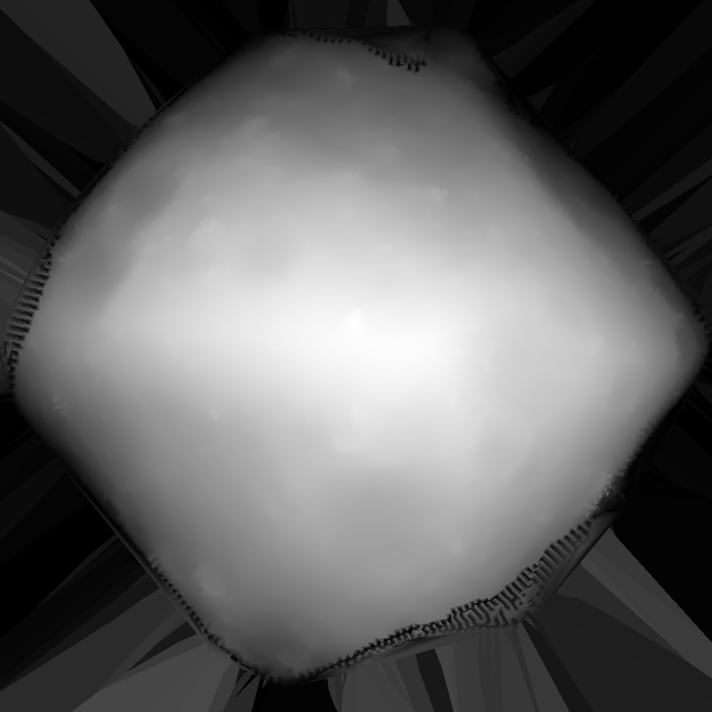

*Figure 1: Lateral X-axis projection heightmap derived from the Hayabusa2 SfM shape model, detailing Ryugu's equatorial ridge.*

### 2.2 Microgravity and Illumination

The gravity vector was set to 1.14×10⁻⁴ m/s², the lower bound of Ryugu's latitude-dependent surface gravity [1] and the most demanding case for traction and rebound control. The celestial backdrop is the ESO/S. Brunier Milky Way panorama mapped onto an equirectangular sky sphere [4]; scene illumination is a single directional source representing the Sun, consistent with Ryugu's atmosphere-free lighting. Solar power is physically plausible at Ryugu's 0.96–1.42 AU orbit [1] (~960 W/m² at the 1.19 AU semi-major axis) — the same orbital regime the solar-powered MINERVA-II rovers operated in, though [8] describes the MINERVA mobility concept rather than measured on-orbit power performance, so this is stated as a plausibility check against Ryugu's known orbit, not a claim independently corroborated by MINERVA-II telemetry.

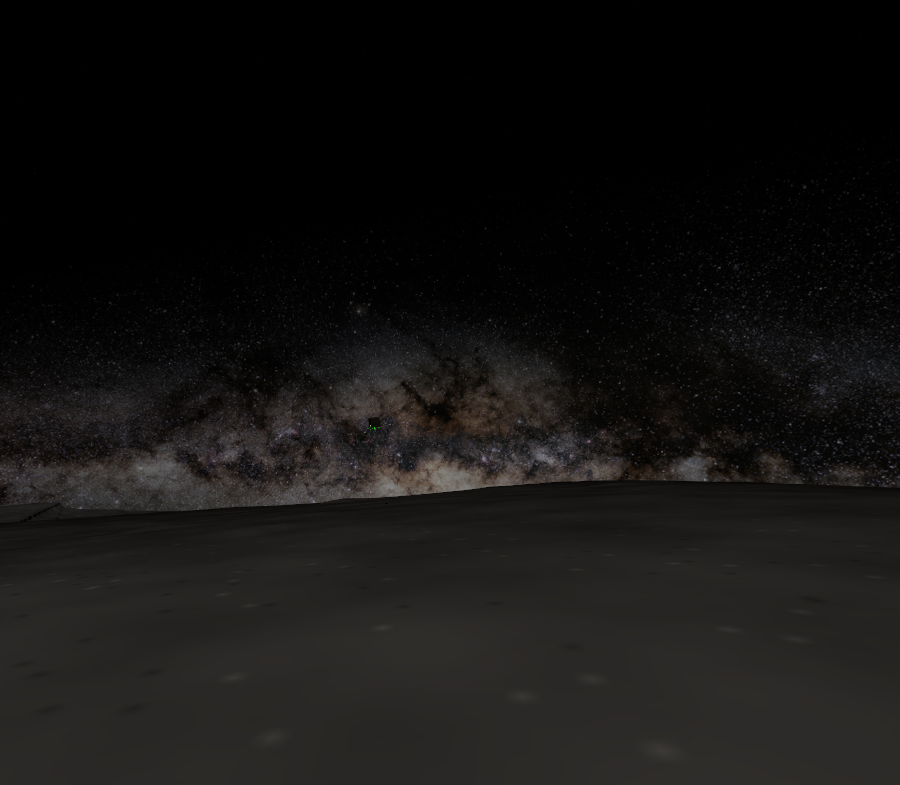

*Figure 2: The simulated environment — heightmap regolith terrain beneath the ESO Milky Way panorama, with a landed scout in the foreground and a second agent visible against the galactic band.*

### 2.3 Software Architecture

Each agent runs an identical four-node control stack; a single swarm-coordination node and a telemetry dashboard serve the fleet. All actuator and sensor traffic crosses a per-agent ROS–Gazebo bridge:

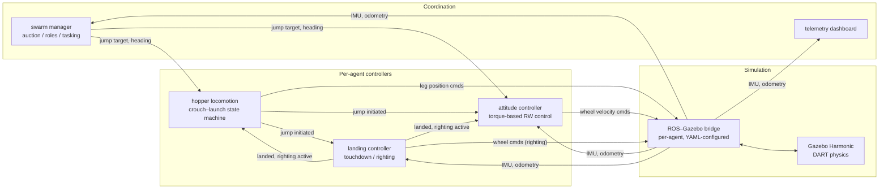

*Figure 3: System architecture. The `landed` and `righting_active` flags implement strict actuator arbitration — exactly one node commands any actuator at any time (§8).*

## 3. System Design

The SpaceHopper is a compact, 2.50 kg tri-pedal robot whose mass distribution keeps the center of gravity close to the geometric center:

| Subsystem | Components Included | Mass (kg) | Mass Fraction |
| :--- | :--- | :--- | :--- |
| **Chassis** | Aluminum 7075-T6 core, CFRP structural panels | 0.70 | 28% |
| **Locomotion** | 6× Maxon RE 13 leg motors (hip+knee ×3), planetary gearheads, legs | 0.45 | 18% |
| **Attitude Control** | 3× Maxon EC 20 flat RW motors + flywheels (X/Y/Z) | 0.20 | 8% |
| **Avionics & Sensors** | Flight computer, IMU, S-Band comms | 0.50 | 20% |
| **Power System** | 4× space-grade Li-ion 18650 cells, BMS | 0.30 | 12% |
| **Scientific Payload** | Rotary-percussive micro-corer, storage carousel | 0.20 | 8% |
| **Thermal & Solar** | GaAs solar arrays, Kapton MLI blankets | 0.15 | 6% |
| **Total Operational Mass** | | **2.50 kg** | **100%** |

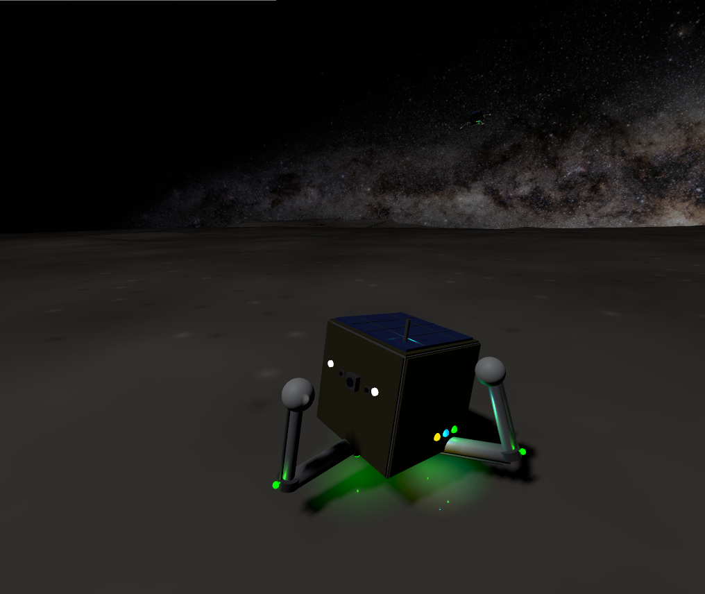

*Figure 4: The SpaceHopper model — face-on view showing the stereo hazard cameras and navigation camera, UHF antenna, solar array, and the tri-pedal articulated legs with spherical feet.*

### 3.1 Jumping Dynamics

The operational weight on Ryugu is merely $W = 2.50 \times 1.14\times10^{-4} = 2.85\times10^{-4}$ N. As a representative energy-budget scale (an illustrative upper-bound design case, not a claim about typically-achieved height — the actually measured apex is far smaller and is reported precisely in §7), a 5 m vertical hop requires potential energy

$$ E_p = mgh = 2.5 \times 1.14\times10^{-4} \times 5 = 1.43\times10^{-3} \text{ J}, $$

and with a leg stroke of $d = 0.1$ m — a round-number approximation of crouch-to-extension vertical travel used only to size this illustrative energy budget, not a precisely defined or currently-referenced constant in the deployed code (the actual launch model, below, is parameterized by the empirically fitted $V_{GAIN}$ instead, which plays a related but distinct role) — a mean thrust of only $F = E_p/d = 1.4\times10^{-2}$ N. The hip and knee joints, driven by Maxon RE 13 motors through 67:1 GP 13 gearheads [11], supply up to 134 mNm — a >60× force margin intended to overcome vacuum cold-welding and thermal-blanket stiffness. A central result of this work (§7, §8) is that this margin, while necessary, is far from sufficient: launch performance in milli-gravity is governed by stroke geometry and contact friction rather than torque.

**Launch stroke geometry.** Total foot–regolith friction capacity is $\mu m g \approx 1.8\times10^{-4}$ N, using $\mu = 0.62$ — explicitly configured on the foot collision geometry (Gazebo/DART `<friction>` block), rather than left at the physics engine's unconfigured default. The value is drawn from an actual Ryugu measurement: Robin et al. [35] derive a boulder-roundness-based internal friction angle for Ryugu of $31.6\pm2.5°$ from surface morphological analysis, giving $\mu = \tan(31.6°) \approx 0.615$, rounded to 0.62. Using a bulk internal friction angle as a proxy for surface sliding friction against a rigid foot is a standard geotechnical approximation when no direct foot–regolith contact measurement exists, not a perfect physical identity, and is stated as such here. Any lateral component of leg force slides the feet rather than lifting the body regardless of the exact $\mu$ value; the deployed stroke keeps each foot directly beneath its hip through the entire extension (a "zigzag" leg posture — calf angled back inward), so the ground reaction remains vertical independent of this uncertainty.

**Rate-modulated launch.** Early builds scaled hop distance by commanding a *fraction* of the full stroke, assuming separation velocity scales with amplitude. Telemetry falsified this: the position-PID joints stay torque-saturated through most of any stepped stroke, so the legs race at near-terminal speed *regardless* of commanded amplitude — a 27% stroke "9 m" hop was measured separating at 0.19 m/s and flying more than 76 m. The deployed launch instead always uses the full stroke geometry and modulates the stroke *rate*: joint targets are interpolated from crouch to extension over a ramp of duration $T = V_{GAIN}/v_{req}$, where $V_{GAIN} = 0.12$ m is an empirically fitted release-window gain, which the joints track without saturating. Two refinements proved essential. First, the interpolation is quadratic (ease-in), because near full extension the leg approaches its straight-leg singularity — $\partial h/\partial\theta \to 0$ — and a linear angle ramp therefore front-loads all body rise and releases the body at a crawl; the eased ramp places peak extension rate at the moment of release. Second, release occurs at 90% amplitude rather than 100% — an engineering margin chosen to stay clear of the singularity's final, most poorly-conditioned degrees of travel while sacrificing minimal usable stroke; it was not derived from a stated error tolerance and is noted here as a tuned choice, not a first-principles optimum.

$V_{GAIN}$ was the subject of a dedicated calibration investigation for this paper, instrumenting odometry-derived body velocity directly (rather than inferring it indirectly from touchdown position and time, which proved too noisy over the irregular terrain mesh to fit at all: two near-identical commanded ramp durations produced apparent delivered-velocity ratios of 0.52 and 1.20 by that method). Direct measurement uncovered two distinct, compounding effects, one an outright bug that was found and fixed, one a real physical characteristic of the simulated launch that was measured and reported rather than papered over.

First, a genuine bug: the launch state machine's keep-awake mechanism (a periodic in-place pose "nudge," needed because the physics engine sleeps a quiescent model regardless of joint commands) was firing on a fixed tick count throughout the launch ramp, including after real separation velocity had already begun building. Because this nudge is implemented as an asynchronous, fire-and-forget pose-teleport call, its exact real-time execution moment relative to the physics step is non-deterministic — and a pose teleport zeroes the body's velocity as a side effect. Two scouts given an *identical* command (same target distance, same ramp duration) delivered 0.003 m/s and 0.173 m/s of a 0.043 m/s request: a 64$\times$ spread on a nominally deterministic control input, tracking nothing but the wake call's timing luck. This was fixed by gating the mid-ramp wake call on genuine physical quiescence (measured speed near zero) rather than a blind timer, so it no longer fires once the stroke has real momentum to lose.

Second, a real and separately characterized effect: even after that fix, the body frequently fails to separate cleanly at the nominal end of the launch stroke. It tips during the post-separation hold and drags a leg across the irregular, boulder-strewn terrain mesh — sometimes for as long as 90 s — before reaching genuine constant-velocity ballistic flight. This was measured directly via odometry, waiting for the velocity vector to hold steady (three consecutive 2 s samples within 5% magnitude and 0.995 cosine similarity) before trusting a reading, and discarding any hop that never stabilized within a 90 s window. Across $n=7$ hops that did stabilize (two more were discarded as never-stabilized), the delivered-to-requested velocity ratio was 0.147, 0.321, 0.941, 0.143, 0.165, 0.959, 0.193 — median 0.193, mean 0.41. The distribution is bimodal rather than a smooth spread: 2 of 7 launches delivered near-full commanded speed (mean ratio 0.95), while 5 of 7 were degraded by terrain contact to a mean ratio of 0.19, with no correlation to commanded ramp duration across the 2.8–11.9 s range tested. Rescaling $V_{GAIN}$ to the median ratio was attempted and reverted: because the ramp-duration formula $T = V_{GAIN}/v_{req}$ is clamped to a minimum of 1.2 s (below which the leg PID saturates, reintroducing the pre-redesign uncontrolled-launch problem described above), the original $V_{GAIN} = 0.12$ differentiates ramp duration — and therefore commanded distance — across essentially the whole reachable world (out to $\approx$49 m); rescaling it by the median ratio (to $\approx$0.023) shrinks that differentiated range to $\approx$1.8 m, collapsing nearly every realistic mission-scale hop to the identical minimum-duration ramp regardless of intended distance. Since the degradation ratio is empirically independent of ramp duration in the first place, no rescaling of this parameter can correct it without this side effect. $V_{GAIN}$ is therefore left at its original, empirically-fitted value, and the terrain-contact degradation is reported here as a characterized, open simulation-fidelity limitation: a structural fix would require the launch state machine to confirm genuine ground clearance before declaring separation, rather than assuming it after a fixed hold duration.

**Directional hopping.** A purely vertical stroke has no ground range. Directionality is obtained by combining reaction-wheel yaw pointing (the swarm layer commands a target heading; the yaw-hold loop aligns the body) with a forward-lean differential built into the crouch (the leading leg is flexed 0.3 rad further, the trailing pair 0.15 rad less, preserving mean stance height), tilting the thrust vector off vertical toward the commanded heading. The lean magnitude is a genuine stability trade: at 0.5 rad the multi-second stroke was measured *tipping the robot over* (uprightness collapsing from 0.85 to 0.38 within a single 3.5 s ramp — at $2.9\times10^{-4}$ N of weight, nothing anchors the stance), while attitude feedback cannot simply be left engaged during the stroke because levelling the body *deletes the lean*: with tilt correction active mid-stroke, a commanded 9 m hop was measured flying 695 s almost perfectly vertically while translating 0.16 m. The deployed compromise holds tilt-position feedback off between ignition and separation, applies rate-only damping (which resists a runaway tip but barely brakes the slow intended lean), and aborts any stroke whose uprightness degrades below 0.7. Measured single-hop performance with this stack: **4.3 m of ground displacement at 1° of heading error** (commanded azimuth −56°, measured −55°) over a clean ~20-minute ballistic arc, launched from a fully settled upright stance and confirmed landed without a false trigger. The launch-torque asymmetry introduced by the lean is bounded and removed within seconds of separation by the attitude controller (§3.2).

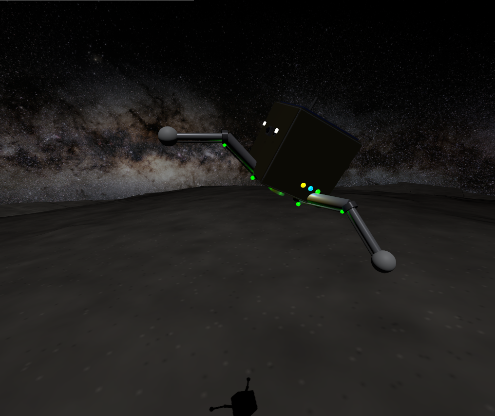

*Figure 5: A scout mid-hop. The forward lean is visible in the body attitude; the shadow on the regolith below shows the altitude gained within seconds of the stroke.*

#### 3.1.1 Escape-Velocity Margin and Containment

A sufficiently energetic hop could genuinely exceed escape velocity and depart the body permanently. For a spherical approximation, using Ryugu's ~450 m mean radius [1]:

$$ v_{esc} = \sqrt{2gR} = \sqrt{2 \times 1.14\times10^{-4} \times 450} \approx 0.320 \text{ m/s}. $$

The longest dispatch under nominal swarm operation — a corner-to-corner traverse of the ±45 m tasking field (§4.3), $d \approx 127$ m — would require $v \approx 0.120$ m/s if taken as a single ballistic hop, a 2.7× margin below escape; the deployed range-per-hop dispatcher (§4.3) never requests more than one 9 m leg at a time, keeping operational velocities an order of magnitude below $v_{esc}$. Because the amplitude-to-velocity mapping is empirically calibrated rather than closed-form, the simulation additionally encloses the terrain in collision-only boundary walls and a 100 m ceiling, providing hard containment independent of calibration accuracy.

#### 3.1.2 Reaction Force at the Feet

The ground reaction at the feet governs both ends of a hop and is worth stating as a single consolidated figure rather than the scattered quantities of §3.1 and §3.4.1. Three regimes:

* **Static support.** Standing weight is $W = mg = 2.85\times10^{-4}$ N (§3.1), distributed across three feet — under 10⁻⁴ N per foot, several orders of magnitude below anything a force sensor on flight hardware would need to resolve at the low end, but the number the friction budget below is checked against.
* **Launch.** The stroke delivers a mean vertical reaction of $F_{launch} = E_p/d \approx 1.4\times10^{-2}$ N per foot-group (§3.1) — roughly 50$\times$ standing weight, well inside the $>60\times$ torque margin of the leg motors, and small enough in absolute terms ($\ll 1$ N) that the dominant constraint is not force magnitude but the *lateral* component: total foot–regolith friction capacity is only $\mu mg \approx 1.8\times10^{-4}$ N (§3.1), so any non-vertical component of the launch reaction slides the feet rather than lifting the body, which is why the deployed stroke keeps the ground reaction axis-aligned through the entire extension.
* **Landing impact.** At the deployed passive joint-damping coefficient ($c = 0.05$ N·m·s/rad, §3.4.1), effective vertical stiffness is $k_{eff} \approx 48$ N/m against the 2.5 kg body, giving a peak impact reaction of $F_{impact} \approx k_{eff}\,x_{max}$ for a compression depth $x_{max}$ set by the ~25 mm/s touchdown speed measured at that damping setting — on the order of $10^{-1}$ N at first contact, decaying over 2–3 bounce cycles at restitution $e \approx 0.2$ (§3.4.1). This is the largest of the three regimes by roughly an order of magnitude, consistent with landing, not launch, being the dynamically demanding event for the leg structure despite launch being the event with the larger torque budget requirement.

The three-regime spread ($10^{-4}$ N static, $10^{-2}$ N launch, $10^{-1}$ N peak landing impact) is itself the practical argument for §3.4.1's passive-damping design: an actively-controlled compliance scheme has to track a reaction force spanning three orders of magnitude in real time with zero phase lag to avoid adding energy at the top of that range, which is precisely the failure mode measured and rejected in §3.4.1.

### 3.2 In-Flight Attitude Control

Uncontrolled tumble, ending in an inverted landing, is a primary failure mode of historical microgravity hoppers. SpaceHopper employs a 3-axis reaction-wheel (RW) assembly on Maxon EC 20 flat motors [10]:

* **Robot moment of inertia:** $I_{bot} = 0.012$–$0.020$ kg·m² about the body z-axis, posture-dependent (legs retracted vs. splayed), computed from the model's per-link inertias via the parallel-axis theorem.
* **Wheel torque budget:** $\tau_{rw} = 0.015$ N·m (short-term permissible; the EC 20 flat datasheet lists ≈8.75 mNm continuous and ≈25.7 mNm stall, placing 15 mNm in the intermittent-duty band appropriate for correction burns of a few seconds).
* **Flywheel inertia:** $I_w = \frac{1}{2}mr^2 = \frac{1}{2}(0.15)(0.06)^2 = 2.7\times10^{-4}$ kg·m².
* **Maximum wheel speed:** 982 rad/s (the datasheet no-load speed), giving a momentum capacity $H_{max} = I_w\,\omega_{max} \approx 0.265$ N·m·s.

At the torque limit in the flight posture, body angular acceleration is $\alpha = \tau_{rw}/I_{bot} = 1.25$ rad/s². A usable correction must arrive at the target angle with zero residual rate; the minimum-time profile is therefore bang-bang [6]:

$$ t_{min} = 2\sqrt{\theta/\alpha} \approx 2.24 \text{ s for } \theta = 90°. $$

The deployed controller deliberately trades speed for monotonic convergence, and both timescales are negligible against ballistic flight times measured in minutes.

**Controller structure.** Two structural lessons from live closed-loop testing shaped the final design. First, attitude error must be computed without small-angle assumptions: the controller rotates the body's local +Z axis into the world frame and forms the cross product with world-up,

$$ \vec{e} = \hat{u}_{local} \times \hat{u}_{world}, $$

a rotation-axis-aligned error valid at any tilt magnitude and independent of yaw. (An initial Euler-angle formulation oscillated at 85–160° tumble angles because body rates cease to correspond to Euler-angle rates there, so its damping term was damping the wrong quantity.) Second, and more fundamentally: a reaction wheel exchanges momentum with the body only **while it accelerates** ($\tau_{body} = -I_w\dot{\omega}_{wheel}$). Any law that commands wheel *velocity* proportional to attitude error stops transferring torque the moment the wheel reaches its commanded speed — leaving steady-state error uncorrected on the ground and a residual spin $\omega_{res} = L_0/(I_{bot} + I_wK_d)$ in flight, both of which were measured before the redesign. The deployed law is therefore the standard torque-based structure [6][7]: a PD law on attitude produces a desired body torque, clipped to the motor budget, converted to wheel acceleration, and integrated into the wheel-speed command:

$$ \tau_{des} = \mathrm{clip}\!\left(K_{ang}\,e - K_{rate}\,\omega,\ \pm\tau_{rw}\right), \qquad \dot{\omega}_{wheel,cmd} = -\tau_{des}/I_w, $$

with $K_{ang} = 0.02$ N·m/rad and $K_{rate} = 0.05$ N·m·s/rad, sized against the whole-robot inertia for an overdamped response ($\zeta \approx 1.1$–$1.6$ across the posture-dependent inertia range) that cannot oscillate by construction. A 1° attitude deadband prevents momentum windup against terrain-imposed tilt (a tripod on regolith never reads exactly level; without the deadband the wheels integrate toward saturation over hours). Rate damping carries no deadband — it acts only during rotation and cannot wind up; a rate deadband was tried and produced a measurable ±1.2° limit cycle at exactly the deadband rate.

Tilt correction is additionally gated on genuine motion ($|v| > 8$ mm/s or $|\omega| > 0.03$ rad/s) *and* on the commanded-flight latch of §8 Law 4: full attitude authority exists only between a commanded ignition and first contact. Torquing a *grounded* body against contact is functionally a rover drive (the mobility principle MINERVA-II exploits deliberately [8]) and, applied inadvertently, was observed to roll resting robots across the terrain and launch them off surface irregularities.

**Momentum budget.** A worst-case single-leg unbalanced launch imparts ≈0.0084 N·m·s of angular momentum, a 31× margin below $H_{max}$. Saturation by a single hop is therefore not credible; the windup path (persistent unreachable error) is closed by the deadband and the landed-state handoff.

### 3.3 Self-Righting

A badly-settled landing is detected from the IMU quaternion (world-frame z-component of the body-up axis, $u_z = 1 - 2(q_x^2 + q_y^2)$): righting is triggered whenever $u_z < 0.85$, i.e. the chassis is settled more than ~32° from upright, not only when fully inverted. This threshold is deliberately tighter than inversion because the launch stance gate itself requires $u_z > 0.85$ — a robot left in the 0.7–0.85 band would otherwise pass the righting check yet abort every subsequent hop. Righting is performed by the reaction wheels — the actuator with overwhelming authority for this task in milli-gravity: tipping the chassis over its support edge requires only $\tau \approx mgw/2 \approx 2.9\times10^{-5}$ N·m against Ryugu weight, a ~500× margin below the wheel torque budget, and internal momentum exchange is the same principle MINERVA-II used for surface mobility [8].

Two regimes are used depending on severity. For a severe tilt or full inversion ($u_z < 0.2$), the maneuver is bang-bang and momentum-neutral: a lateral wheel is driven at full torque (the body counter-rolls), and once the body passes horizontal the wheel is commanded back to zero, braking the roll symmetrically; net wheel momentum returns to approximately zero, so the handoff back to attitude control imparts no kick. Roll axis and sign alternate across retries, making a wrong initial direction self-correcting. Measured performance from a forced full inversion: detection, roll, and stable upright recovery in ~9 s (two attempts, the first having guessed the wrong direction). For the more common partial tilt ($0.2 < u_z < 0.9$), a gentler wheel-only roll is used, with no leg-posture step — because a leg motion is itself a launch impulse in milli-gravity, a fold step at a marginal tilt was measured ejecting the robot into a multi-minute parasitic ballistic arc. The roll direction is derived from the measured tilt and re-derived roughly once per second through the attempt: an earlier revision that held a single direction fixed for the whole 15 s attempt was found (by direct $u_z$ telemetry) to roll the body toward upright but overshoot past its peak short of the success threshold, then roll back down — the dominant cause of righting failures and the uncommanded post-landing re-flight cascades they triggered — while the opposite extreme of re-aiming every control tick chattered destructively at the near-vertical crossing where the horizontal tilt projection is degenerate. The ~1 s re-aim cadence sits deliberately between those two failure modes. During any righting maneuver an explicit arbitration flag silences the attitude controller — two nodes commanding one wheel is a silent last-write-wins conflict (§8).

An earlier leg-sweep righting strategy (alternating splay and asymmetric sweep phases) was retired: it depended on leg-segment ground leverage that vanished when leg collision geometry was reduced to foot spheres, and on stroke dynamics that joint damping (§3.4) suppressed.

### 3.4 Landing Detection and Ground Handling

Touchdown detection on a milli-g body faces a fundamental ambiguity: an accelerometer measures proper acceleration, and a robot *at rest* on Ryugu experiences a support reading of ~10⁻⁴ m/s² — indistinguishable from free-fall at any realistic noise floor. (The same ambiguity shaped MASCOT's multi-sensor settling logic [9] and MINERVA's conservative hop scheduling [8].) The deployed detector fuses:

* **Contact spike** — $|a| > 0.08$ m/s² (motor reaction transients reach ~0.02; genuine impacts exceed 0.05).
* **Rest windows** — altitude confined to a ±2 cm band for 60 s with velocity below 5 mm/s. The window length is set against worst-case *two-sided apex dwell*: a ballistic coast lingers within a ±b band around apex for up to $2\sqrt{2b/g}$ ≈ 37.5 s at b = 2 cm, so a 60 s window cannot false-fire in flight. A velocity-only fallback (|v| < 5 mm/s for 120 s) carries an altitude-drift guard, because free-fall *from rest* also satisfies a pure velocity gate for its first ~44 s ($v = gt$) — a resting robot cannot drift 5 cm; a falling one always does within the window.
* **Liftoff watchdog** — LANDED is not terminal: sustained velocity above 2 cm/s reverts the state machine to FLIGHT, because "landed" must remain true in the physics, not merely in the software.

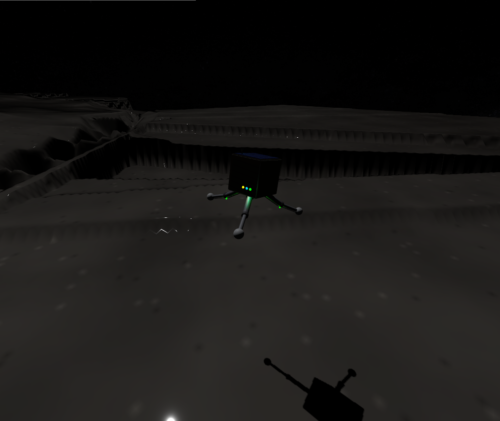

*Figure 6: Final descent over the ridged heightmap terrain — the antenna shadow on the regolith below marks the touchdown point the detector must confirm.*

After confirmation, the legs simply hold their landing pose. No posture is commanded at or after touchdown — a design rule with an empirical basis (§3.4.1). The complete locomotion cycle, spanning both controllers, is:

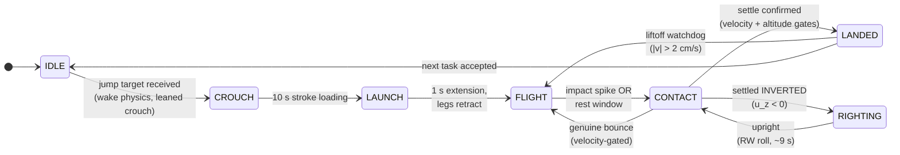

*Figure 7: The hop–land–right cycle. Attitude control runs during FLIGHT (motion-gated), stands down during RIGHTING, and holds yaw only when grounded.*

#### 3.4.1 Impact Dissipation: Why Active Compliance Fails in Milli-Gravity

Stiff position-controlled legs behave as near-lossless springs at touchdown: measured restitution from a 1.15 m drop was ≈0.96, producing non-decaying pogo rebound. Three actively controlled compliance schemes were implemented and measured, and **all three added energy at contact**:

| Scheme | Impact v (mm/s) | Rebound v (mm/s) | Outcome |
|---|---|---|---|
| Step to compliant posture at contact | — | — | 0.7–0.9 m kicks, non-decaying |
| Posture ramped over 2 s | 32 | 38 | rebound exceeds impact |
| Zero-stiffness catch (measured joint angles mirrored as targets) | 16 | 22 | rebound exceeds impact |

The third failure is the instructive one: the joint-state feedback crosses a transport layer with finite latency, so the mirrored target *trails* the joint — during rebound the lagged position error torques *with* the motion, pumping the bounce. This is the classic phase-lag instability of delayed feedback, and in milli-gravity there is no weight margin to absorb it.

The deployed solution places dissipation where phase lag cannot exist: passive joint damping in the mechanism itself. A sweep over the damping coefficient measured the launch/landing tradeoff directly:

| $c$ (N·m·s/rad) | Separation velocity | Landing behavior |
|---|---|---|
| 0.005 | 39.8 mm/s | restitution ≈ 0.96, non-decaying pogo |
| **0.05 (deployed)** | **24.9 mm/s** | **decaying bounces; confirmed landing in ~14 min** |
| 0.15 | few mm/s | overdamped launch; landing benign |

At the deployed value, contact damping ratio is $\zeta \approx 0.45$ (effective vertical stiffness ≈48 N/m against the 2.5 kg mass), giving restitution $e \approx e^{-\pi\zeta/\sqrt{1-\zeta^2}} \approx 0.2$ — bounces decay within two to three cycles — while the launch stroke retains a 35% separation-velocity margin over the 3 m-hop requirement. Series-elastic launch elements, which decouple launch delta-v from joint damping entirely, remain the recommended mechanism for flight hardware [5].

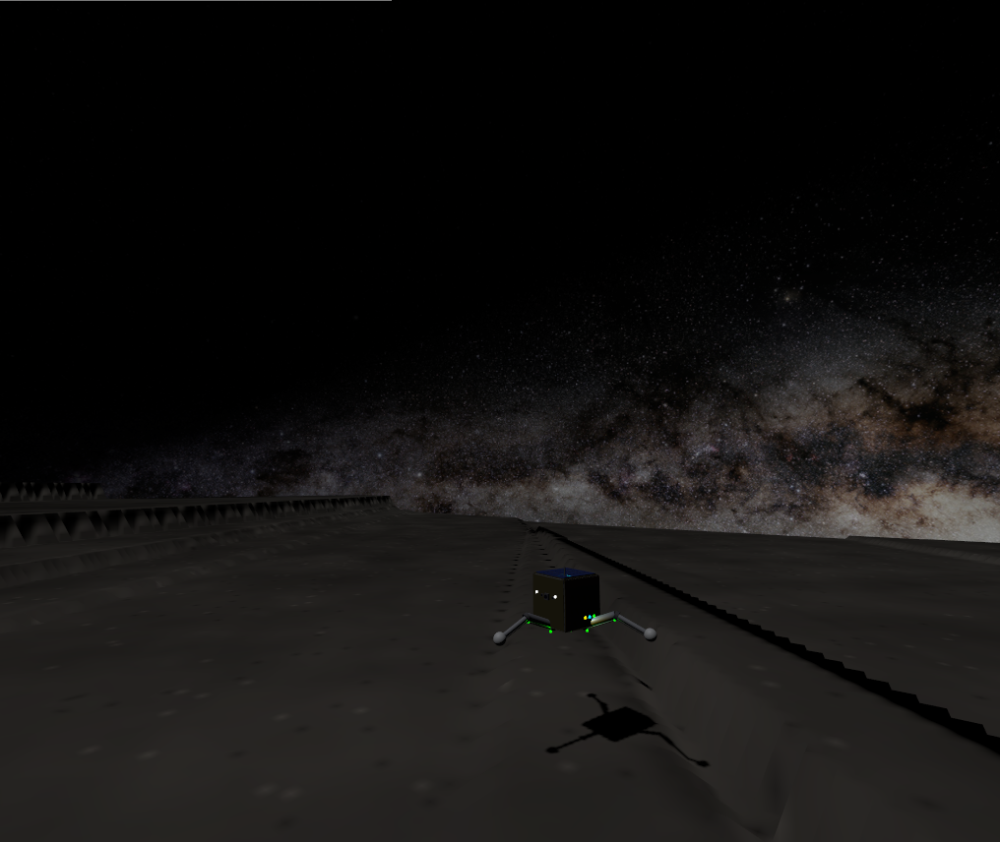

*Figure 8: The end state the landing stack is built to reach — a scout settled upright on its legs after a completed hop, holding its landing pose with no commanded motion.*

## 4. Power and Communication Systems

### 4.1 Energy Budget

This subsection is a component-level design estimate, not simulated telemetry — distinct from every other numeric claim in this paper. The swarm simulation itself models battery state with a simplified, role-based percentage-drain rate (§4.3), not a watt-level subsystem power budget; the table below sizes the physical pack against plausible subsystem draws for the hardware described in §3, and the two models are not currently cross-validated against each other. Powered by a 37.0 Wh space-grade lithium-ion pack:

| Operational State | Subsystem | Peak Power (W) | Avg Continuous Power (W) |
| :--- | :--- | :--- | :--- |
| **Continuous** | Avionics (CPU, IMU, comms Rx) | 2.00 | 2.00 |
| **Continuous** | Reaction wheels (attitude hold) | 5.00 | 1.50 |
| **Intermittent** | Leg motors (launch strokes) | 6.00 | 0.005 |
| **Intermittent** | Micro-corer drill (300 s sequence) | 3.00 | 0.023 |
| | **Total estimated draw** | **16.00** | **3.53** |

Continuous operation yields an estimated 10.5 h of shadowed endurance; the top-mounted GaAs arrays (28% efficiency) generate ~3.5 W net at 1.2 AU, allowing full recovery over the diurnal cycle. In the swarm layer, recharge is modeled as a dedicated RECHARGE role with battery-reserve gating (§4.3).

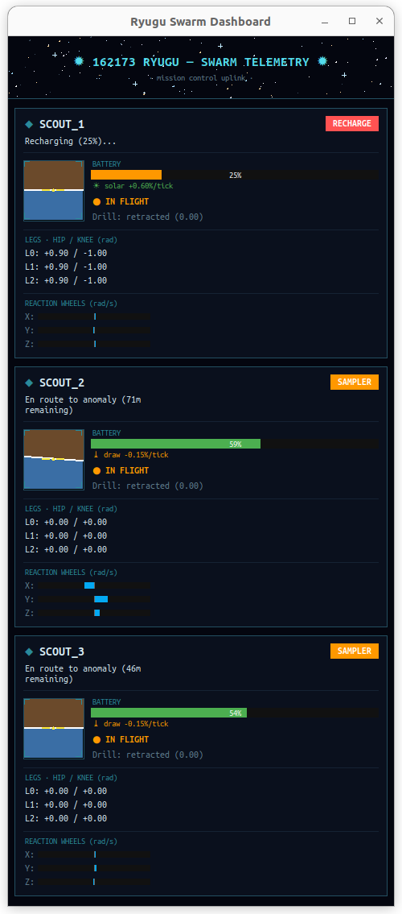

*Figure 9: The power model operating live — a scout depleted to 25% has been reassigned to RECHARGE and regains charge at +0.60%/tick while its squadmates continue their own tasks.*

### 4.2 Swarm Communication

The architecture supports a decentralized swarm methodology: a low-power (<0.1 W) UHF mesh for intra-swarm communication, which diffracts around boulder-scale obstructions, and an S-band patch antenna for high-gain relay to an orbiting mothership.

### 4.3 Swarm Role Allocation (Market-Based Task Auction)

Mission roles (SCOUT / SAMPLER / RELAY / RECHARGE) are allocated by a single-item market auction in the taxonomy of Gerkey & Matarić [13]. When a spectral anomaly enters the task queue, every eligible SCOUT bids

$$ B_a = d_a + w_b\,(100 - \mathrm{SoC}_a) + w_c\,n_a, $$

where $d_a$ is straight-line distance to the target, $\mathrm{SoC}_a$ the battery state of charge ($w_b = 0.5$ m/%), and $n_a$ the carousel load ($w_c = 5$ m/sample); the lowest bid wins, and agents below a 30% charge reserve abstain. These weights are tuned engineering choices, not derived from a cost model, and are stated as such: $w_b = 0.5$ means a full battery drain (100 percentage points) is penalized as if the target were 50 m farther away, and $w_c = 5$ means each already-carried sample is penalized as 5 m of extra distance — both chosen to keep battery and carousel load as meaningful tie-breakers against typical single-hop distances (a few to tens of metres) without letting either dominate the distance term outright. The 30% charge reserve threshold is likewise a tuned safety margin (roughly two SAMPLER-role duty cycles at the measured 0.15%/tick drain rate, §4.1) rather than a value derived from a stated failure-probability target. Verified live with three agents, the auction produces differentiated allocation (e.g., bids of 29.1 vs 40.8 m-equivalent deciding a contested target).

The auction and the routing decision are not solved separately. Every eligible bidder proposes a bid against *every* anomaly currently queued, not just the oldest one, and the globally cheapest (agent, target) pair wins — folding the nearest-neighbor route-selection logic of §5.2 directly into task allocation rather than treating "who goes" and "where do they go first" as two independent steps. This closed a real inefficiency: with FIFO-only dispatch, a newly-detected anomaly much closer to an idle agent still had to wait behind an older, farther one simply because it queued later.

The complete tasking flow for one anomaly:

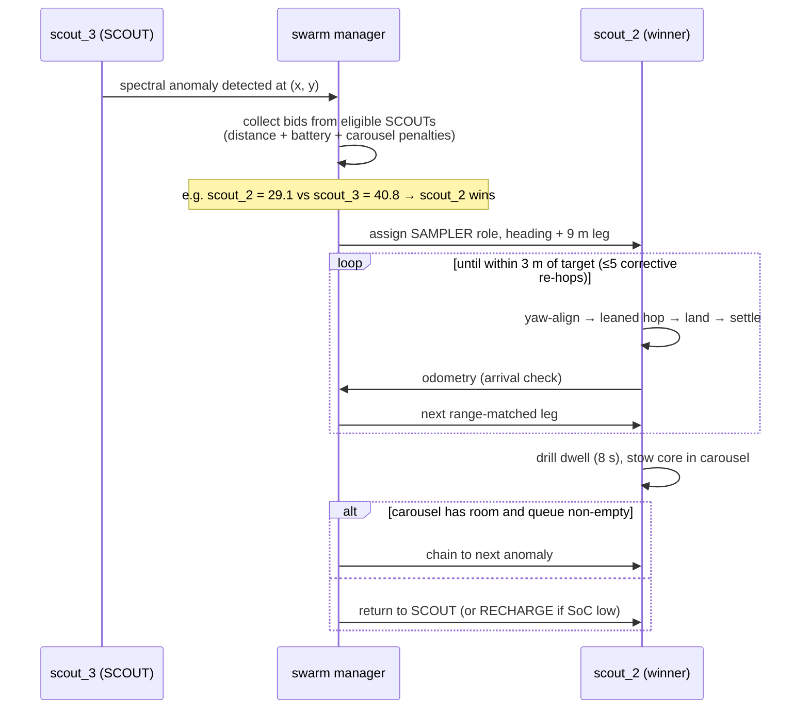

*Figure 10: Auction-based tasking and sampling sequence, as executed live by the three-agent swarm.*

Robustness mechanisms, each mapped to an observed failure mode of naive dispatching: unfinished tasks are re-queued when an agent is forced to RECHARGE or drops offline (10 s odometry-liveness watchdog); arrival is gated on real odometry (within 4 m *and* landed); journeys are dispatched as range-matched legs of at most the measured 9 m hop range, with up to five cooldown-paced corrective re-hops held as an error-correction reserve; core extraction occupies a finite 8 s drill dwell so the power model reflects a real duty cycle; and task coordinates are clamped inside the physical containment boundary, so no assignment is unreachable by construction.

**Actuator arbitration in the dispatch loop itself.** Two live-caught races shaped the final ordering of the swarm's per-tick logic, both instances of the same recurring lesson (§8, Law 3-adjacent): exactly one command may be in flight to a given robot's launch sequence at a time. First, running the auction *after* per-role mission execution let an agent already mid-launch on its own search hop (§5.1) also win the auction in the same tick, producing two conflicting jump commands; the flight controller silently drops whichever arrives second, and the background search hop was winning — a robot that had just detected a genuine anomaly launched toward an unrelated cell instead. Second, bidder eligibility checked only role, not whether the agent was actually idle: a robot still mid-crouch from its own just-issued hop reports "landed" (the flight-armed flag only clears at ignition) and could still win an auction whose dispatch then failed the same way. Both are fixed by (a) running the auction before mission execution, so a winning agent is already reassigned before the mission loop would have dispatched it a second time, and (b) requiring bidders to be landed *and* past a settled cooldown since their own last dispatch, not merely correctly roled.

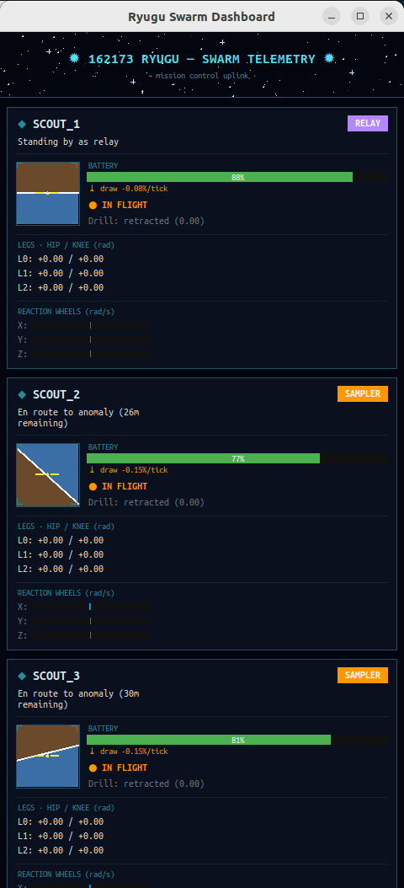

*Figure 11: The mission telemetry dashboard during a live run — differentiated roles (one RELAY, two SAMPLERs en route), per-agent battery and charge rate, attitude indicators, leg and reaction-wheel state.*

## 5. Search Algorithm and Path Planning

### 5.1 Search Algorithm

An anomaly cannot be auctioned (§4.3) until it has been found, and finding it is a genuinely separate problem from deciding who visits it. An early implementation conflated the two: a SCOUT-role agent had a flat per-tick chance of "detecting" an anomaly within instrument range of wherever it currently stood, with no mechanism that ever moved it anywhere — coverage of the tasking field depended entirely on where agents happened to already be, not on any deliberate search behavior.

**Design.** The deployed search algorithm is coverage-driven exploration, built from three pieces:

* **Static territorial partition.** The $\pm45$ m tasking field is divided into three $120°$ angular sectors about the origin, one per agent, so all three SCOUTs search disjoint ground without any negotiation protocol — a fixed simplification of the dynamic Voronoi-partition and DARP (Divide Areas based on Robot Position) approaches used for multi-robot coverage [14, 15]: a fixed division is sufficient for three agents over a roughly square field and needs no repartitioning machinery.
* **A coverage grid.** A coarse $10$ m grid over the field records the simulation tick at which each cell was last visited by an agent operating in the SCOUT role. The cell size is a tuned resolution choice, not derived: coarse enough that a single hop (up to 9 m) reliably crosses into a new cell, fine enough that the $\pm45$ m field still yields a meaningfully large search space (a $9\times9$ grid) for the staleness scoring below to discriminate between candidates.
* **Greedy, cost-aware target selection.** A SCOUT that is landed and past a settling cooldown selects the highest-scoring cell in its own sector, where score trades cell staleness (ticks since last visited) against travel cost (distance penalty), and dispatches a hop toward it. This is a simplified, deterministic instance of the budget-constrained informative-search family in the multi-robot exploration literature [16, 17]: full online planning approaches in that family (distributed Monte Carlo Tree Search [17], deep-RL policies over Voronoi cells or constrained sensor models [15, 18]) were surveyed and explicitly not adopted for this platform — training infrastructure and online search depth are disproportionate to a three-agent team operating over a field this size, and a greedy rule is directly explainable and auditable, which a learned policy is not.

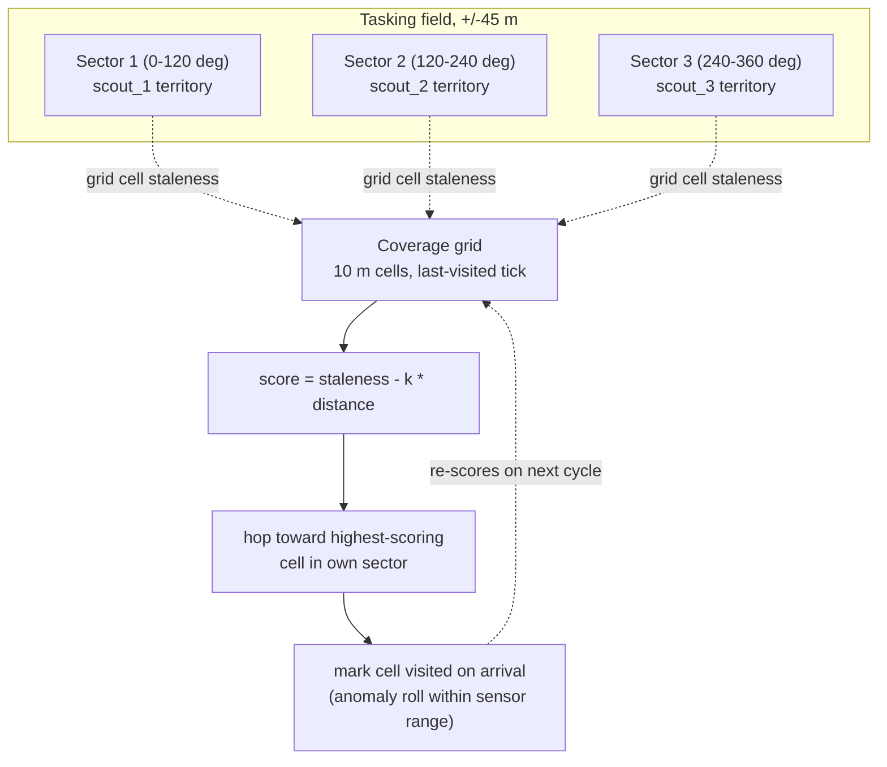

*Figure 12: Search algorithm data flow. Each agent scores candidate cells only within its own static sector, so the three searches never compete for the same ground.*

**Result.** Live-verified over a 9-minute run: agents that previously never moved outside of an assigned task now dispatch search hops autonomously (e.g. a scout with no queued task hopping toward $[-10.0, 0.0]$, $10.0$ m away, purely from coverage staleness), and the anomaly-detection rate measurably outpaced the fleet's physical capacity to service targets — a 41-anomaly backlog accumulated within roughly nine minutes against a single-hop-per-tick, minutes-long-flight-time servicing rate. This is an honest characterization of the platform, not a defect: detection is a cheap per-tick event, while visiting a target requires a multi-minute hop-and-settle cycle, so a real deployment's SCOUT:SAMPLER ratio and battery-reserve threshold (§4.3) are the actual levers for balancing discovery against throughput, not the search algorithm itself.

### 5.2 Path Planning

**Why classical path planning does not apply.** A* [19], Dijkstra's algorithm, RRT/RRT* [20, 21], artificial potential fields [22], and visibility graphs are all built to solve *obstacle-avoidance routing*: finding a path through a medium that contains regions the agent must be routed around, using either continuous real-time steering (potential fields) or a search over a connected, partially-blocked traversable space (the rest). Neither premise holds here. A commanded hop is a ballistic arc: once launched, it is committed for its full multi-minute flight with no mid-flight steering authority, and the arc flies *over* the terrain rather than through it, so there is no obstacle field for any of these algorithms to route around. Stating this directly, with reasoning, is a more defensible position than force-fitting a classical planner where the platform's own physics removes the problem those planners exist to solve — this conclusion follows directly from surveying the classical planning literature against the platform's actual constraints, not from an absence of investigation.

What *does* generalize from the literature is the discrete, sequential character of asteroid-hop planning specifically: real hopping-rover path planning work formulates travel as choosing a *sequence* of discrete ballistic hops between waypoints — via Lambert boundary-value solutions under irregular gravity [23], convex per-hop trajectory optimization combined with ant-colony sequencing across multiple targets [24], or explicit landing-uncertainty-aware trajectory design [25]. The platform's own dispatcher (§4.3) is a simplified instance of exactly this two-layer structure: per-hop trajectory shaping (the rate-modulated launch stroke, §3.1) plus discrete multi-target sequencing (nearest-neighbor route selection, below).

**An exact result from this platform's own launch law.** §3.1 establishes the deployed launch model: required separation velocity scales as $v_{req} = \sqrt{d\,g/\mathrm{SIN2TH}}$ for a hop of distance $d$. Since kinetic energy is $E = \tfrac{1}{2}mv^2$, and $v_{req}^2$ is *exactly linear* in $d$,

$$ E(d) = \frac{mg}{2\,\mathrm{SIN2TH}}\,d. $$

Summing this over any partition of a fixed total distance $D$ into $n$ hops of lengths $d_1, \dots, d_n$ with $\sum_i d_i = D$ gives

$$ E_{\text{total}} = \frac{mg}{2\,\mathrm{SIN2TH}} \sum_i d_i = \frac{mg}{2\,\mathrm{SIN2TH}}\,D, $$

independent of $n$ and independent of how $D$ is split. **Under this platform's own launch law, total launch energy to cover a fixed distance is invariant to how many hops it is broken into** — splitting one 9 m leg into three 3 m legs costs the same total kinetic energy as a single 9 m leg, to first order. This is a genuinely different result from the general convex hop-sequencing literature [24], which assumes (correctly, for a broader class of launch mechanisms) that energy cost is *superlinear* in hop distance and therefore that splitting is favorable; this platform's specific $v \propto \sqrt{d}$ law makes the energy landscape exactly flat with respect to splitting instead.

What is *not* invariant to hop count is **time**. Each hop carries a large, largely distance-independent fixed overhead — crouch and yaw-alignment (up to 45 s), launch ramp (1.2–20 s), and post-landing settle-confirmation (§3.4, measured on the order of minutes) — so mission duration scales with the *number* of hops, not the energy spent. This is the actual, correct justification for the dispatcher's range-matched-leg strategy (always take the maximum 9 m leg, with only the final leftover leg shorter): it is a **time-optimal**, not an energy-optimal, choice, and stating the distinction precisely is more defensible than an unqualified energy-optimality claim the platform's own physics does not support.

**Multi-target routing.** What genuinely was FIFO, and is now fixed, is target *ordering* when multiple anomalies are queued. §4.3 already describes the deployed mechanism: every eligible bidder proposes its own cheapest reachable target across the *entire* queue (a greedy nearest-neighbor rule), and carousel chaining (a SAMPLER with cores remaining after a completed extraction) likewise selects its nearest remaining queued target rather than the oldest. This is the greedy simplification of the Team Orienteering Problem [16] — routing multiple agents through reward-bearing nodes under a travel/survival budget — appropriate here because the platform's fixed per-hop time cost (above) makes hop *count*, not routing distance, the dominant scheduling variable, and a full orienteering solve is disproportionate machinery for a three-agent fleet with a queue depth the greedy rule already handles correctly (§4.3).

Multi-robot deconfliction — ensuring two agents never target overlapping ground or airspace at once — was surveyed via the prioritized-planning pattern used for real multi-rover teams [26] (rank agents, commit high-priority trajectories first, lower-priority agents plan around them) but was not implemented: with hop flight times measured in minutes and a $\pm45$ m field shared by three agents, the collision-probability is low enough by construction (§5.1's territorial partition already keeps search hops geographically separated, and SAMPLER dispatches are rare, single-target events) that the added bookkeeping was judged not to be load-bearing for the current fleet size, and is noted here as a scoped-out extension rather than a silent gap.

## 6. Scientific Payload

Unlike explosive kinetic impactors, the SpaceHopper performs delicate, non-destructive sampling with a hollow rotary-percussive micro-corer at ultra-low RPM. Cores are cached in a sterile three-tube carousel, allowing a single SAMPLER to chain consecutive targets before returning; preserving stratification and volatile organics significantly increases the scientific integrity of retrieved material.

## 7. Results

All results below are from live closed-loop simulation telemetry (IMU, odometry, and physics-engine ground truth), not open-loop estimates.

* **Launch:** rate-commandable separation via the eased full-stroke ramp (§3.1); vertical delta-v delivered on demand up to ~60–70 mm/s with the launch handshake producing zero false landing triggers across the final verification runs. Clean ballistic arcs with apex energy matching $v^2/2g$ within measurement noise.
* **Directional range:** 4.3 m of ground displacement at 1° heading error against the commanded azimuth (−55° measured vs −56° commanded) on a ~20-minute arc; yaw alignment at ignition within 1–3° on every measured hop. Figure 13 shows a measured trajectory.
* **Jump height and launch delivery:** direct odometry measurement of separation velocity (§3.1) across $n=7$ stabilized hops gives a delivered-to-requested velocity ratio of median 0.193, mean 0.41, bimodally distributed — 2/7 launches near-full delivery (mean ratio 0.95), 5/7 degraded by post-separation terrain contact (mean ratio 0.19). A representative clean flight (commanded 0.43 m hop, delivered ratio 0.94) reached apex within seconds of separation on the expected quasi-vertical arc; a representative degraded flight (commanded 9 m hop, delivered ratio 0.15) shows the terrain-drag signature directly in telemetry — vertical delta-v climbing smoothly for over a minute past the point the commanded leg motion had already stopped, before settling to a much-reduced, still constant-velocity, ballistic value. Both are consequences of the terrain-contact effect characterized in §3.1, not of an actuator torque deficit.

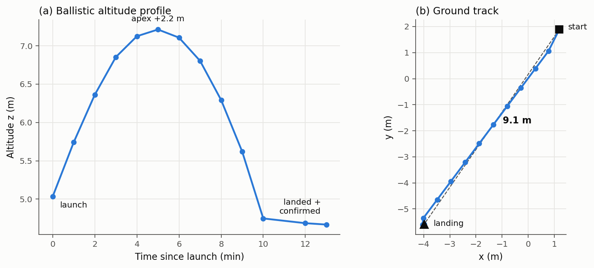

*Figure 13: Measured single-hop trajectory from odometry telemetry — (a) the ballistic altitude profile over a multi-minute flight and (b) the straight-line ground track.*
* **Flight stabilization:** in-flight body rates damped to 0.005–0.015 rad/s; launch transients of 0.24 rad/s removed within seconds; no persistent yaw spin. A commanded 107° yaw slew converged overdamped and held within 1° at zero rate; a 165° tumble was damped to 3.6° in ~20 s.
* **Self-righting:** recovery from forced full inversion in ~9 s via the reaction-wheel roll, including self-correction of an initial wrong-direction guess. Partial-tilt recovery — the more common case, and the one whose overshoot failure mode (§3.3) previously drove the majority of righting failures and their multi-minute-to-hour uncommanded re-flight cascades — succeeded in every trial observed after the ~1 s roll-direction re-aim fix, including one case that needed 4 of the 5 available attempts before converging.
* **Landing:** decaying-bounce settle and confirmed LANDED in ~14 min after a full-stroke hop; no false confirmations in flight and no post-landing self-ejection across the final verification runs.
* **Swarm autonomy (3 agents):** differentiated role allocation on first boot (RELAY + 2× SCOUT), competitive auctions on detected anomalies, dispatch, range-matched directional hops, and cooldown-paced corrective re-hops — the full loop operating without operator intervention.
* **Sampling cycle:** on a SAMPLER reaching its anomaly (arrival check against live odometry, 0.9 m from target on the verified run), the swarm layer autonomously deployed the core drill, completed the extraction dwell, stowed the core in carousel tube 1/3, and immediately re-tasked the agent to its next queued anomaly — the complete arrive → drill → cache → chain sequence executed by the autonomy stack with no operator input. Figures 13–15 document the sequence from live telemetry.

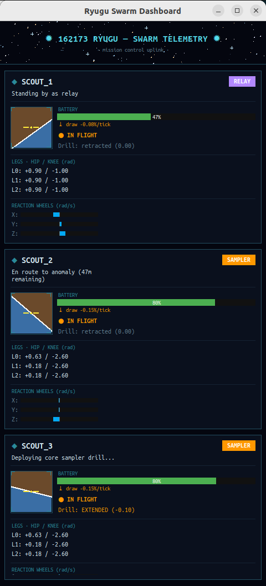

*Figure 14: Live mission dashboard at the moment of sampling: scout_3 (bottom panel, SAMPLER role) reports "Deploying core sampler drill..." with the drill state EXTENDED (−0.10 m), while scout_2 is en route to a second anomaly and scout_1 holds the relay role.*

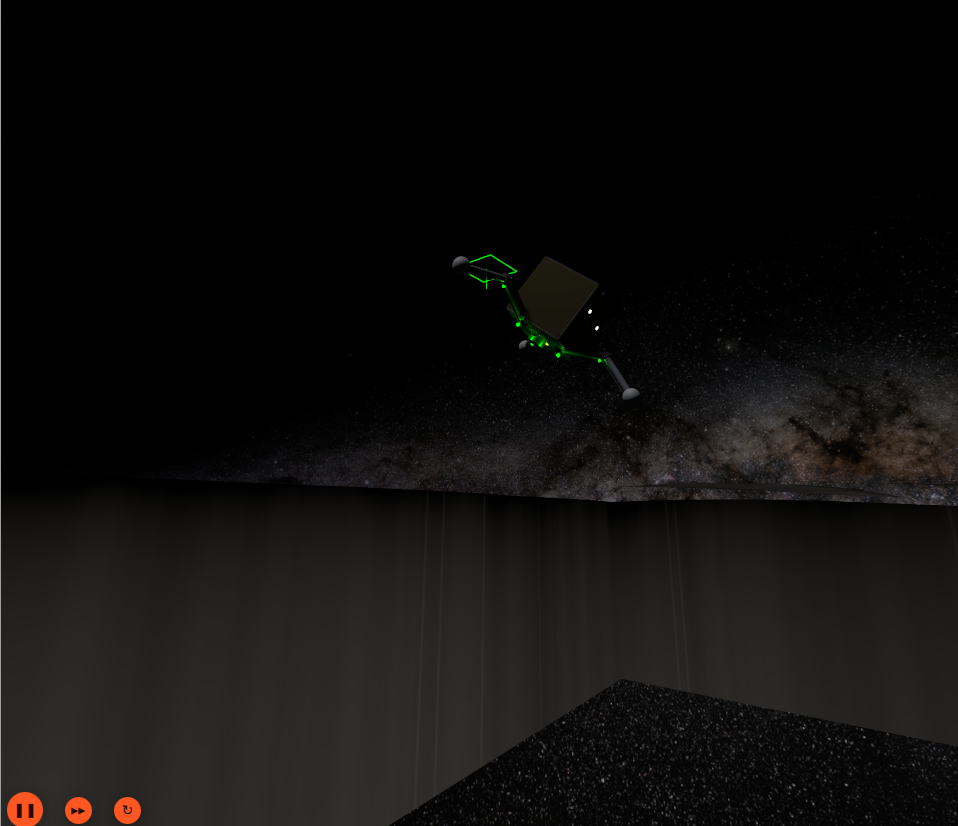

*Figure 15: scout_3 departing the sampling site on its next commanded hop after caching the core, navigation lights on, silhouetted against the Milky Way panorama. The green wireframe marks the just-sampled anomaly site.*

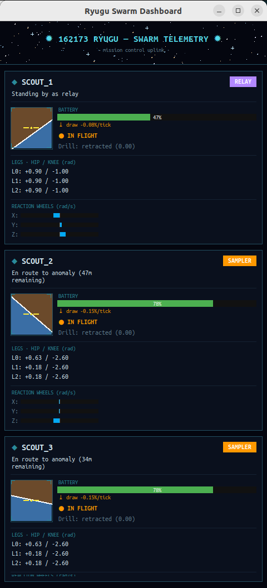

*Figure 16: The dashboard moments later: scout_3's core is cached (drill retracted) and the agent is already "En route to anomaly (34 m remaining)" — carousel chaining lets one SAMPLER service consecutive targets before returning.*

### 7.1 Validation Against Flight Heritage and Comparable Systems

Internal telemetry consistency ($v^2/2g$ apex-energy matching, restitution measurements, etc.) establishes that the simulation is self-consistent, but not that its operating regime is physically realistic. Three external checks:

**Same body, real flight data.** MINERVA-II-1, deployed by Hayabusa2 onto this same asteroid at this same surface gravity ($1.14\times10^{-4}$ m/s², [1]), executed real hops on Ryugu [2]. Widely-reported mission figures place individual hop flight times on the order of minutes and horizontal displacements on the order of tens of metres — a citation caveat is warranted here: [2] is JAXA's own mission media record, not a peer-reviewed flight-dynamics paper with tabulated per-hop data, so these figures are cited as broadly-reported mission characteristics rather than precise, individually-verifiable measurements. Even at that lower bar of precision, this platform's own measured flights span the same order of magnitude — minutes-long ballistic arcs for metre-to-several-metre displacements (§7, Figure 13) — under the same gravity, on the same body, which is a materially stronger check than a scaled analogy from a different gravity regime would be. The comparison also frames the platform's principal advance over MINERVA-II precisely: MINERVA-II's eccentric-mass hopping mechanism [8] has no active in-flight steering and no reaction-wheel stabilization, where this work adds both — directional targeting (§3.1) and closed-loop attitude correction (§3.2) on top of the same class of milli-gravity ballistic hopping MINERVA-II already flew successfully.

**Escape-velocity margin, empirically corroborated.** §3.1.1 calculates $v_{esc} \approx 0.320$ m/s for Ryugu and keeps operational hop velocities an order of magnitude below it. MINERVA-II's many repeated hops on this same body, none of which escaped, are direct empirical proof that hop velocities safely bounded below $v_{esc}$ are achievable in practice on Ryugu specifically, not merely on paper.

**Cross-gravity scaling check against a reaction-wheel-free hopper.** ETH Zurich's SpaceHopper [5] reports jumps up to 6 m in simulated Ceres gravity ($g_{Ceres} \approx 0.284$ m/s², roughly 2500$\times$ Ryugu's). Ballistic range scales as $v^2/g$ for a fixed launch velocity and angle, so the same delta-v budget at Ryugu's much weaker gravity would be expected to produce a *much* longer range than at Ceres — this platform's measured multi-metre ranges at a far smaller absolute delta-v budget ($\sim$0.04–0.07 m/s vs. whatever SpaceHopper's unreported launch velocity is) are consistent with, not contradicted by, that scaling direction. This check is necessarily qualitative rather than a precise numeric match, since SpaceHopper's exact launch velocity and elevation angle were not available from the retrieved source — stated as a bound on the check's strength rather than overclaiming a match.

**Reaction-wheel torque budget, checked against terrestrial legged-robot precedent.** No asteroid-specific source reports an in-flight reaction-wheel torque budget directly comparable to §3.2's numbers — the closest asteroid-context match, a Cubli-type reaction-wheel rover [27], addresses static balance control rather than in-flight correction. A different, genuinely useful comparison class exists, however: terrestrial legged robots that use reaction wheels for aerial-phase attitude correction during jumps and dynamic gaits, the same actuation principle applied to the same class of problem, just at Earth gravity. A CMU quadruped fitted with a hardware reaction-wheel MPC stabilization system uses per-axis wheels rated to 5 N·m and up to 1900–3800 RPM [28]; an ETH-lineage master's thesis on reaction wheels for aerial legged-robot maneuvers used a 0.3 N·m, 5000 RPM motor [29]; earlier NTUA work applied a reaction wheel for pitch stabilization during quadruped pronking [30] and bounding speed control [31]. Against this class, this platform's 0.015 N·m wheel torque budget is 20–330$\times$ smaller than these terrestrial systems' — consistent with, not contradicted by, the fact that this platform is both far lighter (2.5 kg vs. quadruped-class mass) and correcting against a gravity roughly four orders of magnitude weaker, so the torque needed to dominate gravitational and inertial disturbances is expected to scale down sharply. This is a real external check, not merely an internal one, though it remains a cross-domain comparison (terrestrial vs. milli-gravity) rather than a same-environment validation — unlike the MINERVA-II check above, no source here operates at Ryugu-scale gravity, so the comparison validates that the *actuation principle and its rough scaling* are sound, not that the specific gains ($K_{ang}$, $K_{rate}$) are independently corroborated.

**Launch delivery efficiency, checked against a matching-scale, matching-gravity-regime flywheel hopper.** A closer comparison than any above exists for the §3.1 finding that commanded launch velocity is delivered with a median efficiency of $\approx$19% (bimodal: $\approx$95% on a clean separation, $\approx$19% when post-separation terrain contact degrades it): Hockman, Frick, Nesnas, and Pavone's internally-actuated hopper prototype [32] is close to this platform's own scale in every dimension that matters — 2.3 kg mass against this platform's 2.5 kg, 0.013 kg$\cdot$m$^2$ body inertia against this platform's 0.012–0.020 kg$\cdot$m$^2$ range, and flywheels sized at roughly 1/10th total mass, operated at an emulated 0.001 g — genuinely comparable to Ryugu's regime, not a different-planet analogy. Critically, they report a real commanded-vs-achieved hop-distance measurement: a 1 m commanded hop (flywheel driven to a calculated 550 RPM) produced a measured mean distance of 0.94 m across 30 trials ($\sigma = 0.07$ m) — a $\approx$94% delivery efficiency, close to this platform's own clean-separation mode ($\approx$95%) but far above its degraded-mode mean. This comparison is informative rather than flattering: it indicates the clean-launch actuation itself is not the deficiency — when separation goes cleanly, this platform matches Hockman et al.'s delivery efficiency almost exactly — but that the terrain-contact degradation characterized in §3.1 is a real, distinct, and as yet structurally unresolved failure mode specific to how this platform's launch state machine currently determines that separation has occurred.

**Contact restitution, checked against real asteroid-lander hardware.** §3.4.1's deployed damping coefficient produces restitution $e \approx 0.2$. Biele et al. [33] performed physical pendulum-drop restitution testing on actual MASCOT flight hardware (the same lander design already cited for its landing-detection logic [9]) against a hard, ideally elastic surface, measuring a median structural coefficient of restitution of $\approx$0.4 and a maximum of $\approx$0.6 across trials. This platform's simulated $e \approx 0.2$ sits below that measured range, meaning the deployed passive damping is, if anything, more conservative (more energy-absorbing) than measured real lander hardware bouncing on a hard surface — consistent with a deliberately cautious design choice (§3.4.1 explicitly prioritizes decaying bounces over separation-velocity margin) rather than an artifact of unrealistic simulated contact physics.

**Self-righting speed, checked against a dedicated reaction-wheel unicycle.** §3.3 reports full-inversion recovery in $\approx$9 s. Geist et al.'s Wheelbot [34], a 1.4 kg reaction-wheel-actuated unicycle purpose-built for rapid self-erection, recovers from a topple in under 0.5 s at a 100 Hz control rate — roughly 18$\times$ faster. This comparison needs an explicit caveat rather than a bare number: Wheelbot self-erects from a partial topple using a single-axis bang-brake maneuver optimized specifically for erection speed on a two-wheel platform, whereas this platform's maneuver recovers from full 3-axis inversion using a bang-bang roll whose parameters (§3.3) were tuned for controlled, momentum-neutral convergence rather than minimum time. The gap is informative, not damning: it indicates there is real, unexploited headroom in this platform's righting speed (the $\approx$500$\times$ torque margin noted in §3.3 was never pushed toward a time-optimal maneuver), which is honest to flag as a direction for tuning rather than a limitation to explain away.

## 8. Discussion: Four Laws of Milli-Gravity Ground Operations

The platform's development history yields four findings we consider more valuable than the nominal design margins, each established by direct measurement:

1. **Contact dynamics, not actuator torque, are the binding constraint.** The leg motors carry a >60× force margin over the hop energy requirement, yet launch capability was governed entirely by stroke geometry against a friction capacity of $\mu mg \approx 1.8\times10^{-4}$ N and by contact-time dynamics. Torque margins that would be decisive on planetary surfaces are nearly irrelevant here.

2. **Active landing compliance is destabilizing under feedback latency.** Every actively controlled compliance scheme tested — stepped, ramped, and measured-state-mirroring — *added* energy at contact, the latter through classic phase-lag pumping. Impact dissipation belongs in passive mechanism properties (joint damping, and in future hardware, series elasticity [5]), where phase lag cannot exist.

3. **Every grounded actuator motion is a propulsion event.** Posture changes, stand-up ramps, and reaction-wheel momentum bleeds each ejected a resting robot from the surface during development (up to 0.128 m/s — three times a nominal launch). Internal torque against ground contact is a mobility mechanism [8]; used inadvertently, it is a failure mode. Ground-handling software for milli-gravity bodies must be designed as flight control, not manipulation: after touchdown, the correct number of commanded motions is zero.

4. **Attitude authority must be tied to commanded flight, not to sensed motion.** An early controller armed full tilt-correction whenever the robot reported itself airborne — a condition a bouncing, grounded robot also satisfies. The result was a measured self-sustaining loop: wheel torque against the surface acts as propulsion (Law 3), the resulting motion keeps the "airborne" flag set, and the fleet scattered itself for twelve hours without completing a single mission. The deployed controller latches full attitude authority only between a *commanded* ignition and first contact; all uncommanded motion receives dissipation-only rate damping, which by construction ($\tau$ opposing $\omega$, $P = -\tau\omega < 0$) can calm motion but can never pump it.

## 9. Conclusion

Simulated end-to-end validation demonstrates that tri-pedal directional hopping with reaction-wheel stabilization is a viable locomotion and sampling strategy for microgravity rubble piles. A three-agent SpaceHopper swarm autonomously allocates scientific targets by market auction, traverses by multi-metre stabilized directional hops with single-degree heading fidelity, lands, self-rights when required, and samples — with every subsystem claim in this paper backed by live telemetry rather than design intent. The four ground-operations laws of §8, together with the quantified launch-versus-landing damping tradeoff of §3.4.1, constitute the platform's principal transferable contribution to small-body robotics; a series-elastic launch mechanism and hardware-in-the-loop validation are the natural next steps toward flight.

## Acknowledgment

The authors thank Professor Suresh Balakrishnan for his guidance and support throughout the development of this work.

## References

[1] S. Watanabe *et al.*, "Hayabusa2 arrives at the carbonaceous asteroid 162173 Ryugu — A spinning top-shaped rubble pile," *Science*, vol. 364, no. 6437, pp. 268–272, Apr. 2019.
[2] Japan Aerospace Exploration Agency (JAXA), "Hayabusa2 Project: Images from the MINERVA-II1 rover," JAXA Hayabusa2 Gallery.
[3] JAXA Data ARchive and Transmission System (DARTS), "Watanabe_2019 Hayabusa2 Shape Models and Derivatives," ISAS/JAXA, 2019.
[4] European Southern Observatory (ESO), "The Milky Way panorama," ESO GigaGalaxy Zoom Project, Image ID: eso0932a.
[5] SpaceHopper Project, ETH Zurich, "SpaceHopper: A Small-Scale Legged Robot for Exploring Low-Gravity Celestial Bodies," arXiv:2403.02831, 2024.
[6] M. J. Sidi, *Spacecraft Dynamics and Control: A Practical Engineering Approach*. Cambridge University Press, 1997.
[7] B. Wie, *Space Vehicle Dynamics and Control*, 2nd ed. AIAA Education Series, 2008.
[8] T. Yoshimitsu, T. Kubota, I. Nakatani, T. Adachi, and H. Saito, "Micro-hopping robot for asteroid exploration," *Acta Astronautica*, vol. 52, no. 2–6, pp. 441–446, 2003.
[9] T.-M. Ho *et al.*, "MASCOT — The Mobile Asteroid Surface Scout onboard the Hayabusa2 mission," *Space Science Reviews*, vol. 208, pp. 339–374, 2017.
[10] Maxon Group, "EC 20 flat Ø20 mm, brushless, 5 Watt," motor datasheet, maxon catalog.
[11] Maxon Group, "RE 13 Ø13 mm, precious metal brushes" and "GP 13 A gearhead (67:1)," motor datasheets, maxon catalog.
[12] G. Dudek, M. Jenkin, E. Milios, and D. Wilkes, "A taxonomy for multi-agent robotics," *Autonomous Robots*, vol. 3, pp. 375–397, 1996.
[13] B. P. Gerkey and M. J. Matarić, "A formal analysis and taxonomy of task allocation in multi-robot systems," *The International Journal of Robotics Research*, vol. 23, no. 9, pp. 939–954, 2004.
[14] Y. Huang, M. Li, and T. Zhao, "A Multi-Robot Coverage Path Planning Algorithm Based on Improved DARP Algorithm," arXiv:2304.09741, 2023.
[15] J. Hu, H. Niu, J. Carrasco, B. Lennox, and F. Arvin, "Voronoi-Based Multi-Robot Autonomous Exploration in Unknown Environments via Deep Reinforcement Learning," *IEEE Transactions on Vehicular Technology*, vol. 69, no. 12, pp. 14413–14423, 2020.
[16] S. Jorgensen, R. H. Chen, M. B. Milam, and M. Pavone, "The Team Surviving Orienteers Problem: Routing Robots in Uncertain Environments with Survival Constraints," *Autonomous Robots*, 2017, arXiv:1612.03232.
[17] A. Shamshirgaran, S. Manjanna, and S. Carpin, "Distributed Multi-Robot Online Sampling with Budget Constraints," 2024 IEEE International Conference on Robotics and Automation (ICRA), arXiv:2407.18545.
[18] J. Chiun, S. Zhang, Y. Wang, Y. Cao, and G. Sartoretti, "MARVEL: Multi-Agent Reinforcement Learning for Constrained Field-of-View Multi-Robot Exploration in Large-Scale Environments," 2025 IEEE International Conference on Robotics and Automation (ICRA), arXiv:2502.20217.
[19] P. E. Hart, N. J. Nilsson, and B. Raphael, "A Formal Basis for the Heuristic Determination of Minimum Cost Paths," *IEEE Transactions on Systems Science and Cybernetics*, vol. 4, no. 2, pp. 100–107, 1968.
[20] S. M. LaValle, "Rapidly-Exploring Random Trees: A New Tool for Path Planning," TR 98-11, Iowa State University, 1998.
[21] S. Karaman and E. Frazzoli, "Sampling-based Algorithms for Optimal Motion Planning," *The International Journal of Robotics Research*, vol. 30, no. 7, pp. 846–894, 2011.
[22] O. Khatib, "Real-Time Obstacle Avoidance for Manipulators and Mobile Robots," *The International Journal of Robotics Research*, vol. 5, no. 1, pp. 90–98, 1986.
[23] H. Kalita and J. Thangavelautham, "Motion Planning on an Asteroid Surface with Irregular Gravity Fields," AAS Guidance, Navigation and Control Conference, 2019, arXiv:1902.02065.
[24] X. Liu, H. Yang, and S. Li, "Collision-Free Trajectory Design for Long-Distance Hopping Transfer on Asteroid Surface Using Convex Optimization," *IEEE Transactions on Aerospace and Electronic Systems*, vol. 57, no. 5, pp. 3071–3083, 2021.
[25] C. Zhao, S. Zhu, and P. Di Lizia, "Collision-probability-based hopping trajectory optimization on hazardous terrain of small bodies," *Advances in Space Research*, vol. 71, no. 11, pp. 4877–4894, 2023.
[26] S. Swinton, J.-H. Ewers, E. McGookin, D. Anderson, and D. Thomson, "Autonomous mission planning for planetary surface exploration using a team of micro rovers," *Frontiers in Robotics and AI*, 2025.
[27] H. Huang, Z. Li, Z. Guo, J. Guo, L. Suo, and H. Wang, "Prescribed Performance Adaptive Balance Control for Reaction Wheel-Based Inverted Pendulum-Type Cubli Rovers in Asteroid," *Aerospace* (MDPI), vol. 9, no. 11, art. 728, 2022.
[28] C.-Y. Lee, "Enhancing Quadruped Locomotion Stability with Reaction Wheel Systems and Model Predictive Control," M.S. thesis, CMU-RI-TR-22-57, Robotics Institute, Carnegie Mellon University, Jul. 2022.
[29] A. Cumerlotti, "Reaction Wheels: Enhancing Aerial Maneuvers for Legged Robots," M.S. thesis, Politecnico di Torino, in collaboration with Istituto Italiano di Tecnologia (IIT) Dynamic Legged Systems Lab, Academic Year 2021/2022.
[30] V. Vasilopoulos, K. Machairas, and E. Papadopoulos, "Quadruped Pronking on Compliant Terrains Using a Reaction Wheel," presented at IEEE ICRA, 2016.
[31] N. Cherouvim and E. Papadopoulos, "Speed Control of Quadrupedal Bounding Using a Reaction Wheel," in *Proc. 2006 IEEE Int. Conf. on Control Applications (CCA)*, Munich, Germany, Oct. 2006, pp. 2481–2486.
[32] B. J. Hockman, A. Frick, I. A. D. Nesnas, and M. Pavone, "Design, Control, and Experimentation of Internally-Actuated Rovers for the Exploration of Low-Gravity Planetary Bodies," *Journal of Field Robotics*, vol. 34, no. 1, pp. 5–24, 2017.
[33] J. Biele, L. Kesseler, C. D. Grimm, S. Schröder, O. Mierheim, M. Lange, and T.-M. Ho, "Experimental Determination of the Structural Coefficient of Restitution of a Bouncing Asteroid Lander," DLR, arXiv:1705.00701, 2017.
[34] A. R. Geist, J. Fiene, N. Tashiro, Z. Jia, and S. Trimpe, "The Wheelbot: A Jumping Reaction Wheel Unicycle," *IEEE Robotics and Automation Letters*, arXiv:2207.06988, 2022.
[35] C. Robin, R. Duchene, N. Murdoch, N. Vincent, et al., "Mechanical properties of rubble pile asteroids (Dimorphos, Itokawa, Ryugu, and Bennu) through surface boulder morphological analysis," *Nature Communications*, vol. 15, art. 5629, 2024.
