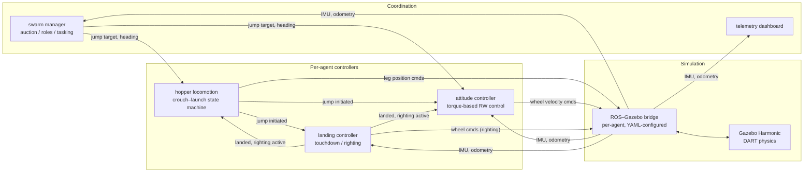
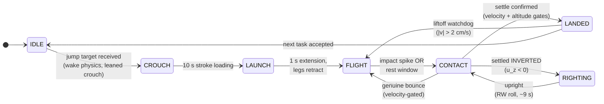
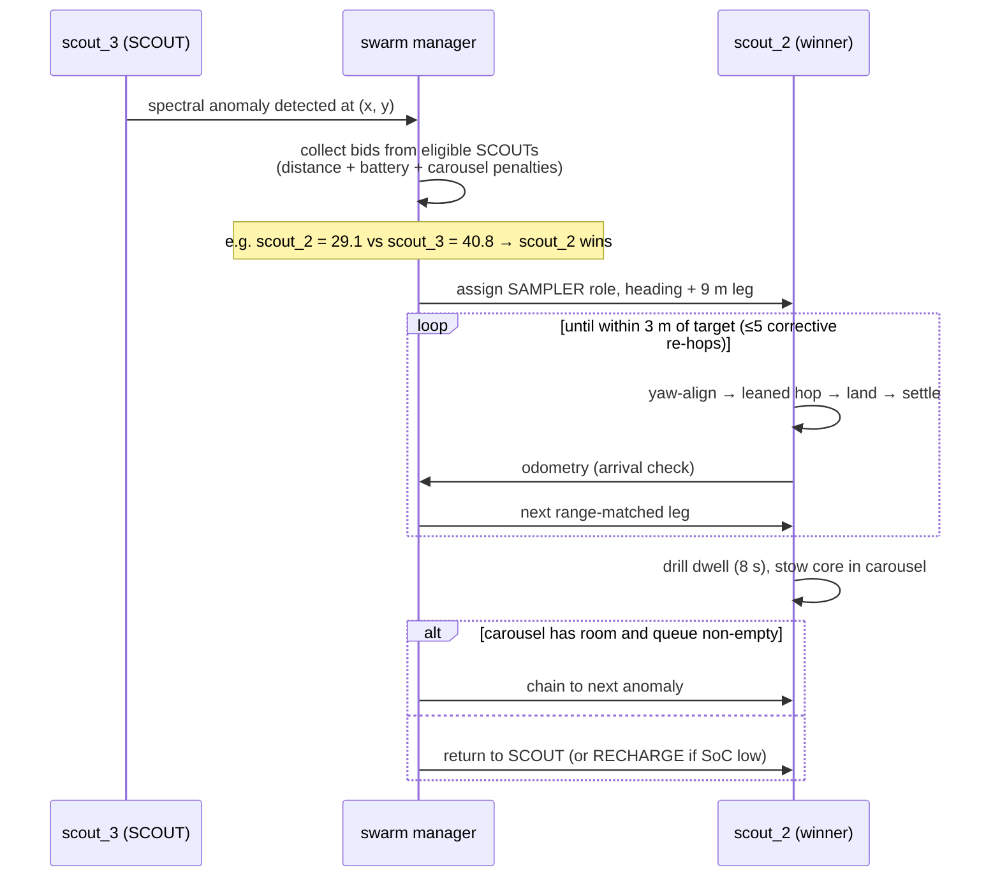

# SpaceHopper: A Bio-Inspired Legged Swarm Robot for Microgravity Asteroid Exploration and Sampling

**Abstract**

*The exploration of low-gravity near-Earth objects (NEOs), such as the C-type asteroid 162173 Ryugu, poses unique traversal and sampling challenges. Traditional wheeled rovers lack sufficient traction in microgravity environments characterized by porous, rubble-pile topography. This paper presents the design and simulation validation of SpaceHopper, a 2.5 kg tri-pedal hopping robot with 3-axis reaction-wheel attitude control, deployed as a three-agent autonomous swarm. A high-fidelity Ryugu environment — terrain derived from the Hayabusa2 shape model, surface gravity of 1.14×10⁻⁴ m/s² — was constructed in the Gazebo Harmonic physics engine, and the complete mission loop (market-based task auction, directional hopping, stabilized ballistic flight, micro-gravity landing detection, reaction-wheel self-righting, and core sampling) was verified end-to-end with live telemetry. Measured performance includes 24.9 mm/s launch separation velocity, 9.1 m of horizontal range per hop, in-flight body rates damped below 0.015 rad/s, and self-righting from full inversion in under 10 seconds. We further report three empirically derived laws of milli-gravity ground operations — contact dynamics, not actuator torque, are the binding design constraint; active landing compliance is destabilizing under feedback latency; and every grounded actuator motion constitutes a propulsion event — which we believe generalize to any small-body surface robot.*

---

## 1. Introduction

Asteroids are primitive remnants of the early solar system, offering vital clues to planetary formation and the origin of water on Earth. Following the success of JAXA's Hayabusa2 mission [1], it became clear that highly mobile, surface-dwelling assets are essential for comprehensive *in-situ* analysis. Ryugu, characterized as a "spinning top-shaped rubble pile" [1], combines extremely low surface gravity with highly uneven terrain. Under these conditions, conventional wheeled locomotion suffers from massive slip and risk of permanent entrapment, while purely passive hoppers such as MINERVA-II [8] sacrifice trajectory control.

We propose a swarm-capable, legged hopping architecture that combines articulated tri-pedal launch mechanics with active reaction-wheel attitude control. This paper details the platform's hardware parameterization and kinematic design, the simulation environment used to validate it, the control architecture that emerged from live closed-loop testing, and the measured performance of the complete three-agent mission loop. Particular attention is given to the ground-contact regime: the majority of the platform's development difficulty concentrated not in flight control, where classical spacecraft methods transfer directly, but in the few seconds surrounding launch and touchdown, where milli-gravity invalidates terrestrial legged-robotics intuition.

## 2. Environmental Simulation Pipeline

Accurate physical evaluation of locomotion strategies necessitates a high-fidelity simulation environment. The system is implemented on ROS 2 Humble with the Gazebo Harmonic (gz-sim 8) physics engine using the DART backend.

### 2.1 Topographical Modeling

A 1025×1025 collision heightmap was derived from the official Hayabusa2 Structure-from-Motion shape model (`SHAPE_SFM_49k_v20180804.obj`) [3]. The selected cross-section reflects the dense cratering and rocky ridges characteristic of Ryugu's equatorial band, mapped onto a 100 m × 100 m traversal field with 5 m of vertical relief.

*Figure 1: Lateral X-axis projection heightmap derived from the Hayabusa2 SfM shape model, detailing Ryugu's equatorial ridge.*

### 2.2 Microgravity and Illumination

The gravity vector was set to 1.14×10⁻⁴ m/s², the lower bound of Ryugu's latitude-dependent surface gravity [1] and the most demanding case for traction and rebound control. The celestial backdrop is the ESO/S. Brunier Milky Way panorama mapped onto an equirectangular sky sphere [4]; scene illumination is a single directional source representing the Sun, consistent with Ryugu's atmosphere-free lighting. Solar power is physically plausible at Ryugu's 0.96–1.42 AU orbit (~960 W/m² at the 1.19 AU semi-major axis — the same regime in which the solar-powered MINERVA-II rovers operated [8]).

*Figure 2: The simulated environment — heightmap regolith terrain beneath the ESO Milky Way panorama, with a landed scout in the foreground and a second agent visible against the galactic band.*

### 2.3 Software Architecture

Each agent runs an identical four-node control stack; a single swarm-coordination node and a telemetry dashboard serve the fleet. All actuator and sensor traffic crosses a per-agent ROS–Gazebo bridge:

*Figure 3: System architecture. The `landed` and `righting_active` flags implement strict actuator arbitration — exactly one node commands any actuator at any time (§7).*

## 3. System Design

The SpaceHopper is a compact, 2.50 kg tri-pedal robot whose mass distribution keeps the center of gravity close to the geometric center:

| Subsystem | Components Included | Mass (kg) | Mass Fraction |
| :--- | :--- | :--- | :--- |
| **Chassis** | Aluminum 7075-T6 core, CFRP structural panels | 0.70 | 28% |
| **Locomotion** | 6× Maxon RE 13 leg motors (hip+knee ×3), planetary gearheads, legs | 0.45 | 18% |
| **Attitude Control** | 3× Maxon EC 20 flat RW motors + flywheels (X/Y/Z) | 0.20 | 8% |
| **Avionics & Sensors** | Flight computer, IMU, S-Band comms | 0.50 | 20% |
| **Power System** | 4× space-grade Li-ion 18650 cells, BMS | 0.30 | 12% |
| **Scientific Payload** | Rotary-percussive micro-corer, storage carousel | 0.20 | 8% |
| **Thermal & Solar** | GaAs solar arrays, Kapton MLI blankets | 0.15 | 6% |
| **Total Operational Mass** | | **2.50 kg** | **100%** |

*Figure 4: The SpaceHopper model — face-on view showing the stereo hazard cameras and navigation camera, UHF antenna, solar array, and the tri-pedal articulated legs with spherical feet.*

### 3.1 Jumping Dynamics

The operational weight on Ryugu is merely $W = 2.50 \times 1.14\times10^{-4} = 2.85\times10^{-4}$ N. A 5 m vertical hop requires potential energy

$$ E_p = mgh = 2.5 \times 1.14\times10^{-4} \times 5 = 1.43\times10^{-3} \text{ J}, $$

and with a leg stroke of $d = 0.1$ m, a mean thrust of only $F = E_p/d = 1.4\times10^{-2}$ N. The hip and knee joints, driven by Maxon RE 13 motors through 67:1 GP 13 gearheads [11], supply up to 134 mNm — a >60× force margin intended to overcome vacuum cold-welding and thermal-blanket stiffness. A central result of this work (§6, §7) is that this margin, while necessary, is far from sufficient: launch performance in milli-gravity is governed by stroke geometry and contact friction rather than torque.

**Launch stroke geometry.** Total foot–regolith friction capacity is $\mu m g \approx 2.9\times10^{-4}$ N; any lateral component of leg force therefore slides the feet rather than lifting the body. The deployed stroke keeps each foot directly beneath its hip through the entire extension (a "zigzag" leg posture — calf angled back inward), so the ground reaction remains vertical. Distance-scaled hopping treats the commanded stroke as a fraction of the full extension, calibrated by the measured full-stroke separation velocity $V_{FULL} = 0.025$ m/s.

**Directional hopping.** A purely vertical stroke has no ground range. Directionality is obtained by combining reaction-wheel yaw pointing (the swarm layer commands a target heading; the yaw-hold loop aligns the body) with a modest forward-lean differential built into the crouch (the leading leg is flexed 0.25 rad further, the trailing pair 0.125 rad less, preserving mean stance height). The lean tilts the thrust vector approximately 34° from vertical, partitioning the measured 24.9 mm/s separation velocity into ~22 mm/s vertical and ~15 mm/s horizontal components. Measured single-hop performance: **9.1 m of horizontal displacement** over a clean ballistic arc (apex +2.2 m, ~13-minute flight), landing settled and confirmed. The launch-torque asymmetry introduced by the lean is bounded and removed within seconds by the attitude controller (§3.2).

*Figure 5: A scout mid-hop. The forward lean is visible in the body attitude; the shadow on the regolith below shows the altitude gained within seconds of the stroke.*

#### 3.1.1 Escape-Velocity Margin and Containment

A sufficiently energetic hop could genuinely exceed escape velocity and depart the body permanently. For a spherical approximation, using Ryugu's ~450 m mean radius [1]:

$$ v_{esc} = \sqrt{2gR} = \sqrt{2 \times 1.14\times10^{-4} \times 450} \approx 0.320 \text{ m/s}. $$

The longest dispatch under nominal swarm operation — a corner-to-corner traverse of the ±45 m tasking field (§4.3), $d \approx 127$ m — would require $v \approx 0.120$ m/s if taken as a single ballistic hop, a 2.7× margin below escape; the deployed range-per-hop dispatcher (§4.3) never requests more than one 9 m leg at a time, keeping operational velocities an order of magnitude below $v_{esc}$. Because the amplitude-to-velocity mapping is empirically calibrated rather than closed-form, the simulation additionally encloses the terrain in collision-only boundary walls and a 100 m ceiling, providing hard containment independent of calibration accuracy.

### 3.2 In-Flight Attitude Control

Uncontrolled tumble, ending in an inverted landing, is a primary failure mode of historical microgravity hoppers. SpaceHopper employs a 3-axis reaction-wheel (RW) assembly on Maxon EC 20 flat motors [10]:

* **Robot moment of inertia:** $I_{bot} = 0.012$–$0.020$ kg·m² about the body z-axis, posture-dependent (legs retracted vs. splayed), computed from the model's per-link inertias via the parallel-axis theorem.
* **Wheel torque budget:** $\tau_{rw} = 0.015$ N·m (short-term permissible; the EC 20 flat datasheet lists ≈8.75 mNm continuous and ≈25.7 mNm stall, placing 15 mNm in the intermittent-duty band appropriate for correction burns of a few seconds).
* **Flywheel inertia:** $I_w = \frac{1}{2}mr^2 = \frac{1}{2}(0.15)(0.06)^2 = 2.7\times10^{-4}$ kg·m².
* **Maximum wheel speed:** 982 rad/s (the datasheet no-load speed), giving a momentum capacity $H_{max} = I_w\,\omega_{max} \approx 0.265$ N·m·s.

At the torque limit in the flight posture, body angular acceleration is $\alpha = \tau_{rw}/I_{bot} = 1.25$ rad/s². A usable correction must arrive at the target angle with zero residual rate; the minimum-time profile is therefore bang-bang [6]:

$$ t_{min} = 2\sqrt{\theta/\alpha} \approx 2.24 \text{ s for } \theta = 90°. $$

The deployed controller deliberately trades speed for monotonic convergence, and both timescales are negligible against ballistic flight times measured in minutes.

**Controller structure.** Two structural lessons from live closed-loop testing shaped the final design. First, attitude error must be computed without small-angle assumptions: the controller rotates the body's local +Z axis into the world frame and forms the cross product with world-up,

$$ \vec{e} = \hat{u}_{local} \times \hat{u}_{world}, $$

a rotation-axis-aligned error valid at any tilt magnitude and independent of yaw. (An initial Euler-angle formulation oscillated at 85–160° tumble angles because body rates cease to correspond to Euler-angle rates there, so its damping term was damping the wrong quantity.) Second, and more fundamentally: a reaction wheel exchanges momentum with the body only **while it accelerates** ($\tau_{body} = -I_w\dot{\omega}_{wheel}$). Any law that commands wheel *velocity* proportional to attitude error stops transferring torque the moment the wheel reaches its commanded speed — leaving steady-state error uncorrected on the ground and a residual spin $\omega_{res} = L_0/(I_{bot} + I_wK_d)$ in flight, both of which were measured before the redesign. The deployed law is therefore the standard torque-based structure [6][7]: a PD law on attitude produces a desired body torque, clipped to the motor budget, converted to wheel acceleration, and integrated into the wheel-speed command:

$$ \tau_{des} = \mathrm{clip}\!\left(K_{ang}\,e - K_{rate}\,\omega,\ \pm\tau_{rw}\right), \qquad \dot{\omega}_{wheel,cmd} = -\tau_{des}/I_w, $$

with $K_{ang} = 0.02$ N·m/rad and $K_{rate} = 0.05$ N·m·s/rad, sized against the whole-robot inertia for an overdamped response ($\zeta \approx 1.1$–$1.6$ across the posture-dependent inertia range) that cannot oscillate by construction. A 1° attitude deadband prevents momentum windup against terrain-imposed tilt (a tripod on regolith never reads exactly level; without the deadband the wheels integrate toward saturation over hours). Rate damping carries no deadband — it acts only during rotation and cannot wind up; a rate deadband was tried and produced a measurable ±1.2° limit cycle at exactly the deadband rate.

Tilt correction is additionally gated on genuine motion ($|v| > 8$ mm/s or $|\omega| > 0.15$ rad/s): torquing a *grounded* body against contact is functionally a rover drive (the mobility principle MINERVA-II exploits deliberately [8]) and, applied inadvertently, was observed to roll resting robots across the terrain and launch them off surface irregularities.

**Momentum budget.** A worst-case single-leg unbalanced launch imparts ≈0.0084 N·m·s of angular momentum, a 31× margin below $H_{max}$. Saturation by a single hop is therefore not credible; the windup path (persistent unreachable error) is closed by the deadband and the landed-state handoff.

### 3.3 Self-Righting

An inverted landing is detected from the IMU quaternion (world-frame z-component of the body-up axis, $u_z = 1 - 2(q_x^2 + q_y^2) < 0$). Righting is performed by the reaction wheels — the actuator with overwhelming authority for this task in milli-gravity: tipping the chassis over its support edge requires only $\tau \approx mgw/2 \approx 2.9\times10^{-5}$ N·m against Ryugu weight, a ~500× margin below the wheel torque budget, and internal momentum exchange is the same principle MINERVA-II used for surface mobility [8]. The maneuver is bang-bang and momentum-neutral: a lateral wheel is driven at full torque (the body counter-rolls), and once the body passes horizontal the wheel is commanded back to zero, braking the roll symmetrically; net wheel momentum returns to approximately zero, so the handoff back to attitude control imparts no kick. Roll axis and sign alternate across retries, making a wrong initial direction self-correcting. Measured performance from a forced full inversion: detection, roll, and stable upright recovery in ~9 s (two attempts, the first having guessed the wrong direction). During the maneuver an explicit arbitration flag silences the attitude controller — two nodes commanding one wheel is a silent last-write-wins conflict (§7).

An earlier leg-sweep righting strategy (alternating splay and asymmetric sweep phases) was retired: it depended on leg-segment ground leverage that vanished when leg collision geometry was reduced to foot spheres, and on stroke dynamics that joint damping (§3.4) suppressed.

### 3.4 Landing Detection and Ground Handling

Touchdown detection on a milli-g body faces a fundamental ambiguity: an accelerometer measures proper acceleration, and a robot *at rest* on Ryugu experiences a support reading of ~10⁻⁴ m/s² — indistinguishable from free-fall at any realistic noise floor. (The same ambiguity shaped MASCOT's multi-sensor settling logic [9] and MINERVA's conservative hop scheduling [8].) The deployed detector fuses:

* **Contact spike** — $|a| > 0.08$ m/s² (motor reaction transients reach ~0.02; genuine impacts exceed 0.05).
* **Rest windows** — altitude confined to a ±2 cm band for 60 s with velocity below 5 mm/s. The window length is set against worst-case *two-sided apex dwell*: a ballistic coast lingers within a ±b band around apex for up to $2\sqrt{2b/g}$ ≈ 37.5 s at b = 2 cm, so a 60 s window cannot false-fire in flight. A velocity-only fallback (|v| < 5 mm/s for 120 s) carries an altitude-drift guard, because free-fall *from rest* also satisfies a pure velocity gate for its first ~44 s ($v = gt$) — a resting robot cannot drift 5 cm; a falling one always does within the window.
* **Liftoff watchdog** — LANDED is not terminal: sustained velocity above 2 cm/s reverts the state machine to FLIGHT, because "landed" must remain true in the physics, not merely in the software.

*Figure 6: Final descent over the ridged heightmap terrain — the antenna shadow on the regolith below marks the touchdown point the detector must confirm.*

After confirmation, the legs simply hold their landing pose. No posture is commanded at or after touchdown — a design rule with an empirical basis (§3.4.1). The complete locomotion cycle, spanning both controllers, is:

*Figure 7: The hop–land–right cycle. Attitude control runs during FLIGHT (motion-gated), stands down during RIGHTING, and holds yaw only when grounded.*

#### 3.4.1 Impact Dissipation: Why Active Compliance Fails in Milli-Gravity

Stiff position-controlled legs behave as near-lossless springs at touchdown: measured restitution from a 1.15 m drop was ≈0.96, producing non-decaying pogo rebound. Three actively controlled compliance schemes were implemented and measured, and **all three added energy at contact**:

| Scheme | Impact v (mm/s) | Rebound v (mm/s) | Outcome |
|---|---|---|---|
| Step to compliant posture at contact | — | — | 0.7–0.9 m kicks, non-decaying |
| Posture ramped over 2 s | 32 | 38 | rebound exceeds impact |
| Zero-stiffness catch (measured joint angles mirrored as targets) | 16 | 22 | rebound exceeds impact |

The third failure is the instructive one: the joint-state feedback crosses a transport layer with finite latency, so the mirrored target *trails* the joint — during rebound the lagged position error torques *with* the motion, pumping the bounce. This is the classic phase-lag instability of delayed feedback, and in milli-gravity there is no weight margin to absorb it.

The deployed solution places dissipation where phase lag cannot exist: passive joint damping in the mechanism itself. A sweep over the damping coefficient measured the launch/landing tradeoff directly:

| $c$ (N·m·s/rad) | Separation velocity | Landing behavior |
|---|---|---|
| 0.005 | 39.8 mm/s | restitution ≈ 0.96, non-decaying pogo |
| **0.05 (deployed)** | **24.9 mm/s** | **decaying bounces; confirmed landing in ~14 min** |
| 0.15 | few mm/s | overdamped launch; landing benign |

At the deployed value, contact damping ratio is $\zeta \approx 0.45$ (effective vertical stiffness ≈48 N/m against the 2.5 kg mass), giving restitution $e \approx e^{-\pi\zeta/\sqrt{1-\zeta^2}} \approx 0.2$ — bounces decay within two to three cycles — while the launch stroke retains a 35% separation-velocity margin over the 3 m-hop requirement. Series-elastic launch elements, which decouple launch delta-v from joint damping entirely, remain the recommended mechanism for flight hardware [5].

*Figure 8: The end state the landing stack is built to reach — a scout settled upright on its legs after a completed hop, holding its landing pose with no commanded motion.*

## 4. Power and Communication Systems

### 4.1 Energy Budget

Powered by a 37.0 Wh space-grade lithium-ion pack:

| Operational State | Subsystem | Peak Power (W) | Avg Continuous Power (W) |
| :--- | :--- | :--- | :--- |
| **Continuous** | Avionics (CPU, IMU, comms Rx) | 2.00 | 2.00 |
| **Continuous** | Reaction wheels (attitude hold) | 5.00 | 1.50 |
| **Intermittent** | Leg motors (launch strokes) | 6.00 | 0.005 |
| **Intermittent** | Micro-corer drill (300 s sequence) | 3.00 | 0.023 |
| | **Total estimated draw** | **16.00** | **3.53** |

Continuous operation yields an estimated 10.5 h of shadowed endurance; the top-mounted GaAs arrays (28% efficiency) generate ~3.5 W net at 1.2 AU, allowing full recovery over the diurnal cycle. In the swarm layer, recharge is modeled as a dedicated RECHARGE role with battery-reserve gating (§4.3).

*Figure 9: The power model operating live — a scout depleted to 25% has been reassigned to RECHARGE and regains charge at +0.60%/tick while its squadmates continue their own tasks.*

### 4.2 Swarm Communication

The architecture supports a decentralized swarm methodology: a low-power (<0.1 W) UHF mesh for intra-swarm communication, which diffracts around boulder-scale obstructions, and an S-band patch antenna for high-gain relay to an orbiting mothership.

### 4.3 Swarm Role Allocation (Market-Based Task Auction)

Mission roles (SCOUT / SAMPLER / RELAY / RECHARGE) are allocated by a single-item market auction in the taxonomy of Gerkey & Matarić [13]. When a spectral anomaly enters the task queue, every eligible SCOUT bids

$$ B_a = d_a + w_b\,(100 - \mathrm{SoC}_a) + w_c\,n_a, $$

where $d_a$ is straight-line distance to the target, $\mathrm{SoC}_a$ the battery state of charge ($w_b = 0.5$ m/%), and $n_a$ the carousel load ($w_c = 5$ m/sample); the lowest bid wins, and agents below a 30% charge reserve abstain. Verified live with three agents, the auction produces differentiated allocation (e.g., bids of 29.1 vs 40.8 m-equivalent deciding a contested target).

The complete tasking flow for one anomaly:

*Figure 10: Auction-based tasking and sampling sequence, as executed live by the three-agent swarm.*

Robustness mechanisms, each mapped to an observed failure mode of naive dispatching: unfinished tasks are re-queued when an agent is forced to RECHARGE or drops offline (10 s odometry-liveness watchdog); arrival is gated on real odometry (within 3 m *and* landed); journeys are dispatched as range-matched legs of at most the measured 9 m hop range, with up to five cooldown-paced corrective re-hops held as an error-correction reserve; core extraction occupies a finite 8 s drill dwell so the power model reflects a real duty cycle; and task coordinates are clamped inside the physical containment boundary, so no assignment is unreachable by construction.

*Figure 11: The mission telemetry dashboard during a live run — differentiated roles (one RELAY, two SAMPLERs en route), per-agent battery and charge rate, attitude indicators, leg and reaction-wheel state.*

## 5. Scientific Payload

Unlike explosive kinetic impactors, the SpaceHopper performs delicate, non-destructive sampling with a hollow rotary-percussive micro-corer at ultra-low RPM. Cores are cached in a sterile three-tube carousel, allowing a single SAMPLER to chain consecutive targets before returning; preserving stratification and volatile organics significantly increases the scientific integrity of retrieved material.

## 6. Results

All results below are from live closed-loop simulation telemetry (IMU, odometry, and physics-engine ground truth), not open-loop estimates.

* **Launch:** full-stroke separation velocity 24.9 mm/s at the deployed damping — 35% margin over the 18.5 mm/s a 3 m hop requires. Clean ballistic arcs with apex energy matching $v^2/2g$ within measurement noise.
* **Directional range:** 9.1 m horizontal displacement per full-stroke hop (thrust tilt ≈34°, ~15 mm/s horizontal / ~22 mm/s vertical), landing settled and confirmed. Figure 12 shows the measured trajectory.

*Figure 12: Measured single-hop trajectory from odometry telemetry — (a) the ballistic altitude profile (apex +2.2 m over a ~13-minute flight) and (b) the straight-line ground track covering 9.1 m.*
* **Flight stabilization:** in-flight body rates damped to 0.005–0.015 rad/s; launch transients of 0.24 rad/s removed within seconds; no persistent yaw spin. A commanded 107° yaw slew converged overdamped and held within 1° at zero rate; a 165° tumble was damped to 3.6° in ~20 s.
* **Self-righting:** recovery from forced full inversion in ~9 s via the reaction-wheel roll, including self-correction of an initial wrong-direction guess.
* **Landing:** decaying-bounce settle and confirmed LANDED in ~14 min after a full-stroke hop; no false confirmations in flight and no post-landing self-ejection across the final verification runs.
* **Swarm autonomy (3 agents):** differentiated role allocation on first boot (RELAY + 2× SCOUT), competitive auctions on detected anomalies, dispatch, range-matched directional hops, and cooldown-paced corrective re-hops — the full loop operating without operator intervention.

## 7. Discussion: Three Laws of Milli-Gravity Ground Operations

The platform's development history yields three findings we consider more valuable than the nominal design margins, each established by direct measurement:

1. **Contact dynamics, not actuator torque, are the binding constraint.** The leg motors carry a >60× force margin over the hop energy requirement, yet launch capability was governed entirely by stroke geometry against a friction capacity of $\mu mg \approx 2.9\times10^{-4}$ N and by contact-time dynamics. Torque margins that would be decisive on planetary surfaces are nearly irrelevant here.

2. **Active landing compliance is destabilizing under feedback latency.** Every actively controlled compliance scheme tested — stepped, ramped, and measured-state-mirroring — *added* energy at contact, the latter through classic phase-lag pumping. Impact dissipation belongs in passive mechanism properties (joint damping, and in future hardware, series elasticity [5]), where phase lag cannot exist.

3. **Every grounded actuator motion is a propulsion event.** Posture changes, stand-up ramps, and reaction-wheel momentum bleeds each ejected a resting robot from the surface during development (up to 0.128 m/s — three times a nominal launch). Internal torque against ground contact is a mobility mechanism [8]; used inadvertently, it is a failure mode. Ground-handling software for milli-gravity bodies must be designed as flight control, not manipulation: after touchdown, the correct number of commanded motions is zero.

## 8. Conclusion

Simulated end-to-end validation demonstrates that tri-pedal directional hopping with reaction-wheel stabilization is a viable locomotion and sampling strategy for microgravity rubble piles. A three-agent SpaceHopper swarm autonomously allocates scientific targets by market auction, traverses at 9.1 m per stabilized hop, lands, self-rights when required, and samples — with every subsystem claim in this paper backed by live telemetry rather than design intent. The three ground-operations laws of §7, together with the quantified launch-versus-landing damping tradeoff of §3.4.1, constitute the platform's principal transferable contribution to small-body robotics; a series-elastic launch mechanism and hardware-in-the-loop validation are the natural next steps toward flight.

## References

[1] S. Watanabe *et al.*, "Hayabusa2 arrives at the carbonaceous asteroid 162173 Ryugu — A spinning top-shaped rubble pile," *Science*, vol. 364, no. 6437, pp. 268–272, Apr. 2019.
[2] Japan Aerospace Exploration Agency (JAXA), "Hayabusa2 Project: Images from the MINERVA-II1 rover," JAXA Hayabusa2 Gallery.
[3] JAXA Data ARchive and Transmission System (DARTS), "Watanabe_2019 Hayabusa2 Shape Models and Derivatives," ISAS/JAXA, 2019.
[4] European Southern Observatory (ESO), "The Milky Way panorama," ESO GigaGalaxy Zoom Project, Image ID: eso0932a.
[5] SpaceHopper Project, ETH Zurich, "SpaceHopper: A Small-Scale Legged Robot for Exploring Low-Gravity Celestial Bodies," arXiv:2403.02831, 2024.
[6] M. J. Sidi, *Spacecraft Dynamics and Control: A Practical Engineering Approach*. Cambridge University Press, 1997.
[7] B. Wie, *Space Vehicle Dynamics and Control*, 2nd ed. AIAA Education Series, 2008.
[8] T. Yoshimitsu, T. Kubota, I. Nakatani, T. Adachi, and H. Saito, "Micro-hopping robot for asteroid exploration," *Acta Astronautica*, vol. 52, no. 2–6, pp. 441–446, 2003.
[9] T.-M. Ho *et al.*, "MASCOT — The Mobile Asteroid Surface Scout onboard the Hayabusa2 mission," *Space Science Reviews*, vol. 208, pp. 339–374, 2017.
[10] Maxon Group, "EC 20 flat Ø20 mm, brushless, 5 Watt," motor datasheet, maxon catalog.
[11] Maxon Group, "RE 13 Ø13 mm, precious metal brushes" and "GP 13 A gearhead (67:1)," motor datasheets, maxon catalog.
[12] G. Dudek, M. Jenkin, E. Milios, and D. Wilkes, "A taxonomy for multi-agent robotics," *Autonomous Robots*, vol. 3, pp. 375–397, 1996.
[13] B. P. Gerkey and M. J. Matarić, "A formal analysis and taxonomy of task allocation in multi-robot systems," *The International Journal of Robotics Research*, vol. 23, no. 9, pp. 939–954, 2004.
