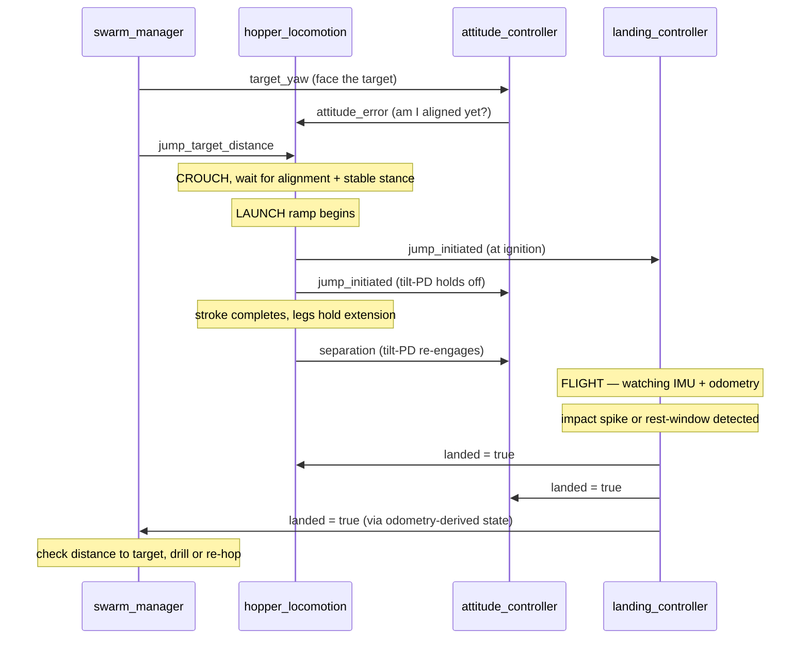

# The SpaceHopper Ryugu Simulation — Complete Study Guide

This is the "explain everything, simply, but for real" document. `Research_Paper.md` is
written for a grader and states results. `research_report.md` explains the environment
build and a handful of deep case studies. This document is different: it starts from
zero and walks through **every subsystem, in order, in plain language**, until you could
rebuild the reasoning from scratch. Where the paper says "we measured X," this document
says "here is why X had to be measured, what we guessed first, why the guess was wrong,
and what the correct physical picture is."

Read it top to bottom the first time. After that, use the table of contents to jump to
whatever you're being asked about.

## Table of contents

1. [The big picture — what problem is this solving?](#1)
2. [Why micro-gravity breaks normal robot intuition](#2)
3. [The robot: SpaceHopper](#3)
4. [The software architecture — how the pieces talk](#4)
5. [The hop, start to finish](#5)
6. [Attitude control — the reaction wheels](#6)
7. [Landing detection — knowing when you've stopped](#7)
8. [Self-righting — getting back upright](#8)
9. [Swarm intelligence — three robots, one mission](#9)
10. [Case studies — the bugs that taught us the physics](#10)
11. [Quick reference — constants, topics, states](#11)

---

<a name="1"></a>
## 1. The big picture — what problem is this solving?

**162173 Ryugu** is a real asteroid, about 900 metres across, that Japan's Hayabusa2
spacecraft visited and sampled between 2018 and 2019. It's a "rubble pile" — not solid
rock, but a loose gravitational aggregate of boulders and dust held together by its own
extremely weak gravity. Surface gravity on Ryugu is about **1.14 × 10⁻⁴ m/s²** — roughly
**8,800 times weaker than Earth's**. For comparison, the Moon's gravity is about 1.6
m/s², itself already "low gravity" — Ryugu is four orders of magnitude below even that.

This project simulates a fictional but physically grounded follow-up mission: three
small hopping robots ("SpaceHopper") exploring Ryugu's surface, finding points of
scientific interest ("anomalies"), and drilling core samples — all coordinating
autonomously, with no human driving them turn by turn. It's built in **Gazebo Harmonic**
(a physics simulator) controlled through **ROS2** (Robot Operating System 2, a
message-passing framework that lets many small programs — "nodes" — cooperate).

The one-sentence version of everything that follows: **at Ryugu's gravity, every
intuition you have from driving a car or a rover on Earth is wrong**, and almost the
entire engineering story of this project is discovering exactly how it's wrong, one
measured failure at a time.

---

<a name="2"></a>
## 2. Why micro-gravity breaks normal robot intuition

### 2.1 Wheels don't work

A wheeled rover moves by spinning a wheel against the ground; friction between the tire
and the ground converts that spin into forward motion. Friction force is proportional to
how hard the wheel presses down, which is proportional to the vehicle's weight (mass ×
gravity). SpaceHopper is a 2.5 kg robot. On Earth its weight would be about 24.5 N —
plenty of force to grip a road. On Ryugu, its weight is:

```
F = m × g = 2.5 kg × 1.14×10⁻⁴ m/s² = 2.85×10⁻⁴ N
```

That's roughly the weight of a single grain of rice on Earth. The maximum friction force
available to a wheel is `μ × F` (μ, the friction coefficient, is at best around 1 for
rough regolith) — so at best you get 2.85×10⁻⁴ N of traction. Any bump, any bit of
loose dust, any tiny disturbance and the wheels simply spin in place or the whole robot
drifts off the ground. This is why real missions to small bodies (Hayabusa2's MINERVA-II
rovers, for example) don't use wheels at all — they **hop**.

### 2.2 Hopping means "everything is a rocket launch, and everything after is orbital
mechanics"

If you can't roll, you push off the ground once and then coast — like a very slow
cannonball. A "hop" for SpaceHopper isn't a little bounce; it's a full ballistic
trajectory, exactly like an artillery shell (with the parabola stretched out enormously
because gravity is so weak). A 9-metre hop on Ryugu takes several **minutes** to complete
in the air, not the fraction of a second a shuffle-step takes on Earth. Every mission
plan has to accept that: navigation happens in hop-sized jumps, and each jump is a
multi-minute wait.

### 2.3 "Any grounded motion is a launch"

This is the single most important idea in the whole project, and it's stated as **Law 3**
in the research paper: *every actuator motion made while touching the ground is a
propulsion event.* On Earth, if a robot arm on a rover twitches while parked, nothing
happens — the rover's weight anchors it. At Ryugu weight, the same twitch can be a bigger
force than gravity itself, and the reaction to that twitch (Newton's third law: every
action has an equal and opposite reaction) is enough to knock the whole robot off the
ground. This project discovered that lesson the hard way, repeatedly — see the case
studies in Section 10 — and the final rule that came out of it is blunt: **once a robot
has landed, the correct number of commanded leg or wheel motions is zero**, until the
next deliberate hop.

### 2.4 Free-fall looks exactly like resting

An accelerometer (the sensor inside an IMU, Inertial Measurement Unit) measures *proper
acceleration* — the acceleration you'd feel pressed into your seat, not gravity itself.
A robot in free-fall (flying through the air on a hop) feels weightless and reads
essentially zero acceleration. A robot **resting motionless on the ground** at Ryugu's
gravity *also* reads essentially zero acceleration, because gravity itself is only
0.000114 m/s² — far below what the sensor can distinguish from noise. This means the
IMU **cannot tell the difference between "flying" and "sitting still"** by itself. Every
landing-detection algorithm in this project has to use a second signal (usually
position/velocity from odometry) to break that ambiguity. This single fact caused more
bugs than anything else in the project — see Section 7 and several of the case studies.

---

<a name="3"></a>
## 3. The robot: SpaceHopper

### 3.1 Body plan

SpaceHopper is **tri-pedal** — three legs arranged 120° apart around a central body,
like a tripod. Each leg has two joints (a hip and a knee), so it can fold up into a
compact crouch or extend out straight. The three-fold symmetry means the robot can land
on any of its three legs and always has a stable footing, unlike a two- or four-legged
design which can end up straddling awkwardly.

Mounted inside the body are **three reaction wheels**, one aligned with each of the
robot's x, y, and z axes. A reaction wheel is a spinning disc, driven by its own small
motor, that does nothing when spun at constant speed — but *while accelerating or
decelerating*, its motor pushes back on the robot's frame with an equal and opposite
torque (this is Newton's third law again, applied across a motor instead of a leg).
Spacecraft have used reaction wheels for attitude control for decades; here they do the
same job for a robot that can't press against anything else to reorient itself while
flying.

### 3.2 Why hop instead of walk?

Legs *could* walk, in principle, but walking requires many small footfalls, each one a
potential "everything is a rocket launch" event (Section 2.3) — every step risks kicking
the robot off the ground entirely. A single deliberate, controlled hop is much easier to
reason about and predict than a sequence of many uncontrolled little pushes. So the
robot's legs are used almost exclusively for one maneuver: crouch down, then extend
explosively (well — "explosively" is relative; see Section 5) to launch the body into a
ballistic arc.

### 3.3 The model file

The physical robot description that Gazebo actually simulates — link masses, joint
limits, motor torque caps, reaction wheel inertia, everything — lives in a file called
`model.sdf`. That file is **generated**, not hand-written: the actual source of truth is
`scripts/generate_detailed_spacehopper.py`, a Python script that builds the SDF (Simulation
Description Format) XML programmatically. If you ever need to change a physical
parameter (mass, joint range, motor torque), you change the generator script and re-run
it — never hand-edit `model.sdf` directly, because the next regeneration would silently
overwrite the edit.

### 3.4 Key numbers to remember

| Quantity | Value | Why it matters |
|---|---|---|
| Robot mass | 2.5 kg | Sets weight, and hence friction and launch impulse budgets |
| Ryugu surface gravity | 1.14 × 10⁻⁴ m/s² | ~8,800× weaker than Earth |
| Robot weight on Ryugu | 2.85 × 10⁻⁴ N | About the weight of a grain of rice |
| Leg motor torque cap | 0.134 N·m | The position controller can't push harder than this |
| Reaction-wheel motor torque budget | 0.015 N·m | Per axis; this is the whole attitude-control "budget" |
| Reaction-wheel spin-axis inertia | 2.7 × 10⁻⁴ kg·m² | Used to convert torque into wheel spin-up rate |
| Reaction-wheel no-load top speed | 982 rad/s | ~9,380 rpm, from the real Maxon EC 20 flat motor spec |

---

<a name="4"></a>
## 4. The software architecture — how the pieces talk

### 4.1 ROS2 nodes and topics, in one paragraph

ROS2 organizes a robot's software as a collection of independent programs called
**nodes**, each doing one job, that communicate by publishing and subscribing to named
data channels called **topics**. A node that wants to tell the world "I just jumped"
publishes a message on a topic like `/scout_1/jump_initiated`; any other node that cares
subscribes to that same topic and gets called automatically whenever a new message
arrives. No node needs to know who else is listening — this is what lets four separate
control programs per robot (times three robots, plus one shared brain) cooperate without
being tightly wired together.

### 4.2 The five kinds of node in this project

Each of the three robots (`scout_1`, `scout_2`, `scout_3`) runs **four per-robot nodes**,
plus there is **one shared swarm-level node**:

1. **`hopper_locomotion`** — owns the legs. Runs a state machine (IDLE → CROUCH →
   LAUNCH → FLIGHT) that turns a "go this far" command into an actual leg-extension
   sequence. Section 5.
2. **`attitude_controller`** — owns the reaction wheels. Keeps the robot pointed the
   right way in flight and holds a heading while grounded. Section 6.
3. **`landing_controller`** — owns nothing directly (it mostly *watches*), but decides
   when the robot has actually landed, detects bad tilts, and runs the self-righting
   maneuver when needed. Sections 7 and 8.
4. **`spawner`** — a small utility node that places the robot models into the world at
   startup. Not part of the control loop.
5. **`swarm_manager`** — the one node that exists **once**, not per-robot. It assigns
   roles (Scout / Sampler / Relay), runs the task auction, tracks battery, dispatches
   hops toward targets, and manages the drill. Section 9.

There's also **`swarm_gui`**, the dashboard you've seen in screenshots — it just
subscribes to status topics from `swarm_manager` and draws them, it has no control
authority at all.

### 4.3 The critical topics, and why they exist

A handful of topics form the backbone that lets these otherwise-independent nodes stay
in sync. Understanding what each one *means physically* is most of what you need to
understand the whole codebase:

| Topic | Publisher → Subscriber | What it physically means |
|---|---|---|
| `/{bot}/jump_target_distance` | swarm_manager → hopper_locomotion | "Hop this many metres in the direction you're currently facing" |
| `/{bot}/target_yaw` | swarm_manager → attitude_controller | "Point this way" (world-frame heading, radians) |
| `/{bot}/jump_initiated` | hopper_locomotion → landing_controller, attitude_controller | "I am now airborne (as of ignition)" |
| `/{bot}/separation` | hopper_locomotion → attitude_controller | "The feet have actually left the ground now" |
| `/{bot}/landed` | landing_controller → hopper_locomotion, attitude_controller, swarm_manager | "I am confirmed at rest on the surface" |
| `/{bot}/ground_contact` | landing_controller → attitude_controller | "I am touching the ground right now" (true only during the CONTACT_DETECTED state) |
| `/{bot}/righting_active` | landing_controller → attitude_controller | "I am running the self-righting maneuver — don't touch the wheels" |
| `/{bot}/attitude_error` | attitude_controller → hopper_locomotion | "How far off my commanded heading am I right now" (used to gate launch timing) |

The theme running through nearly every one of these topics is **arbitration**: making
sure that at any given moment, exactly one node is allowed to command a given actuator
(the legs, or the wheels). Section 10 has several case studies where two nodes
accidentally fought over the same actuator, and the fix was always some version of "add
a flag that says whose turn it is."

### 4.4 A picture of the flow



---

<a name="5"></a>
## 5. The hop, start to finish

This section walks through `hopper_locomotion`'s state machine exactly as the code
implements it today. There are four states: **IDLE**, **CROUCH**, **LAUNCH**, **FLIGHT**.

### 5.1 IDLE

Nothing happens until either (a) `swarm_manager` sends a jump command, or (b) the robot
has sat idle, landed, with no command for 5 minutes (`IDLE_RECOVERY_TICKS`), which
triggers a small automatic "recovery hop" — a safety net so a robot that's fallen out of
the mission loop for some reason doesn't just sit frozen forever.

### 5.2 CROUCH — plant the feet and get ready

The crouch pose bends all three legs so the feet sit almost directly under the hips.
This detail matters more than it sounds: friction on Ryugu is so weak (Section 2.1) that
if the legs pushed at any real sideways angle, the feet would simply **slide** instead
of pressing the body upward. Keeping the ground-reaction force close to vertical is what
lets the crouch actually lift the body at all.

Two gates must both be satisfied before the robot is allowed to launch:

- **Alignment** — the reaction wheels must have already turned the body to face the
  commanded heading (`attitude_error < 0.15` rad, about 9°). Launching mid-turn scatters
  the hop wildly off-target.
- **Stance quality** (`_stance_ok`) — the body must be upright (`uz > 0.85`, where `uz`
  is a simple measure of "how upright," 1.0 = perfectly vertical) and nearly motionless
  (`speed < 0.012` m/s). Launching from a tilted or still-bouncing stance was measured
  scattering both the hop distance *and* the direction unpredictably.

If 45 seconds pass and the stance is still bad, the hop is aborted back to IDLE rather
than firing a doomed hop — the swarm will just try again on its next dispatch cycle.

**Directional lean.** A perfectly symmetric crouch/extend cycle only launches the robot
straight up — no horizontal travel at all. To get *directional* hops, one leg (the one
in the direction of travel) is crouched a little more, and the other two a little less,
tilting the whole thrust vector off vertical. The amount of this tilt (`LEAN`) has gone
through several revisions — see Case Study 10.5 for the full story of why it landed at
0.3 radians (~17°) instead of the larger angle first tried.

### 5.3 LAUNCH — the actual push

This is the part of the project that took the most iterations to get right, because the
first two approaches both failed for non-obvious reasons.

**Attempt 1 — "stroke fraction."** The original idea was simple: to hop a shorter
distance, command a smaller leg extension (say, 27% of full extension for a 9-metre hop
instead of 100%). This seems intuitive — less extension, less push, shorter hop.

It was wrong. The legs are driven by a **position-controlled PID** motor with a torque
cap of 0.134 N·m. When you command a *step* target (instantly "go to this angle"), the
motor slams against its torque limit and drives the leg at essentially the same terminal
speed **no matter how big the step is** — a small step and a big step both get driven at
nearly the same speed, because the motor is saturated (maxed out) either way. Measured
directly: a hop commanded at 27% stroke (intended: 9 metres) actually separated at
0.19 m/s and flew over 76 metres. The "stroke fraction" dial did almost nothing to
control speed — it was nearly useless as a distance control, which is exactly why early
missions saw robots wildly overshoot or undershoot with no consistent pattern.

**Attempt 2 — rate-modulated launch (what's actually deployed).** If commanding a big
step always saturates the motor, then amplitude is the wrong control knob. The fix:
*always* use the full stroke geometry (never scale the target angle down), and instead
control **how fast** the target moves from crouch to extension — a smooth ramp instead
of an instant step. If the ramp moves slowly enough (roughly 1.2 seconds or slower), the
PID never saturates; the leg tracks the ramp closely, and the body's climb rate is set
directly by the ramp's rate. This makes launch speed a genuine, controllable dial:
longer ramp = slower push = shorter hop; shorter ramp = faster push = longer hop.

**A second wrinkle — the straight-leg singularity.** Even with a rate-controlled ramp,
the first version used a *linear* ramp (angle increases at a constant rate) and still
under-delivered separation speed by about 4×. The reason is geometric: as a leg
approaches full extension, it's nearly straight, and a small further change in *joint
angle* produces almost no further change in *foot height* — imagine trying to push a
door open when it's already almost flat against the wall; your hand moves a lot but the
door barely swings. This is called a "singularity" in the leg's Jacobian (the
angle-to-height sensitivity). A linear angle ramp therefore does almost all of its
useful height-gain early and crawls at the very end — exactly the wrong place, since the
*end* of the stroke is when the foot is about to leave the ground and separation speed
is set.

The fix has three parts, all present in the current code:
1. **Quadratic ease-in** — the ramp's progress variable is squared (`s = s²`) before
   being applied, so the target moves slowly at first and fastest right at the very end,
   putting peak push-rate exactly where the body is about to separate.
2. **Release at 90% amplitude**, not 100% — stopping just short of the dead-zone where
   the singularity is worst.
3. **A velocity model recalibrated from measured data**, not pure geometry — rather than
   trying to compute delta-v from stroke height and angle math (which kept being wrong
   by factors of 4–5×), the ramp duration formula (`T = V_GAIN / v_required`) uses an
   empirical gain constant, tuned against actual measured hop ranges from live telemetry
   runs.

### 5.4 FLIGHT — separating cleanly

Once the stroke completes, the legs don't just snap back to neutral instantly. That was
tried and it broke landing detection: an instant step commands enormous torque (the same
saturation problem as Attempt 1), which jerks the IMU hard enough that
`landing_controller` mistook the retraction *itself* for a landing impact, while the
robot was still just centimetres off the ground — every hop looked like it "landed"
immediately in place, and the swarm could never make progress. See Case Study 10.7.

The fix: hold the extended pose for about 8 seconds (enough time to genuinely clear the
ground), then retract over a slow 4-second ramp with a negligible IMU signature. The
`jump_initiated` signal (telling other nodes "I'm airborne") is also sent right at
ignition rather than at the end of the stroke, and a **separate** `separation` signal
marks the true moment the feet clear the ground — different nodes need different
timing information, and conflating them was a recurring source of bugs (see Section 6.3).

---

<a name="6"></a>
## 6. Attitude control — the reaction wheels

### 6.1 The physics of a reaction wheel

A reaction wheel is a small flywheel with its own motor. Spinning it at a *constant*
speed applies zero net torque to the robot body — but *changing* its speed does, because
of Newton's third law: the motor pushes on the wheel to speed it up, and the wheel pushes
back equally on the motor (and therefore the robot frame) in the opposite direction.

```
τ_body = − I_wheel × (dω_wheel/dt)
```

This is the single equation the whole attitude controller is built around. If you want a
certain body torque `τ_body`, you command the wheel to accelerate at
`−τ_body / I_wheel`. Three wheels (x, y, z axes) give control over all three rotation
axes independently.

### 6.2 PD control on attitude — the concept

**PD control** (Proportional–Derivative) is a standard way to steer something toward a
target: apply a correcting force proportional to *how far off* you are (the
"proportional" term — bigger error, bigger push) plus a force proportional to *how fast
you're already moving* (the "derivative"/rate term — this acts as a brake so you don't
overshoot and oscillate). Written for one axis:

```
τ = K_ang × error − K_rate × rate
```

For yaw (turning left/right), `error` is just the difference between the target heading
and the current heading. For **tilt** (roll/pitch — is the robot leaning over?), the
early version of this code tried to extract "roll" and "pitch" angles the conventional
way (Euler angles), but that approach mathematically breaks down at large tilt angles
(a real limitation called gimbal lock) — and this robot genuinely tumbles through large
angles regularly. The fix used instead: take the robot's own "up" direction (its local
+Z axis) and rotate it into world coordinates; the cross product of that vector against
true world-up gives a well-behaved error vector at *any* tilt angle, with no
discontinuities. You don't need to follow the vector-math derivation to use this
concept — the important idea is: **"how tilted am I" is measured directly as an angle
between two 3D directions, not by trying to decompose orientation into separate roll and
pitch numbers**, because that decomposition has blind spots this robot runs into.

### 6.3 Law 4: attitude authority must be tied to *commanded* flight

This is the deepest lesson in the whole project, discovered on 2026-07-18 after a
**twelve-hour** simulation run produced zero completed missions. Here's the chain of
cause and effect, in order:

1. Early logic armed "full attitude control" (the strong tilt-correcting PD law)
   whenever the robot's `landed` flag was `False` — i.e., whenever it looked airborne.
2. But a robot bouncing around on the ground, tumbling after a rough landing, *also*
   reports `landed = False` for a while — it looks exactly like "airborne" from that
   flag's point of view.
3. So the full-strength wheel torque engaged on a grounded, tumbling robot.
4. But wheel torque against a surface **is** a launch impulse (Section 2.3 / Law 3) —
   the reaction wheel torquing the body pushes the feet against the ground, and the
   ground pushes back, moving the robot.
5. That motion kept the robot bouncing, which kept `landed = False`, which kept full
   attitude control engaged, which kept torquing the robot against the ground...

This is a **self-sustaining feedback loop** — a pump, not a controller. The fleet spent
twelve hours in this loop: 149 aborted launch attempts, 87 self-righting attempts, and
zero completed sampling missions, because the robots were never actually *at rest* long
enough for anything downstream to proceed.

The fix, now called **Law 4** in the paper, is a rule about *when* the strong controller
is even allowed to run: full attitude authority is granted only between a **commanded**
ignition (the moment `hopper_locomotion` actually starts a deliberate hop) and the first
ground contact after it — never just because the `landed` flag happens to read false.
Everything else — any uncommanded motion, any bounce, any post-landing tumble — gets
routed through a **dissipation-only** rate-damping law instead:

```
τ = − K_rate × rate      (no proportional/position term at all)
```

This law can only ever *remove* energy, never add it, because power delivered by a
torque opposing the current rotation rate is always negative
(`P = −τ × rate < 0`, always, by construction — the torque is defined to point exactly
opposite the current spin). A controller built this way is *physically incapable* of
sustaining a pump loop, no matter what triggers it. This is the single most important
design principle to internalize from this whole project: **when you cannot fully trust
your own "am I flying or not" signal, build the fallback controller so that it is safe
by construction, not safe because you were careful.**

### 6.4 The stroke-hold exception

One more subtlety: during the LAUNCH ramp itself (Section 5.3), the deliberate lean
(Section 5.2) *intentionally* tilts the body to aim the thrust. If the tilt-correcting PD
law were active during the stroke, it would fight the lean and try to level the body —
which was tried, and measured directly: a commanded 9-metre hop flew for over 11 minutes
almost perfectly straight up, travelling only 0.16 metres horizontally, because the
attitude controller had cancelled the entire intended tilt. So tilt-*position* correction
is explicitly held off from ignition to separation — but *rate-only* damping stays active
during the stroke (same trick as Law 4: it can only remove energy), which resists any
runaway tip-over (Case Study 10.6) without fighting the deliberate lean.

---

<a name="7"></a>
## 7. Landing detection — knowing when you've stopped

### 7.1 Why this is hard

Recall Section 2.4: an IMU can't tell "flying" from "resting" by acceleration alone,
because both read close to zero at Ryugu's gravity. `landing_controller` has to combine
several imperfect signals to make a confident decision, and it runs as its own explicit
state machine: **IDLE → FLIGHT → CONTACT_DETECTED → (LANDED or RIGHTING)**.

### 7.2 Detecting the moment of impact

The primary signal is an acceleration **spike**: a genuine impact produces a short burst
of proper acceleration well above the free-fall noise floor (the threshold used is
0.08 m/s²). This sounds simple, but the very first version used a much lower threshold
(0.02 m/s²) and it kept false-triggering on ordinary motor activity — reaction-wheel
torque reactions and leg-joint corrections routinely produce transient accelerations in
that same tiny range, since they're driven by *motor* torque limits that have nothing to
do with how weak gravity is here. A false "contact detected" event while the robot was
still several metres in the air would immediately start the settle-and-confirm sequence
and could gate a science action (drill deployment) despite the robot not being on the
ground at all.

### 7.3 The rest-window fallback

Some landings never produce a clean spike at all — a very soft touchdown, or a robot
that was already resting when its node restarted. For those cases there's a second,
independent detector: if altitude stays within a tight band (2 cm) *and* velocity stays
below 5 mm/s for a full 60 seconds, the robot must be sitting on something (a genuinely
falling object cannot hold still that precisely for that long). The 60-second window
isn't arbitrary — it comes from a real calculation: a slow ballistic bounce can *coast*
near its apex (the top of its arc, where vertical speed briefly passes through zero)
for up to about 37.5 seconds while still genuinely in flight, so the window has to be
comfortably longer than that worst case or it would falsely declare "landed" at the peak
of a bounce, mid-air.

### 7.4 Why "catching" the impact was the wrong idea (the pogo lesson)

The very first landing design tried to be clever: the instant contact was detected, snap
the legs into a soft, compliant "catch" posture to absorb the impact, like a person
bending their knees when they jump down off a wall. Every version of this idea, tried and
measured, made things **worse**:

- **Instant step to a soft posture** — with the leg motors' gains high enough to have
  useful launch authority, the same motors are also *stiff* — so "stepping" to a soft
  target actually whipped the legs hard against the ground, kicking the robot back up
  into a non-decaying bouncing loop (a "pogo stick" effect) with bounce heights measured
  around 5.7 metres, repeating.
- **A 2-second ramped soft posture** (softer version of the same idea) — still added
  energy on each bounce (impact speed 32 mm/s in, rebound 38 mm/s out — *faster* than it
  arrived).
- **Mirroring the measured joint angles as the target** (a "zero-stiffness" catch,
  trying to just follow the leg passively) — this was worse still, because the sensor
  feedback that tells the controller where the leg currently is arrives with a small
  time lag, and by the time the controller reacts, the leg has already moved on — the
  lagged correction ends up pushing in the *wrong* direction (mid-rebound rather than
  mid-impact), pumping the bounce instead of damping it.

The lesson, generalized: **active, software-driven compliance is dangerous whenever
there's any feedback delay**, because a delayed correction doesn't damp the current
motion — it reacts to where the motion *was*, which during a bounce is functionally the
opposite of where it *is*. The eventual fix was to stop trying to control the impact
actively at all: **do nothing with the legs during contact** (zero posture commands),
and let the impact energy dissipate through a purely physical, lag-free mechanism —
increased joint damping baked directly into the model itself (`<damping>` in the SDF,
raised from 0.005 to 0.15). A physical damper has no communication delay because it
isn't "told" anything; it just resists motion as it happens.

### 7.5 The four-state picture

- **FLIGHT** — watching for either an impact spike or the rest-window fallback.
- **CONTACT_DETECTED** — hands-off (no leg commands at all); waiting to see whether this
  settles (→ LANDED / RIGHTING) or bounces back up (→ FLIGHT again).
- **LANDED** — confirmed at rest. A "liftoff watchdog" keeps checking velocity even
  here — if the robot starts moving again for a sustained 2 seconds, it reverts straight
  back to FLIGHT so every downstream system (attitude control, drill gating) re-arms
  correctly.
- **RIGHTING** — the robot settled but is tilted too far over; see Section 8.

---

<a name="8"></a>
## 8. Self-righting — getting back upright

### 8.1 The first approach (legs) and why it was abandoned

The first self-righting attempt used the legs: splay them out flat, then drive one leg
through a big asymmetric sweep to try to roll the body over, like a turtle trying to
flip itself. This depends on the sweeping leg getting real grip ("hooking") into the
ground, and once other fixes changed the foot collision shape and increased joint
damping (Section 7.4), the sweeps lost the leverage they needed and simply failed every
attempt.

### 8.2 The reaction-wheel roll (what's deployed now)

The wheels are a far more reliable actuator here, and they use exactly the same physics
as attitude control (Section 6.1): spin a wheel hard, and the body counter-rolls in the
opposite direction. For a badly tilted or fully inverted robot (`uz < 0.2`, i.e. tipped
more than about 90°), the sequence is **bang-bang** control — full torque one way to
start the roll, then full torque the opposite way (a "brake") once the body has rolled
past horizontal, symmetrically cancelling the momentum so the robot ends up stopped
right-side up instead of overshooting into a roll the other way. If one attempt fails
(still not upright after ~15 seconds), the next attempt alternates the roll axis and
sign, so a wrong first guess self-corrects on the retry rather than repeating the same
failed maneuver forever, up to 5 attempts.

### 8.3 The gap that caused 149 stranded robots (and the fix)

The tilt threshold for triggering righting and the tilt threshold required to *launch* a
hop used to be different numbers (`uz < 0.7` triggers righting; `uz > 0.85` required to
launch). Any robot that settled in between — tilted more than 0.85 but less than
0.7-away-from-upright — was invisible to both checks: too upright to trigger
self-righting, not upright enough to pass the launch gate. It would sit there forever,
aborting every crouch attempt. This "dead band" was directly responsible for most of the
149 aborted crouches in the twelve-hour stall (Section 6.3). The fix simply aligned the
two thresholds to the same value (0.85), so nothing can fall in between.

### 8.4 The momentum-kick bug — righting itself was launching robots

Once partial tilts (not full inversions) started triggering a gentle correction too, a
subtle new bug appeared: the very first version re-computed which direction to roll
*every single sensor tick*, all the way through the maneuver. As the body rolled toward
upright and briefly overshot, the "correct direction" flipped — and the code would
instantly reverse the wheel command, hard, right then. Each reversal is a fresh, large
momentum transfer, and — same physics as everywhere else in this document — that
momentum transfer reacts against the ground. Measured directly: 70 of these reversal
kicks in one run pumped a robot to over 40 metres of altitude, an accidental "launch"
caused entirely by a controller meant to gently fix a small tilt.

The fix: compute the roll direction **once**, at the start of the attempt, and hold it
fixed for the whole maneuver — even if the robot briefly overshoots past upright, that's
tolerated rather than chased. This is the same underlying lesson as Section 6.3's Law 4,
applied one level down: a controller that keeps re-committing to a fresh strong action
based on a noisy or fast-changing signal is dangerous near the ground; commit once, hold
steady, and let a slower supervising loop (the overall attempt/retry structure) handle
correction on a longer timescale instead.

---

<a name="9"></a>
## 9. Swarm intelligence — three robots, one mission

### 9.1 Roles

`swarm_manager` assigns each robot one of four roles at any time: **Scout** (default —
wander and passively "detect" points of interest), **Sampler** (actively travelling to
and drilling a detected anomaly), **Relay** (parked, standing by to transmit collected
data — always exactly one robot holds this role if the swarm has more than one member),
and **Recharge** (battery too low, standing down until it climbs back above 80%).

### 9.2 The auction — why "market-based" rather than "first available"

When a new anomaly is queued, every currently-available Scout submits a **bid** — a
single number representing how costly it would be for *that* robot to take the job. The
lowest bid wins. The bid formula combines three things:

```
bid = distance_to_target
    + (100 − battery%) × 0.5
    + samples_already_carried × 5
```

Distance dominates (further robots cost more, as you'd expect), but a low-battery robot
or one whose sample carousel is already partly full is penalized too, so a fresher,
emptier robot can win even if it's slightly further away. This is what makes the
allocation "market-based" rather than arbitrary — the earliest version of this code just
grabbed the first idle robot in a list regardless of where it actually was, which could
easily send the *farthest* robot on the longest possible trip for no reason.

### 9.3 Corrective re-hops — hops don't land exactly on target

A single hop, even a well-calibrated one, won't land precisely on the requested spot —
there's real-world (well, real-simulation) scatter. If a Sampler lands and confirms
`LANDED` but is still further than the arrival radius (4 metres) from its target, it
gets a **corrective re-hop** toward the remaining distance, up to 5 attempts, with a
90-second cooldown between attempts (a full hop-and-settle cycle takes at least that
long, so re-hopping too eagerly would just fire on stale position data). If all 5
retries fail, the target goes back into the general queue and the robot stands down to
Scout — an unreachable target should never permanently strand a robot.

### 9.4 Adaptive heading calibration — teaching each robot its own bias

This is one of the most interesting fixes in the whole project, and it's a small,
self-contained example of a **calibration loop** — a pattern used constantly in real
navigation systems (this is literally how ship and aircraft dead-reckoning navigation
has worked for centuries: measure your actual drift, and aim off by it next time).

After the launch and attitude fixes in Sections 5 and 6 were in place, hops were finally
landing at real, non-trivial distances — but often in the *wrong direction*, and each
robot's error was consistent rather than random: one robot consistently landed about 11°
off its commanded heading, while two others landed almost exactly **backwards** — 170 to
190 degrees off, meaning "hop east" reliably sent them roughly west. This is a classic
signature of a **systematic bias** (a per-unit quirk — maybe a subtle asymmetry in how
that particular robot's crouch geometry resolves) rather than random noise, and
systematic biases are exactly what a calibration loop is good at removing.

The fix: every time a robot completes a hop, `swarm_manager` compares where it *actually*
ended up against where it was *told* to go, and updates a running per-robot "bias"
estimate — the difference between commanded and achieved heading, blended smoothly over
time (an exponential moving average, "EMA" — a simple way to average a noisy stream of
measurements that gives more weight to recent readings without needing to store the
whole history). The next dispatch aims off by the learned bias, so a robot that's
consistently hopping backwards gets told to face *away* from its target — which, biased
backwards, correctly sends it *toward* the target. A backwards robot self-corrects
within about two hops.

Two subtleties mattered for getting this right, both discovered by measuring what the
naive version actually did:
- **Measure at the right moment.** The first version measured displacement between one
  dispatch and the next, which includes tens of seconds of post-landing bounce drift and
  righting-maneuver rolling — noise, not signal — and the learned bias swung wildly
  (over ±140° between updates) as a result. The fix measures displacement specifically
  at the exact instant `landed` transitions from false to true (the "rising edge") — the
  cleanest, least-contaminated snapshot of "where did the hop actually end."
- **Measure against what was actually commanded, not what was desired.** The bias
  compensation happens *before* the hop; the raw offset used to update the bias has to
  be computed against the post-compensation heading that was truly sent, not the
  original desired heading — otherwise the calibration ends up measuring only its own
  leftover residual error and slowly erases the correction it just learned.

### 9.5 Sensor-range realism

An earlier version of the anomaly-detection code picked a random point anywhere within
the entire ±45-metre world for a Scout to "detect," regardless of how far away that point
was from the Scout doing the detecting. Physically, that makes no sense — a robot's
onboard spectrometer or lidar has a real, finite sensing range; it cannot "detect" a
surface anomaly 50 metres away any more than a flashlight beam reaches across a football
field. The fix constrains detected anomalies to within 4–12 metres of the detecting
robot's *actual current position*, which is both more physically honest and — as a
welcome side effect — means newly-found targets are the sort of distance the swarm can
reach in one or two hops rather than requiring a dozen.

### 9.6 The sampling cycle

Once a Sampler is confirmed `landed` and within the arrival radius of its target, the
core drill deploys (published on `/{bot}/cmd_drill`), stays down for a fixed dwell period
representing real drilling time (not an instant extraction), and the resulting core is
stowed in one of three carousel tube slots. If the carousel still has room and there's
another anomaly queued, the robot chains directly to the next target rather than
returning to base after every single sample — this "carousel chaining" behavior is what
lets one Sampler service several targets per trip instead of one.

---

<a name="10"></a>
## 10. Case studies — the bugs that taught us the physics

Each of these follows the same shape: **symptom** (what was observed), **investigation**
(how the cause was actually pinned down, not guessed), **root cause** (the physical or
software explanation), and **lesson** (the generalizable takeaway). Reading these in
order roughly retraces the project's actual timeline, and each one built on the lesson
of the last.

### 10.1 The IMU that couldn't tell flying from resting

**Symptom:** the attitude controller's tilt-correction wheels slowly wound up to their
maximum speed (982 rad/s) over the course of an unattended overnight run, even though
the robot was sitting still and, by eye, looked fine.

**Investigation:** logged the raw attitude error over the whole run instead of just
sampling it occasionally, and found a *persistent, tiny* residual (about 0.1°) that
never actually reached zero — real terrain isn't perfectly flat, so a robot resting on
regolith always holds some small, physically unavoidable tilt.

**Root cause:** the controller was integrating torque into wheel *speed*
(Section 6.1) with no deadband — meaning any nonzero error, however microscopic, kept
adding a little more torque forever, slowly saturating the wheel over hours even though
nothing was visibly wrong moment to moment.

**Lesson:** an integrating controller needs an explicit "close enough" deadband on the
*position* term, or it will patiently walk itself into saturation on a target that can
never be reached exactly (a perfectly flat rest tilt, in this case). Note the fix does
*not* deadband the rate/damping term — damping only ever acts while the body is actually
moving, so it cannot itself cause windup, and deadbanding it was tried and caused a
different bug (a small oscillation trapped inside the deadband walls).

### 10.2 The stand-up ramp that launched robots

**Symptom:** a robot confirmed `LANDED`, then a few seconds later was measured moving at
0.128 m/s — three times the speed of a normal deliberate launch — with every safety
check disarmed because the state machine believed it was safely on the ground.

**Investigation:** correlated the exact timestamp of the unexpected motion against the
event log and found it landed exactly at the moment a "fold legs to neutral stance"
routine fired, intended just to tidy up the leg posture after landing.

**Root cause:** the fold command was issued as an instant step, and by that point in the
project the leg motor's control gains had already been raised (for launch authority) to
the point where they were genuinely stiff — so "gently folding the legs" at those gains
was, physically, no different from firing a small launch. This is Section 2.3's Law 3
in its purest form: *any* leg motion at Ryugu weight is a potential launch, even ones
intended purely as housekeeping.

**Lesson:** there is no such thing as an "innocuous" leg command once landed. The
eventual fix wasn't to make the fold gentler — it was to **remove the post-landing fold
entirely**. The legs simply hold whatever pose they landed in; the next crouch's own
ramp re-poses them from scratch anyway, so the fold was solving a problem (messy resting
posture) that didn't actually need solving.

### 10.3 The pogo stick (see also Section 7.4)

**Symptom:** a landing robot bounced repeatedly, with each bounce reaching roughly the
*same* or greater height as the last, instead of settling — apex heights around 5.7
metres, non-decaying.

**Investigation:** measured impact speed versus rebound speed directly across several
different "catch" strategies (step to soft posture; ramped soft posture; mirrored
zero-stiffness catch) and found every single one produced a rebound speed *equal to or
greater than* the impact speed — energy was being added at every bounce, not removed.

**Root cause:** explained fully in Section 7.4 — any actively-commanded compliance
scheme introduces either motor stiffness (if commanded too abruptly) or feedback lag (if
smoothed), and either one can pump energy into a bounce instead of absorbing it.

**Lesson:** when a feedback loop has an inherent delay, don't trust it to be your primary
energy-absorption mechanism near a resonant or bouncy system — prefer a physical,
delay-free damping element (here, joint damping baked into the model itself) over a
software approximation of the same idea.

### 10.4 The retraction that faked a landing

**Symptom:** the swarm made zero mission progress for hours; every hop appeared to
"land" almost immediately, essentially in place, even though the ramp-based launch from
Section 5.3 was, by itself, working correctly.

**Investigation:** looked at raw IMU acceleration readings in the milliseconds right
after each launch stroke completed, and found a sharp acceleration spike — 0.27 to
0.57 m/s², several times the 0.08 m/s² contact-detection threshold — occurring at the
exact instant the legs were commanded to retract, while the robot's actual altitude was
still only about 2 centimetres off the ground.

**Root cause:** the legs used to retract with an instant step the moment flight began,
and that step-commanded retraction produced a jerk large enough that `landing_controller`
read it as a genuine touchdown impact. Every hop was scoring itself "landed" a fraction
of a second after leaving the ground, near-zero distance travelled.

**Lesson:** an actuator's *own* motion can masquerade as a sensor event if the two
systems aren't coordinated in time. The fix (Section 5.4) has two parts working
together: don't retract abruptly (hold the pose, then retract on a slow ramp with a
negligible IMU signature), *and* give the landing detector an explicit "ignore contact
spikes for this many seconds after a commanded launch" window, so even a residual
actuation transient can't be mistaken for a real landing.

### 10.5 The lean that couldn't decide how strong to be

**Symptom:** across several iterations, directional hops were either almost purely
vertical (negligible horizontal travel) or so exaggerated a lean that the robot tipped
completely over mid-stroke instead of launching at all.

**Investigation:** this was tuned iteratively with direct measurement at each step
(rather than guessed once) — at a shallow lean (14°), only about a quarter of the
separation speed went into the horizontal direction, and because overall separation
speed was already small at that point in the project, the *residual* wobble from
imperfect stance was the same order of magnitude as the *intended* horizontal push,
making hop direction essentially random. Doubling the lean angle roughly doubled the
horizontal share and moved the launch angle closer to the ballistic optimum — but pushed
too far (0.5 radians, about 29°), it was later measured directly tipping the robot's
uprightness from 0.85 down to 0.38 *during a single stroke*, because at Ryugu's minuscule
weight there is essentially nothing holding the stance down against an aggressive
asymmetric push.

**Root cause:** the lean angle sits on a genuine trade-off curve between "enough
horizontal thrust to be reliably directional" and "not so much asymmetric leg force that
the robot tips over before it even separates" — and because the robot's weight is so
tiny, that safe window is narrower than intuition from a normal-gravity robot would
suggest.

**Lesson:** a single free physical parameter can have two competing failure modes on
opposite ends of its range, and finding the safe middle requires measuring actual
outcomes at each candidate value rather than reasoning from one intuition alone (e.g.
"more lean = more range" is true right up until it very much isn't).

### 10.6 The mid-stroke tip-over

**Symptom:** occasional launches produced a robot that, instead of ascending cleanly,
visibly rolled over during the stroke itself and separated (if at all) at a essentially
random angle.

**Investigation:** directly measured uprightness (`uz`) continuously through a stroke
and found it could collapse from 0.85 to 0.38 within a single 3.5-second ramp — i.e. the
robot was tipping over *during* the push, not after.

**Root cause:** the leaned crouch (Section 10.5) inherently means one leg ends up much
more extended than the other two at any given moment mid-stroke, and with essentially no
weight holding the stance down, that asymmetry alone is enough to roll the body over
before separation if the stroke runs long enough at that lean angle.

**Lesson / fix:** two complementary safeguards, matching the general pattern from Law 4
(Section 6.3) of "make the failure physically impossible rather than just less likely."
First, a direct **mid-stroke abort**: if uprightness measured during the ramp ever drops
below 0.7, the stroke is aborted immediately and the legs retract gently rather than
completing a doomed, randomly-aimed launch. Second, the rate-only tilt damping described
in Section 6.4 runs *throughout* the stroke specifically to resist this kind of runaway
roll, without touching the deliberate lean itself.

### 10.7 The twelve-hour stall (full story: see Section 6.3)

Already told in detail as Law 4 — included here in the list because it's the single
highest-value case study in the project. If you only study one of these ten, study that
one: it's the clearest example in the whole codebase of a controller that was locally
reasonable at every individual decision point, yet globally created a runaway feedback
loop, and the general fix (route uncertain/uncommanded cases through an
energy-cannot-increase fallback law) is a pattern worth remembering for any control
system, not just this one.

### 10.8 The righting maneuver that launched robots into orbit

Already told in detail in Section 8.4 — a controller meant to make a small correction
kept re-committing to a fresh strong action every tick, and each fresh commitment cost
real momentum transferred against the ground. The general lesson (commit once per
attempt, don't re-aim continuously against a noisy fast-changing target near the ground)
generalizes directly from the earlier Section 6.3 lesson, applied one level down in the
same subsystem family.

### 10.9 The heading bias hiding inside "random" scatter

Already told in Section 9.4 — worth re-emphasizing here as a case study in its own
right because it's a different *kind* of bug than the others: not a physics-of-contact
problem, but a **measurement design** problem. The swarm was for a while written off as
having "random" navigation error, and it took specifically reconstructing full hop
trajectories from raw telemetry (not just looking at final positions) to notice the
errors were *not* random at all — they were consistent, per-robot, and therefore
learnable. The general lesson: before building a fix for "noisy" behavior, check whether
it's actually noise, or a bias wearing noise's clothing — the two need completely
different fixes (averaging/filtering for real noise; calibration for a bias).

---

<a name="11"></a>
## 11. Quick reference

### 11.1 The four hopper_locomotion states

| State | Meaning |
|---|---|
| IDLE | Waiting for a jump command (or the 5-minute self-recovery timeout) |
| CROUCH | Planting feet, waiting for heading alignment + stable upright stance |
| LAUNCH | Running the eased stroke ramp; may abort mid-stroke if tipping |
| FLIGHT | Holding extension for clearance, then slow-retracting; landing_controller owns the rest |

### 11.2 The six landing_controller states

| State | Meaning |
|---|---|
| IDLE | Startup; self-arms into FLIGHT or CONTACT_DETECTED based on first readings |
| FLIGHT | Watching for an impact spike or the rest-window fallback |
| CONTACT_DETECTED | Hands-off; settling, or bouncing back to FLIGHT |
| SETTLING | (reserved; current logic resolves directly from CONTACT_DETECTED) |
| LANDED | Confirmed at rest; liftoff watchdog + landed-tilt watchdog both active |
| RIGHTING | Reaction-wheel roll maneuver in progress |

### 11.3 Key tunable numbers and what they physically represent

| Name | Value | Meaning |
|---|---|---|
| `contact_accel_threshold` | 0.08 m/s² | Acceleration spike that counts as a genuine impact |
| `flight_accel_threshold` | 0.005 m/s² | Below this reads as free-fall |
| `REST_Z_BAND` / `REST_Z_TICKS` | 2 cm / 60 s | Rest-window fallback: "hasn't moved" test |
| `LIFTOFF_VEL` / `LIFTOFF_TICKS` | 0.02 m/s / 2 s | How much sustained motion reverts LANDED → FLIGHT |
| `K_ang` / `K_rate` | 0.05 / 0.066 | Attitude PD gains (stiffness / rate damping) |
| `tau_max` | 0.015 N·m | Reaction-wheel motor torque budget per axis |
| `LEAN` | 0.3 rad (~17°) | Forward-lean differential that aims a hop |
| `V_GAIN` | 0.12 m | Empirical launch-ramp velocity-model constant |
| `ARRIVAL_RADIUS` | 4.0 m | How close counts as "arrived" for drilling |
| `MAX_HOP_RETRIES` | 5 | Corrective re-hops before a target is requeued |

### 11.4 The Four Laws of Milli-Gravity Ground Operations (from the paper)

1. **Contact dynamics, not actuator torque, are the binding design constraint.** Motor
   force margins that matter on Earth are nearly irrelevant here; stroke geometry and
   friction limits dominate instead.
2. **Active landing compliance is destabilizing under feedback latency.** Any delayed
   correction near a bouncing system risks pumping energy in rather than damping it out.
3. **Every grounded actuator motion is a propulsion event.** After touchdown, the
   correct number of commanded leg or wheel motions is zero.
4. **Attitude authority must be tied to commanded flight, not to sensed motion.** A
   controller armed by an ambiguous "am I flying" signal can create a self-sustaining
   energy pump; build the fallback so it can only ever remove energy, never add it.

---

*This document is a study companion, not a submission artifact — it's meant to be read,
re-read, and argued with. If any explanation here doesn't match what you see in the
code, the code is the ground truth; treat the mismatch as a bug in this document and dig
into the relevant `.py` file's comments, which were written at the same time as every
fix described above and carry the same reasoning in more technical form.*
