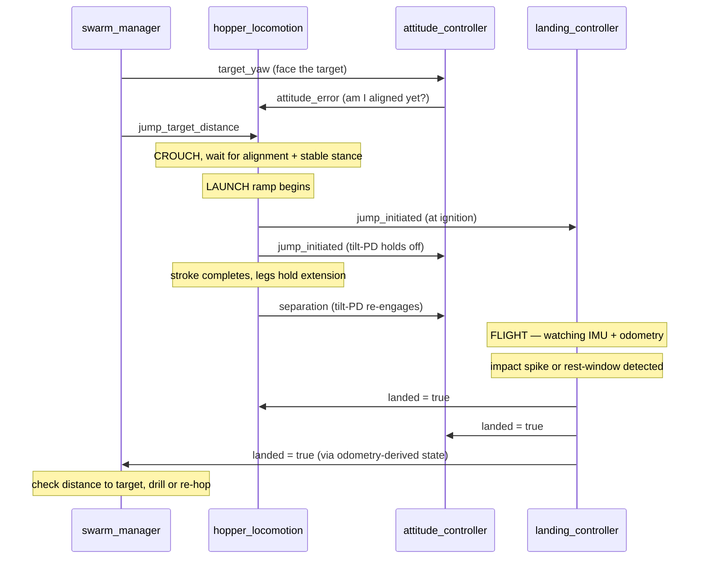

# The SpaceHopper Ryugu Simulation — Complete Study Guide

This is the "explain everything, simply, but for real" document. `Research_Paper.md` is
written for a grader and states results. `research_report.md` explains the environment
build and a handful of deep case studies. This document is different: it starts from
zero and walks through **every subsystem, in order, in plain language**, until you could
rebuild the reasoning from scratch. Where the paper says "we measured X," this document
says "here is why X had to be measured, what we guessed first, why the guess was wrong,
and what the correct physical picture is."

Read it top to bottom the first time. After that, use the table of contents to jump to
whatever you're being asked about.

## Table of contents

**Part I — Concepts and physics**

1. [The big picture — what problem is this solving?](#1)
2. [Why micro-gravity breaks normal robot intuition](#2)
3. [The robot: SpaceHopper](#3)
4. [The software architecture — how the pieces talk](#4)
5. [The hop, start to finish](#5)
6. [Attitude control — the reaction wheels](#6)
7. [Landing detection — knowing when you've stopped](#7)
8. [Self-righting — getting back upright](#8)
9. [Swarm intelligence — three robots, one mission](#9)
10. [Case studies — the bugs that taught us the physics](#10)
11. [Quick reference — constants, topics, states](#11)

**Part II — Implementation deep dive**

12. [ROS2 mechanics as actually used here](#12)
13. [Wiring it together: the launch file and the bridge](#13)
14. [`hopper_locomotion.py` — full code walkthrough](#14)
15. [`attitude_controller.py` — full code walkthrough](#15)
16. [`landing_controller.py` — full code walkthrough](#16)
17. [`swarm_manager.py` — full code walkthrough](#17)
18. [`swarm_gui.py` and `spawner.py` — the supporting nodes](#18)
19. [The model generator — building the robot as code](#19)

---

<a name="1"></a>
## 1. The big picture — what problem is this solving?

**162173 Ryugu** is a real asteroid, about 900 metres across, that Japan's Hayabusa2
spacecraft visited and sampled between 2018 and 2019. It's a "rubble pile" — not solid
rock, but a loose gravitational aggregate of boulders and dust held together by its own
extremely weak gravity. Surface gravity on Ryugu is about **1.14 × 10⁻⁴ m/s²** — roughly
**8,800 times weaker than Earth's**. For comparison, the Moon's gravity is about 1.6
m/s², itself already "low gravity" — Ryugu is four orders of magnitude below even that.

This project simulates a fictional but physically grounded follow-up mission: three
small hopping robots ("SpaceHopper") exploring Ryugu's surface, finding points of
scientific interest ("anomalies"), and drilling core samples — all coordinating
autonomously, with no human driving them turn by turn. It's built in **Gazebo Harmonic**
(a physics simulator) controlled through **ROS2** (Robot Operating System 2, a
message-passing framework that lets many small programs — "nodes" — cooperate).

The one-sentence version of everything that follows: **at Ryugu's gravity, every
intuition you have from driving a car or a rover on Earth is wrong**, and almost the
entire engineering story of this project is discovering exactly how it's wrong, one
measured failure at a time.

---

<a name="2"></a>
## 2. Why micro-gravity breaks normal robot intuition

### 2.1 Wheels don't work

A wheeled rover moves by spinning a wheel against the ground; friction between the tire
and the ground converts that spin into forward motion. Friction force is proportional to
how hard the wheel presses down, which is proportional to the vehicle's weight (mass ×
gravity). SpaceHopper is a 2.5 kg robot. On Earth its weight would be about 24.5 N —
plenty of force to grip a road. On Ryugu, its weight is:

```
F = m × g = 2.5 kg × 1.14×10⁻⁴ m/s² = 2.85×10⁻⁴ N
```

That's roughly the weight of a single grain of rice on Earth. The maximum friction force
available to a wheel is `μ × F` (μ, the friction coefficient, is at best around 1 for
rough regolith) — so at best you get 2.85×10⁻⁴ N of traction. Any bump, any bit of
loose dust, any tiny disturbance and the wheels simply spin in place or the whole robot
drifts off the ground. This is why real missions to small bodies (Hayabusa2's MINERVA-II
rovers, for example) don't use wheels at all — they **hop**.

### 2.2 Hopping means "everything is a rocket launch, and everything after is orbital
mechanics"

If you can't roll, you push off the ground once and then coast — like a very slow
cannonball. A "hop" for SpaceHopper isn't a little bounce; it's a full ballistic
trajectory, exactly like an artillery shell (with the parabola stretched out enormously
because gravity is so weak). A 9-metre hop on Ryugu takes several **minutes** to complete
in the air, not the fraction of a second a shuffle-step takes on Earth. Every mission
plan has to accept that: navigation happens in hop-sized jumps, and each jump is a
multi-minute wait.

### 2.3 "Any grounded motion is a launch"

This is the single most important idea in the whole project, and it's stated as **Law 3**
in the research paper: *every actuator motion made while touching the ground is a
propulsion event.* On Earth, if a robot arm on a rover twitches while parked, nothing
happens — the rover's weight anchors it. At Ryugu weight, the same twitch can be a bigger
force than gravity itself, and the reaction to that twitch (Newton's third law: every
action has an equal and opposite reaction) is enough to knock the whole robot off the
ground. This project discovered that lesson the hard way, repeatedly — see the case
studies in Section 10 — and the final rule that came out of it is blunt: **once a robot
has landed, the correct number of commanded leg or wheel motions is zero**, until the
next deliberate hop.

### 2.4 Free-fall looks exactly like resting

An accelerometer (the sensor inside an IMU, Inertial Measurement Unit) measures *proper
acceleration* — the acceleration you'd feel pressed into your seat, not gravity itself.
A robot in free-fall (flying through the air on a hop) feels weightless and reads
essentially zero acceleration. A robot **resting motionless on the ground** at Ryugu's
gravity *also* reads essentially zero acceleration, because gravity itself is only
0.000114 m/s² — far below what the sensor can distinguish from noise. This means the
IMU **cannot tell the difference between "flying" and "sitting still"** by itself. Every
landing-detection algorithm in this project has to use a second signal (usually
position/velocity from odometry) to break that ambiguity. This single fact caused more
bugs than anything else in the project — see Section 7 and several of the case studies.

---

<a name="3"></a>
## 3. The robot: SpaceHopper

### 3.1 Body plan

SpaceHopper is **tri-pedal** — three legs arranged 120° apart around a central body,
like a tripod. Each leg has two joints (a hip and a knee), so it can fold up into a
compact crouch or extend out straight. The three-fold symmetry means the robot can land
on any of its three legs and always has a stable footing, unlike a two- or four-legged
design which can end up straddling awkwardly.

Mounted inside the body are **three reaction wheels**, one aligned with each of the
robot's x, y, and z axes. A reaction wheel is a spinning disc, driven by its own small
motor, that does nothing when spun at constant speed — but *while accelerating or
decelerating*, its motor pushes back on the robot's frame with an equal and opposite
torque (this is Newton's third law again, applied across a motor instead of a leg).
Spacecraft have used reaction wheels for attitude control for decades; here they do the
same job for a robot that can't press against anything else to reorient itself while
flying.

### 3.2 Why hop instead of walk?

Legs *could* walk, in principle, but walking requires many small footfalls, each one a
potential "everything is a rocket launch" event (Section 2.3) — every step risks kicking
the robot off the ground entirely. A single deliberate, controlled hop is much easier to
reason about and predict than a sequence of many uncontrolled little pushes. So the
robot's legs are used almost exclusively for one maneuver: crouch down, then extend
explosively (well — "explosively" is relative; see Section 5) to launch the body into a
ballistic arc.

### 3.3 The model file

The physical robot description that Gazebo actually simulates — link masses, joint
limits, motor torque caps, reaction wheel inertia, everything — lives in a file called
`model.sdf`. That file is **generated**, not hand-written: the actual source of truth is
`scripts/generate_detailed_spacehopper.py`, a Python script that builds the SDF (Simulation
Description Format) XML programmatically. If you ever need to change a physical
parameter (mass, joint range, motor torque), you change the generator script and re-run
it — never hand-edit `model.sdf` directly, because the next regeneration would silently
overwrite the edit.

### 3.4 Key numbers to remember

| Quantity | Value | Why it matters |
|---|---|---|
| Robot mass | 2.5 kg | Sets weight, and hence friction and launch impulse budgets |
| Ryugu surface gravity | 1.14 × 10⁻⁴ m/s² | ~8,800× weaker than Earth |
| Robot weight on Ryugu | 2.85 × 10⁻⁴ N | About the weight of a grain of rice |
| Leg motor torque cap | 0.134 N·m | The position controller can't push harder than this |
| Reaction-wheel motor torque budget | 0.015 N·m | Per axis; this is the whole attitude-control "budget" |
| Reaction-wheel spin-axis inertia | 2.7 × 10⁻⁴ kg·m² | Used to convert torque into wheel spin-up rate |
| Reaction-wheel no-load top speed | 982 rad/s | ~9,380 rpm, from the real Maxon EC 20 flat motor spec |

---

<a name="4"></a>
## 4. The software architecture — how the pieces talk

### 4.1 ROS2 nodes and topics, in one paragraph

ROS2 organizes a robot's software as a collection of independent programs called
**nodes**, each doing one job, that communicate by publishing and subscribing to named
data channels called **topics**. A node that wants to tell the world "I just jumped"
publishes a message on a topic like `/scout_1/jump_initiated`; any other node that cares
subscribes to that same topic and gets called automatically whenever a new message
arrives. No node needs to know who else is listening — this is what lets four separate
control programs per robot (times three robots, plus one shared brain) cooperate without
being tightly wired together.

### 4.2 The five kinds of node in this project

Each of the three robots (`scout_1`, `scout_2`, `scout_3`) runs **four per-robot nodes**,
plus there is **one shared swarm-level node**:

1. **`hopper_locomotion`** — owns the legs. Runs a state machine (IDLE → CROUCH →
   LAUNCH → FLIGHT) that turns a "go this far" command into an actual leg-extension
   sequence. Section 5.
2. **`attitude_controller`** — owns the reaction wheels. Keeps the robot pointed the
   right way in flight and holds a heading while grounded. Section 6.
3. **`landing_controller`** — owns nothing directly (it mostly *watches*), but decides
   when the robot has actually landed, detects bad tilts, and runs the self-righting
   maneuver when needed. Sections 7 and 8.
4. **`spawner`** — a small utility node that places the robot models into the world at
   startup. Not part of the control loop.
5. **`swarm_manager`** — the one node that exists **once**, not per-robot. It assigns
   roles (Scout / Sampler / Relay), runs the task auction, tracks battery, dispatches
   hops toward targets, and manages the drill. Section 9.

There's also **`swarm_gui`**, the dashboard you've seen in screenshots — it just
subscribes to status topics from `swarm_manager` and draws them, it has no control
authority at all.

### 4.3 The critical topics, and why they exist

A handful of topics form the backbone that lets these otherwise-independent nodes stay
in sync. Understanding what each one *means physically* is most of what you need to
understand the whole codebase:

| Topic | Publisher → Subscriber | What it physically means |
|---|---|---|
| `/{bot}/jump_target_distance` | swarm_manager → hopper_locomotion | "Hop this many metres in the direction you're currently facing" |
| `/{bot}/target_yaw` | swarm_manager → attitude_controller | "Point this way" (world-frame heading, radians) |
| `/{bot}/jump_initiated` | hopper_locomotion → landing_controller, attitude_controller | "I am now airborne (as of ignition)" |
| `/{bot}/separation` | hopper_locomotion → attitude_controller | "The feet have actually left the ground now" |
| `/{bot}/landed` | landing_controller → hopper_locomotion, attitude_controller, swarm_manager | "I am confirmed at rest on the surface" |
| `/{bot}/ground_contact` | landing_controller → attitude_controller | "I am touching the ground right now" (true only during the CONTACT_DETECTED state) |
| `/{bot}/righting_active` | landing_controller → attitude_controller | "I am running the self-righting maneuver — don't touch the wheels" |
| `/{bot}/attitude_error` | attitude_controller → hopper_locomotion | "How far off my commanded heading am I right now" (used to gate launch timing) |

The theme running through nearly every one of these topics is **arbitration**: making
sure that at any given moment, exactly one node is allowed to command a given actuator
(the legs, or the wheels). Section 10 has several case studies where two nodes
accidentally fought over the same actuator, and the fix was always some version of "add
a flag that says whose turn it is."

### 4.4 A picture of the flow



---

<a name="5"></a>
## 5. The hop, start to finish

This section walks through `hopper_locomotion`'s state machine exactly as the code
implements it today. There are four states: **IDLE**, **CROUCH**, **LAUNCH**, **FLIGHT**.

### 5.1 IDLE

Nothing happens until either (a) `swarm_manager` sends a jump command, or (b) the robot
has sat idle, landed, with no command for 5 minutes (`IDLE_RECOVERY_TICKS`), which
triggers a small automatic "recovery hop" — a safety net so a robot that's fallen out of
the mission loop for some reason doesn't just sit frozen forever.

### 5.2 CROUCH — plant the feet and get ready

The crouch pose bends all three legs so the feet sit almost directly under the hips.
This detail matters more than it sounds: friction on Ryugu is so weak (Section 2.1) that
if the legs pushed at any real sideways angle, the feet would simply **slide** instead
of pressing the body upward. Keeping the ground-reaction force close to vertical is what
lets the crouch actually lift the body at all.

Two gates must both be satisfied before the robot is allowed to launch:

- **Alignment** — the reaction wheels must have already turned the body to face the
  commanded heading (`attitude_error < 0.15` rad, about 9°). Launching mid-turn scatters
  the hop wildly off-target.
- **Stance quality** (`_stance_ok`) — the body must be upright (`uz > 0.85`, where `uz`
  is a simple measure of "how upright," 1.0 = perfectly vertical) and nearly motionless
  (`speed < 0.012` m/s). Launching from a tilted or still-bouncing stance was measured
  scattering both the hop distance *and* the direction unpredictably.

If 45 seconds pass and the stance is still bad, the hop is aborted back to IDLE rather
than firing a doomed hop — the swarm will just try again on its next dispatch cycle.

**Directional lean.** A perfectly symmetric crouch/extend cycle only launches the robot
straight up — no horizontal travel at all. To get *directional* hops, one leg (the one
in the direction of travel) is crouched a little more, and the other two a little less,
tilting the whole thrust vector off vertical. The amount of this tilt (`LEAN`) has gone
through several revisions — see Case Study 10.5 for the full story of why it landed at
0.3 radians (~17°) instead of the larger angle first tried.

### 5.3 LAUNCH — the actual push

This is the part of the project that took the most iterations to get right, because the
first two approaches both failed for non-obvious reasons.

**Attempt 1 — "stroke fraction."** The original idea was simple: to hop a shorter
distance, command a smaller leg extension (say, 27% of full extension for a 9-metre hop
instead of 100%). This seems intuitive — less extension, less push, shorter hop.

It was wrong. The legs are driven by a **position-controlled PID** motor with a torque
cap of 0.134 N·m. When you command a *step* target (instantly "go to this angle"), the
motor slams against its torque limit and drives the leg at essentially the same terminal
speed **no matter how big the step is** — a small step and a big step both get driven at
nearly the same speed, because the motor is saturated (maxed out) either way. Measured
directly: a hop commanded at 27% stroke (intended: 9 metres) actually separated at
0.19 m/s and flew over 76 metres. The "stroke fraction" dial did almost nothing to
control speed — it was nearly useless as a distance control, which is exactly why early
missions saw robots wildly overshoot or undershoot with no consistent pattern.

**Attempt 2 — rate-modulated launch (what's actually deployed).** If commanding a big
step always saturates the motor, then amplitude is the wrong control knob. The fix:
*always* use the full stroke geometry (never scale the target angle down), and instead
control **how fast** the target moves from crouch to extension — a smooth ramp instead
of an instant step. If the ramp moves slowly enough (roughly 1.2 seconds or slower), the
PID never saturates; the leg tracks the ramp closely, and the body's climb rate is set
directly by the ramp's rate. This makes launch speed a genuine, controllable dial:
longer ramp = slower push = shorter hop; shorter ramp = faster push = longer hop.

**A second wrinkle — the straight-leg singularity.** Even with a rate-controlled ramp,
the first version used a *linear* ramp (angle increases at a constant rate) and still
under-delivered separation speed by about 4×. The reason is geometric: as a leg
approaches full extension, it's nearly straight, and a small further change in *joint
angle* produces almost no further change in *foot height* — imagine trying to push a
door open when it's already almost flat against the wall; your hand moves a lot but the
door barely swings. This is called a "singularity" in the leg's Jacobian (the
angle-to-height sensitivity). A linear angle ramp therefore does almost all of its
useful height-gain early and crawls at the very end — exactly the wrong place, since the
*end* of the stroke is when the foot is about to leave the ground and separation speed
is set.

The fix has three parts, all present in the current code:
1. **Quadratic ease-in** — the ramp's progress variable is squared (`s = s²`) before
   being applied, so the target moves slowly at first and fastest right at the very end,
   putting peak push-rate exactly where the body is about to separate.
2. **Release at 90% amplitude**, not 100% — stopping just short of the dead-zone where
   the singularity is worst.
3. **A velocity model recalibrated from measured data**, not pure geometry — rather than
   trying to compute delta-v from stroke height and angle math (which kept being wrong
   by factors of 4–5×), the ramp duration formula (`T = V_GAIN / v_required`) uses an
   empirical gain constant, tuned against actual measured hop ranges from live telemetry
   runs.

### 5.4 FLIGHT — separating cleanly

Once the stroke completes, the legs don't just snap back to neutral instantly. That was
tried and it broke landing detection: an instant step commands enormous torque (the same
saturation problem as Attempt 1), which jerks the IMU hard enough that
`landing_controller` mistook the retraction *itself* for a landing impact, while the
robot was still just centimetres off the ground — every hop looked like it "landed"
immediately in place, and the swarm could never make progress. See Case Study 10.7.

The fix: hold the extended pose for about 8 seconds (enough time to genuinely clear the
ground), then retract over a slow 4-second ramp with a negligible IMU signature. The
`jump_initiated` signal (telling other nodes "I'm airborne") is also sent right at
ignition rather than at the end of the stroke, and a **separate** `separation` signal
marks the true moment the feet clear the ground — different nodes need different
timing information, and conflating them was a recurring source of bugs (see Section 6.3).

---

<a name="6"></a>
## 6. Attitude control — the reaction wheels

### 6.1 The physics of a reaction wheel

A reaction wheel is a small flywheel with its own motor. Spinning it at a *constant*
speed applies zero net torque to the robot body — but *changing* its speed does, because
of Newton's third law: the motor pushes on the wheel to speed it up, and the wheel pushes
back equally on the motor (and therefore the robot frame) in the opposite direction.

```
τ_body = − I_wheel × (dω_wheel/dt)
```

This is the single equation the whole attitude controller is built around. If you want a
certain body torque `τ_body`, you command the wheel to accelerate at
`−τ_body / I_wheel`. Three wheels (x, y, z axes) give control over all three rotation
axes independently.

### 6.2 PD control on attitude — the concept

**PD control** (Proportional–Derivative) is a standard way to steer something toward a
target: apply a correcting force proportional to *how far off* you are (the
"proportional" term — bigger error, bigger push) plus a force proportional to *how fast
you're already moving* (the "derivative"/rate term — this acts as a brake so you don't
overshoot and oscillate). Written for one axis:

```
τ = K_ang × error − K_rate × rate
```

For yaw (turning left/right), `error` is just the difference between the target heading
and the current heading. For **tilt** (roll/pitch — is the robot leaning over?), the
early version of this code tried to extract "roll" and "pitch" angles the conventional
way (Euler angles), but that approach mathematically breaks down at large tilt angles
(a real limitation called gimbal lock) — and this robot genuinely tumbles through large
angles regularly. The fix used instead: take the robot's own "up" direction (its local
+Z axis) and rotate it into world coordinates; the cross product of that vector against
true world-up gives a well-behaved error vector at *any* tilt angle, with no
discontinuities. You don't need to follow the vector-math derivation to use this
concept — the important idea is: **"how tilted am I" is measured directly as an angle
between two 3D directions, not by trying to decompose orientation into separate roll and
pitch numbers**, because that decomposition has blind spots this robot runs into.

### 6.3 Law 4: attitude authority must be tied to *commanded* flight

This is the deepest lesson in the whole project, discovered on 2026-07-18 after a
**twelve-hour** simulation run produced zero completed missions. Here's the chain of
cause and effect, in order:

1. Early logic armed "full attitude control" (the strong tilt-correcting PD law)
   whenever the robot's `landed` flag was `False` — i.e., whenever it looked airborne.
2. But a robot bouncing around on the ground, tumbling after a rough landing, *also*
   reports `landed = False` for a while — it looks exactly like "airborne" from that
   flag's point of view.
3. So the full-strength wheel torque engaged on a grounded, tumbling robot.
4. But wheel torque against a surface **is** a launch impulse (Section 2.3 / Law 3) —
   the reaction wheel torquing the body pushes the feet against the ground, and the
   ground pushes back, moving the robot.
5. That motion kept the robot bouncing, which kept `landed = False`, which kept full
   attitude control engaged, which kept torquing the robot against the ground...

This is a **self-sustaining feedback loop** — a pump, not a controller. The fleet spent
twelve hours in this loop: 149 aborted launch attempts, 87 self-righting attempts, and
zero completed sampling missions, because the robots were never actually *at rest* long
enough for anything downstream to proceed.

The fix, now called **Law 4** in the paper, is a rule about *when* the strong controller
is even allowed to run: full attitude authority is granted only between a **commanded**
ignition (the moment `hopper_locomotion` actually starts a deliberate hop) and the first
ground contact after it — never just because the `landed` flag happens to read false.
Everything else — any uncommanded motion, any bounce, any post-landing tumble — gets
routed through a **dissipation-only** rate-damping law instead:

```
τ = − K_rate × rate      (no proportional/position term at all)
```

This law can only ever *remove* energy, never add it, because power delivered by a
torque opposing the current rotation rate is always negative
(`P = −τ × rate < 0`, always, by construction — the torque is defined to point exactly
opposite the current spin). A controller built this way is *physically incapable* of
sustaining a pump loop, no matter what triggers it. This is the single most important
design principle to internalize from this whole project: **when you cannot fully trust
your own "am I flying or not" signal, build the fallback controller so that it is safe
by construction, not safe because you were careful.**

### 6.4 The stroke-hold exception

One more subtlety: during the LAUNCH ramp itself (Section 5.3), the deliberate lean
(Section 5.2) *intentionally* tilts the body to aim the thrust. If the tilt-correcting PD
law were active during the stroke, it would fight the lean and try to level the body —
which was tried, and measured directly: a commanded 9-metre hop flew for over 11 minutes
almost perfectly straight up, travelling only 0.16 metres horizontally, because the
attitude controller had cancelled the entire intended tilt. So tilt-*position* correction
is explicitly held off from ignition to separation — but *rate-only* damping stays active
during the stroke (same trick as Law 4: it can only remove energy), which resists any
runaway tip-over (Case Study 10.6) without fighting the deliberate lean.

---

<a name="7"></a>
## 7. Landing detection — knowing when you've stopped

### 7.1 Why this is hard

Recall Section 2.4: an IMU can't tell "flying" from "resting" by acceleration alone,
because both read close to zero at Ryugu's gravity. `landing_controller` has to combine
several imperfect signals to make a confident decision, and it runs as its own explicit
state machine: **IDLE → FLIGHT → CONTACT_DETECTED → (LANDED or RIGHTING)**.

### 7.2 Detecting the moment of impact

The primary signal is an acceleration **spike**: a genuine impact produces a short burst
of proper acceleration well above the free-fall noise floor (the threshold used is
0.08 m/s²). This sounds simple, but the very first version used a much lower threshold
(0.02 m/s²) and it kept false-triggering on ordinary motor activity — reaction-wheel
torque reactions and leg-joint corrections routinely produce transient accelerations in
that same tiny range, since they're driven by *motor* torque limits that have nothing to
do with how weak gravity is here. A false "contact detected" event while the robot was
still several metres in the air would immediately start the settle-and-confirm sequence
and could gate a science action (drill deployment) despite the robot not being on the
ground at all.

### 7.3 The rest-window fallback

Some landings never produce a clean spike at all — a very soft touchdown, or a robot
that was already resting when its node restarted. For those cases there's a second,
independent detector: if altitude stays within a tight band (2 cm) *and* velocity stays
below 5 mm/s for a full 60 seconds, the robot must be sitting on something (a genuinely
falling object cannot hold still that precisely for that long). The 60-second window
isn't arbitrary — it comes from a real calculation: a slow ballistic bounce can *coast*
near its apex (the top of its arc, where vertical speed briefly passes through zero)
for up to about 37.5 seconds while still genuinely in flight, so the window has to be
comfortably longer than that worst case or it would falsely declare "landed" at the peak
of a bounce, mid-air.

### 7.4 Why "catching" the impact was the wrong idea (the pogo lesson)

The very first landing design tried to be clever: the instant contact was detected, snap
the legs into a soft, compliant "catch" posture to absorb the impact, like a person
bending their knees when they jump down off a wall. Every version of this idea, tried and
measured, made things **worse**:

- **Instant step to a soft posture** — with the leg motors' gains high enough to have
  useful launch authority, the same motors are also *stiff* — so "stepping" to a soft
  target actually whipped the legs hard against the ground, kicking the robot back up
  into a non-decaying bouncing loop (a "pogo stick" effect) with bounce heights measured
  around 5.7 metres, repeating.
- **A 2-second ramped soft posture** (softer version of the same idea) — still added
  energy on each bounce (impact speed 32 mm/s in, rebound 38 mm/s out — *faster* than it
  arrived).
- **Mirroring the measured joint angles as the target** (a "zero-stiffness" catch,
  trying to just follow the leg passively) — this was worse still, because the sensor
  feedback that tells the controller where the leg currently is arrives with a small
  time lag, and by the time the controller reacts, the leg has already moved on — the
  lagged correction ends up pushing in the *wrong* direction (mid-rebound rather than
  mid-impact), pumping the bounce instead of damping it.

The lesson, generalized: **active, software-driven compliance is dangerous whenever
there's any feedback delay**, because a delayed correction doesn't damp the current
motion — it reacts to where the motion *was*, which during a bounce is functionally the
opposite of where it *is*. The eventual fix was to stop trying to control the impact
actively at all: **do nothing with the legs during contact** (zero posture commands),
and let the impact energy dissipate through a purely physical, lag-free mechanism —
increased joint damping baked directly into the model itself (`<damping>` in the SDF,
raised from 0.005 to 0.15). A physical damper has no communication delay because it
isn't "told" anything; it just resists motion as it happens.

### 7.5 The four-state picture

- **FLIGHT** — watching for either an impact spike or the rest-window fallback.
- **CONTACT_DETECTED** — hands-off (no leg commands at all); waiting to see whether this
  settles (→ LANDED / RIGHTING) or bounces back up (→ FLIGHT again).
- **LANDED** — confirmed at rest. A "liftoff watchdog" keeps checking velocity even
  here — if the robot starts moving again for a sustained 2 seconds, it reverts straight
  back to FLIGHT so every downstream system (attitude control, drill gating) re-arms
  correctly.
- **RIGHTING** — the robot settled but is tilted too far over; see Section 8.

---

<a name="8"></a>
## 8. Self-righting — getting back upright

### 8.1 The first approach (legs) and why it was abandoned

The first self-righting attempt used the legs: splay them out flat, then drive one leg
through a big asymmetric sweep to try to roll the body over, like a turtle trying to
flip itself. This depends on the sweeping leg getting real grip ("hooking") into the
ground, and once other fixes changed the foot collision shape and increased joint
damping (Section 7.4), the sweeps lost the leverage they needed and simply failed every
attempt.

### 8.2 The reaction-wheel roll (what's deployed now)

The wheels are a far more reliable actuator here, and they use exactly the same physics
as attitude control (Section 6.1): spin a wheel hard, and the body counter-rolls in the
opposite direction. For a badly tilted or fully inverted robot (`uz < 0.2`, i.e. tipped
more than about 90°), the sequence is **bang-bang** control — full torque one way to
start the roll, then full torque the opposite way (a "brake") once the body has rolled
past horizontal, symmetrically cancelling the momentum so the robot ends up stopped
right-side up instead of overshooting into a roll the other way. If one attempt fails
(still not upright after ~15 seconds), the next attempt alternates the roll axis and
sign, so a wrong first guess self-corrects on the retry rather than repeating the same
failed maneuver forever, up to 5 attempts.

### 8.3 The gap that caused 149 stranded robots (and the fix)

The tilt threshold for triggering righting and the tilt threshold required to *launch* a
hop used to be different numbers (`uz < 0.7` triggers righting; `uz > 0.85` required to
launch). Any robot that settled in between — tilted more than 0.85 but less than
0.7-away-from-upright — was invisible to both checks: too upright to trigger
self-righting, not upright enough to pass the launch gate. It would sit there forever,
aborting every crouch attempt. This "dead band" was directly responsible for most of the
149 aborted crouches in the twelve-hour stall (Section 6.3). The fix simply aligned the
two thresholds to the same value (0.85), so nothing can fall in between.

### 8.4 The momentum-kick bug — righting itself was launching robots

Once partial tilts (not full inversions) started triggering a gentle correction too, a
subtle new bug appeared: the very first version re-computed which direction to roll
*every single sensor tick*, all the way through the maneuver. As the body rolled toward
upright and briefly overshot, the "correct direction" flipped — and the code would
instantly reverse the wheel command, hard, right then. Each reversal is a fresh, large
momentum transfer, and — same physics as everywhere else in this document — that
momentum transfer reacts against the ground. Measured directly: 70 of these reversal
kicks in one run pumped a robot to over 40 metres of altitude, an accidental "launch"
caused entirely by a controller meant to gently fix a small tilt.

The fix: compute the roll direction **once**, at the start of the attempt, and hold it
fixed for the whole maneuver — even if the robot briefly overshoots past upright, that's
tolerated rather than chased. This is the same underlying lesson as Section 6.3's Law 4,
applied one level down: a controller that keeps re-committing to a fresh strong action
based on a noisy or fast-changing signal is dangerous near the ground; commit once, hold
steady, and let a slower supervising loop (the overall attempt/retry structure) handle
correction on a longer timescale instead.

---

<a name="9"></a>
## 9. Swarm intelligence — three robots, one mission

### 9.1 Roles

`swarm_manager` assigns each robot one of four roles at any time: **Scout** (default —
wander and passively "detect" points of interest), **Sampler** (actively travelling to
and drilling a detected anomaly), **Relay** (parked, standing by to transmit collected
data — always exactly one robot holds this role if the swarm has more than one member),
and **Recharge** (battery too low, standing down until it climbs back above 80%).

### 9.2 The auction — why "market-based" rather than "first available"

When a new anomaly is queued, every currently-available Scout submits a **bid** — a
single number representing how costly it would be for *that* robot to take the job. The
lowest bid wins. The bid formula combines three things:

```
bid = distance_to_target
    + (100 − battery%) × 0.5
    + samples_already_carried × 5
```

Distance dominates (further robots cost more, as you'd expect), but a low-battery robot
or one whose sample carousel is already partly full is penalized too, so a fresher,
emptier robot can win even if it's slightly further away. This is what makes the
allocation "market-based" rather than arbitrary — the earliest version of this code just
grabbed the first idle robot in a list regardless of where it actually was, which could
easily send the *farthest* robot on the longest possible trip for no reason.

### 9.3 Corrective re-hops — hops don't land exactly on target

A single hop, even a well-calibrated one, won't land precisely on the requested spot —
there's real-world (well, real-simulation) scatter. If a Sampler lands and confirms
`LANDED` but is still further than the arrival radius (4 metres) from its target, it
gets a **corrective re-hop** toward the remaining distance, up to 5 attempts, with a
90-second cooldown between attempts (a full hop-and-settle cycle takes at least that
long, so re-hopping too eagerly would just fire on stale position data). If all 5
retries fail, the target goes back into the general queue and the robot stands down to
Scout — an unreachable target should never permanently strand a robot.

### 9.4 Adaptive heading calibration — teaching each robot its own bias

This is one of the most interesting fixes in the whole project, and it's a small,
self-contained example of a **calibration loop** — a pattern used constantly in real
navigation systems (this is literally how ship and aircraft dead-reckoning navigation
has worked for centuries: measure your actual drift, and aim off by it next time).

After the launch and attitude fixes in Sections 5 and 6 were in place, hops were finally
landing at real, non-trivial distances — but often in the *wrong direction*, and each
robot's error was consistent rather than random: one robot consistently landed about 11°
off its commanded heading, while two others landed almost exactly **backwards** — 170 to
190 degrees off, meaning "hop east" reliably sent them roughly west. This is a classic
signature of a **systematic bias** (a per-unit quirk — maybe a subtle asymmetry in how
that particular robot's crouch geometry resolves) rather than random noise, and
systematic biases are exactly what a calibration loop is good at removing.

The fix: every time a robot completes a hop, `swarm_manager` compares where it *actually*
ended up against where it was *told* to go, and updates a running per-robot "bias"
estimate — the difference between commanded and achieved heading, blended smoothly over
time (an exponential moving average, "EMA" — a simple way to average a noisy stream of
measurements that gives more weight to recent readings without needing to store the
whole history). The next dispatch aims off by the learned bias, so a robot that's
consistently hopping backwards gets told to face *away* from its target — which, biased
backwards, correctly sends it *toward* the target. A backwards robot self-corrects
within about two hops.

Two subtleties mattered for getting this right, both discovered by measuring what the
naive version actually did:
- **Measure at the right moment.** The first version measured displacement between one
  dispatch and the next, which includes tens of seconds of post-landing bounce drift and
  righting-maneuver rolling — noise, not signal — and the learned bias swung wildly
  (over ±140° between updates) as a result. The fix measures displacement specifically
  at the exact instant `landed` transitions from false to true (the "rising edge") — the
  cleanest, least-contaminated snapshot of "where did the hop actually end."
- **Measure against what was actually commanded, not what was desired.** The bias
  compensation happens *before* the hop; the raw offset used to update the bias has to
  be computed against the post-compensation heading that was truly sent, not the
  original desired heading — otherwise the calibration ends up measuring only its own
  leftover residual error and slowly erases the correction it just learned.

### 9.5 Sensor-range realism

An earlier version of the anomaly-detection code picked a random point anywhere within
the entire ±45-metre world for a Scout to "detect," regardless of how far away that point
was from the Scout doing the detecting. Physically, that makes no sense — a robot's
onboard spectrometer or lidar has a real, finite sensing range; it cannot "detect" a
surface anomaly 50 metres away any more than a flashlight beam reaches across a football
field. The fix constrains detected anomalies to within 4–12 metres of the detecting
robot's *actual current position*, which is both more physically honest and — as a
welcome side effect — means newly-found targets are the sort of distance the swarm can
reach in one or two hops rather than requiring a dozen.

### 9.6 The sampling cycle

Once a Sampler is confirmed `landed` and within the arrival radius of its target, the
core drill deploys (published on `/{bot}/cmd_drill`), stays down for a fixed dwell period
representing real drilling time (not an instant extraction), and the resulting core is
stowed in one of three carousel tube slots. If the carousel still has room and there's
another anomaly queued, the robot chains directly to the next target rather than
returning to base after every single sample — this "carousel chaining" behavior is what
lets one Sampler service several targets per trip instead of one.

### 9.7 Search algorithm — from luck to coverage

Early in the project, "searching" wasn't really a behavior at all: a Scout just stood
wherever it last landed and rolled a 15% chance every 2 seconds of "detecting" an
anomaly somewhere near its current position. Nothing ever told a Scout to actually go
looking anywhere — coverage of the whole field depended entirely on where robots happened
to already be, which is luck, not search.

The fix has three pieces, each solving a different part of "how do three robots divide up
an unknown area without stepping on each other":

- **Territory** — the field is split into three 120° pie-slice wedges around the center,
  one per robot, decided purely by angle from the origin. No negotiation needed: robot 1
  always owns 0–120°, robot 2 owns 120–240°, and so on. Simple, but sufficient for three
  robots over a roughly square area.
- **Memory** — a coarse 10 m grid remembers, for every cell, the last time any robot was
  there. A cell nobody has visited in a while is "stale" and worth checking; a cell
  visited a minute ago isn't.
- **Choice** — when a Scout is free to move, it scores every cell in its own wedge by
  staleness minus a distance penalty (so it doesn't trek to the far corner of its
  territory for a marginal gain) and hops toward the winner.

This is a simplified, hand-built version of ideas from real multi-robot search research —
splitting territory the way DARP/Voronoi-partition approaches do, and scoring
staleness-against-cost the way budget-constrained search approaches do — without pulling
in the heavier machinery (online tree search, learned policies) those approaches usually
pair it with. For three robots over a modest field, a simple, fully-explainable rule beats
a black box that would need training infrastructure this project doesn't have.

One honest, and slightly funny, result of turning search "on": detection now vastly
outpaces the fleet's ability to actually visit what it finds. A 9-minute run produced a
41-anomaly backlog, because finding something is a cheap, instant per-tick check, while
visiting it is a multi-minute hop-and-settle cycle. That's not a bug — it's what you'd
expect once search actually works, and it just means the real bottleneck moves to "how
many robots can afford to travel" rather than "can we find anything at all."

### 9.8 Path planning — why the classic algorithms don't apply here

If you've studied robotics, "path planning" probably means A*, Dijkstra, RRT, or
potential fields — all algorithms for finding a route through a space that has obstacles
you need to go *around*. None of them fit this platform, and it's worth understanding
*why*, not just accepting it:

- A hop is a **ballistic arc** — once launched, there's no steering. You can't adjust
  course mid-flight the way a driving robot can.
- The arc flies **over** the terrain, not through it. There's no obstacle field to route
  around in the first place (no walls, no boulders blocking a flight path in this
  simulation).

Every one of the classic algorithms is solving "how do I get around things in my way" —
and this platform doesn't have things in its way. Saying "these don't apply, and here's
precisely why" is a stronger, more defensible position than forcing one in just to have
an answer.

What *does* transfer from the path-planning world is something narrower and more useful:
when you have several hops to plan (not just one), in what *order* do you take them? This
is a real research area for asteroid hoppers specifically — treat each hop as one edge in
a sequence, and either compute each hop's own trajectory plus optimize the visiting order
together (as real published work on this exact problem does), or simply choose the
nearest not-yet-visited target next (nearest-neighbor), which is what this platform
actually does when several anomalies are queued at once.

There's also a genuinely interesting piece of physics buried in this platform's own
numbers, worth walking through slowly because it overturned an assumption. The commanded
launch speed for a hop of distance $d$ is $v_{req} = \sqrt{d \cdot g / \text{SIN2TH}}$ —
notice the *square root*. Kinetic energy is $\tfrac{1}{2}mv^2$, and squaring a square root
just gives you back the thing inside it — so energy per hop turns out to be **exactly
proportional to distance**, not to distance-squared or anything fancier. Do the algebra for
splitting one long hop into several short ones covering the same total distance, and the
number of hops cancels out completely: the *total* energy is the same either way. That's
a genuinely surprising result — the intuition "shorter hops must be cheaper" turns out to
be simply wrong for this specific launch law. What actually does change with hop count is
**time**: every hop carries a big fixed overhead (aligning, crouching, settling — measured
in tens of seconds to minutes) regardless of how far it goes, so fewer, longer hops are
faster overall even though they're not more efficient. The platform's own dispatcher
(always take the longest leg it can) turns out to be the right call — just for a different
reason than "saves energy."

---

<a name="10"></a>
## 10. Case studies — the bugs that taught us the physics

Each of these follows the same shape: **symptom** (what was observed), **investigation**
(how the cause was actually pinned down, not guessed), **root cause** (the physical or
software explanation), and **lesson** (the generalizable takeaway). Reading these in
order roughly retraces the project's actual timeline, and each one built on the lesson
of the last.

### 10.1 The IMU that couldn't tell flying from resting

**Symptom:** the attitude controller's tilt-correction wheels slowly wound up to their
maximum speed (982 rad/s) over the course of an unattended overnight run, even though
the robot was sitting still and, by eye, looked fine.

**Investigation:** logged the raw attitude error over the whole run instead of just
sampling it occasionally, and found a *persistent, tiny* residual (about 0.1°) that
never actually reached zero — real terrain isn't perfectly flat, so a robot resting on
regolith always holds some small, physically unavoidable tilt.

**Root cause:** the controller was integrating torque into wheel *speed*
(Section 6.1) with no deadband — meaning any nonzero error, however microscopic, kept
adding a little more torque forever, slowly saturating the wheel over hours even though
nothing was visibly wrong moment to moment.

**Lesson:** an integrating controller needs an explicit "close enough" deadband on the
*position* term, or it will patiently walk itself into saturation on a target that can
never be reached exactly (a perfectly flat rest tilt, in this case). Note the fix does
*not* deadband the rate/damping term — damping only ever acts while the body is actually
moving, so it cannot itself cause windup, and deadbanding it was tried and caused a
different bug (a small oscillation trapped inside the deadband walls).

### 10.2 The stand-up ramp that launched robots

**Symptom:** a robot confirmed `LANDED`, then a few seconds later was measured moving at
0.128 m/s — three times the speed of a normal deliberate launch — with every safety
check disarmed because the state machine believed it was safely on the ground.

**Investigation:** correlated the exact timestamp of the unexpected motion against the
event log and found it landed exactly at the moment a "fold legs to neutral stance"
routine fired, intended just to tidy up the leg posture after landing.

**Root cause:** the fold command was issued as an instant step, and by that point in the
project the leg motor's control gains had already been raised (for launch authority) to
the point where they were genuinely stiff — so "gently folding the legs" at those gains
was, physically, no different from firing a small launch. This is Section 2.3's Law 3
in its purest form: *any* leg motion at Ryugu weight is a potential launch, even ones
intended purely as housekeeping.

**Lesson:** there is no such thing as an "innocuous" leg command once landed. The
eventual fix wasn't to make the fold gentler — it was to **remove the post-landing fold
entirely**. The legs simply hold whatever pose they landed in; the next crouch's own
ramp re-poses them from scratch anyway, so the fold was solving a problem (messy resting
posture) that didn't actually need solving.

### 10.3 The pogo stick (see also Section 7.4)

**Symptom:** a landing robot bounced repeatedly, with each bounce reaching roughly the
*same* or greater height as the last, instead of settling — apex heights around 5.7
metres, non-decaying.

**Investigation:** measured impact speed versus rebound speed directly across several
different "catch" strategies (step to soft posture; ramped soft posture; mirrored
zero-stiffness catch) and found every single one produced a rebound speed *equal to or
greater than* the impact speed — energy was being added at every bounce, not removed.

**Root cause:** explained fully in Section 7.4 — any actively-commanded compliance
scheme introduces either motor stiffness (if commanded too abruptly) or feedback lag (if
smoothed), and either one can pump energy into a bounce instead of absorbing it.

**Lesson:** when a feedback loop has an inherent delay, don't trust it to be your primary
energy-absorption mechanism near a resonant or bouncy system — prefer a physical,
delay-free damping element (here, joint damping baked into the model itself) over a
software approximation of the same idea.

### 10.4 The retraction that faked a landing

**Symptom:** the swarm made zero mission progress for hours; every hop appeared to
"land" almost immediately, essentially in place, even though the ramp-based launch from
Section 5.3 was, by itself, working correctly.

**Investigation:** looked at raw IMU acceleration readings in the milliseconds right
after each launch stroke completed, and found a sharp acceleration spike — 0.27 to
0.57 m/s², several times the 0.08 m/s² contact-detection threshold — occurring at the
exact instant the legs were commanded to retract, while the robot's actual altitude was
still only about 2 centimetres off the ground.

**Root cause:** the legs used to retract with an instant step the moment flight began,
and that step-commanded retraction produced a jerk large enough that `landing_controller`
read it as a genuine touchdown impact. Every hop was scoring itself "landed" a fraction
of a second after leaving the ground, near-zero distance travelled.

**Lesson:** an actuator's *own* motion can masquerade as a sensor event if the two
systems aren't coordinated in time. The fix (Section 5.4) has two parts working
together: don't retract abruptly (hold the pose, then retract on a slow ramp with a
negligible IMU signature), *and* give the landing detector an explicit "ignore contact
spikes for this many seconds after a commanded launch" window, so even a residual
actuation transient can't be mistaken for a real landing.

### 10.5 The lean that couldn't decide how strong to be

**Symptom:** across several iterations, directional hops were either almost purely
vertical (negligible horizontal travel) or so exaggerated a lean that the robot tipped
completely over mid-stroke instead of launching at all.

**Investigation:** this was tuned iteratively with direct measurement at each step
(rather than guessed once) — at a shallow lean (14°), only about a quarter of the
separation speed went into the horizontal direction, and because overall separation
speed was already small at that point in the project, the *residual* wobble from
imperfect stance was the same order of magnitude as the *intended* horizontal push,
making hop direction essentially random. Doubling the lean angle roughly doubled the
horizontal share and moved the launch angle closer to the ballistic optimum — but pushed
too far (0.5 radians, about 29°), it was later measured directly tipping the robot's
uprightness from 0.85 down to 0.38 *during a single stroke*, because at Ryugu's minuscule
weight there is essentially nothing holding the stance down against an aggressive
asymmetric push.

**Root cause:** the lean angle sits on a genuine trade-off curve between "enough
horizontal thrust to be reliably directional" and "not so much asymmetric leg force that
the robot tips over before it even separates" — and because the robot's weight is so
tiny, that safe window is narrower than intuition from a normal-gravity robot would
suggest.

**Lesson:** a single free physical parameter can have two competing failure modes on
opposite ends of its range, and finding the safe middle requires measuring actual
outcomes at each candidate value rather than reasoning from one intuition alone (e.g.
"more lean = more range" is true right up until it very much isn't).

### 10.6 The mid-stroke tip-over

**Symptom:** occasional launches produced a robot that, instead of ascending cleanly,
visibly rolled over during the stroke itself and separated (if at all) at a essentially
random angle.

**Investigation:** directly measured uprightness (`uz`) continuously through a stroke
and found it could collapse from 0.85 to 0.38 within a single 3.5-second ramp — i.e. the
robot was tipping over *during* the push, not after.

**Root cause:** the leaned crouch (Section 10.5) inherently means one leg ends up much
more extended than the other two at any given moment mid-stroke, and with essentially no
weight holding the stance down, that asymmetry alone is enough to roll the body over
before separation if the stroke runs long enough at that lean angle.

**Lesson / fix:** two complementary safeguards, matching the general pattern from Law 4
(Section 6.3) of "make the failure physically impossible rather than just less likely."
First, a direct **mid-stroke abort**: if uprightness measured during the ramp ever drops
below 0.7, the stroke is aborted immediately and the legs retract gently rather than
completing a doomed, randomly-aimed launch. Second, the rate-only tilt damping described
in Section 6.4 runs *throughout* the stroke specifically to resist this kind of runaway
roll, without touching the deliberate lean itself.

### 10.7 The twelve-hour stall (full story: see Section 6.3)

Already told in detail as Law 4 — included here in the list because it's the single
highest-value case study in the project. If you only study one of these ten, study that
one: it's the clearest example in the whole codebase of a controller that was locally
reasonable at every individual decision point, yet globally created a runaway feedback
loop, and the general fix (route uncertain/uncommanded cases through an
energy-cannot-increase fallback law) is a pattern worth remembering for any control
system, not just this one.

### 10.8 The righting maneuver that launched robots into orbit

Already told in detail in Section 8.4 — a controller meant to make a small correction
kept re-committing to a fresh strong action every tick, and each fresh commitment cost
real momentum transferred against the ground. The general lesson (commit once per
attempt, don't re-aim continuously against a noisy fast-changing target near the ground)
generalizes directly from the earlier Section 6.3 lesson, applied one level down in the
same subsystem family.

### 10.9 The heading bias hiding inside "random" scatter

Already told in Section 9.4 — worth re-emphasizing here as a case study in its own
right because it's a different *kind* of bug than the others: not a physics-of-contact
problem, but a **measurement design** problem. The swarm was for a while written off as
having "random" navigation error, and it took specifically reconstructing full hop
trajectories from raw telemetry (not just looking at final positions) to notice the
errors were *not* random at all — they were consistent, per-robot, and therefore
learnable. The general lesson: before building a fix for "noisy" behavior, check whether
it's actually noise, or a bias wearing noise's clothing — the two need completely
different fixes (averaging/filtering for real noise; calibration for a bias).

### 10.10 The auction that raced its own search hop

Once Scouts started actually moving (Section 9.7), a new, sneaky bug appeared: a Scout
could get a background search hop *and* win a real anomaly auction in the same 2-second
tick. Both are jump commands sent to the same robot within microseconds of each other in
the code — but `hopper_locomotion` only accepts a jump command while it's fully `IDLE`,
and whichever command it processes first "wins," silently dropping the second with a
warning nobody was watching for. The background search hop was winning every time, which
is exactly backwards: a robot that just found something valuable should always take
priority over its own idle wandering.

The fix wasn't to add a lock or a queue — it was to notice that **order already decides
the outcome**, so just put the auction first. Run the auction before the per-role
behavior loop each tick, and any robot that wins immediately becomes a Sampler — so by
the time the loop reaches the "if I'm a Scout, go search" logic moments later, that robot
no longer qualifies, and the conflict can't happen at all. No new synchronization
primitive, just re-ordering two blocks of code that were already there. This is the same
"exactly one thing may command an actuator at a time" lesson that shows up throughout
this project (Section 6.3, Section 8.3) — it's just the swarm-coordination-layer version
of it instead of the low-level-motor version.

A second, sneakier version of the same bug survived that fix: a robot could still be
*mid-crouch* from its own search hop (not yet airborne, so still reporting `landed=True`)
and win an auction anyway, because the auction only checked *role*, not whether the robot
was actually free to receive a new command. The fix there was to also require the robot
to be landed *and* past a settling cooldown since its own last dispatch — a cheap,
good-enough stand-in for "is this robot really idle," since the swarm-coordination code
has no direct visibility into the flight controller's internal state machine.

### 10.11 The jump-height number that wasn't what it looked like

This one is a lesson about not stopping at the first plausible-sounding explanation.
Measuring a hop's peak height directly from telemetry gave 0.49 m for a commanded 9 m
hop — much lower than a back-of-envelope ballistic formula predicts (about 7.35 m,
roughly 15× higher). The easy, lazy explanation would have been "eh, contact dynamics are
complicated, that tracks with everything else we've found" — and that explanation isn't
*wrong*, exactly, but it's not an *answer*. It doesn't say anything you could check.

The fix was to use **two** measurements from the same hop instead of one: not just the
peak height, but also the horizontal distance actually covered. Two independent readings
of the same flight give you two equations, which is enough to solve for both unknowns at
once — the real launch speed *and* the real launch angle — instead of assuming one of
them and blaming the other for the whole gap. Worked out, the real numbers were: only
about 34% of the commanded launch speed was actually delivered, **and** the real launch
angle (≈47°) was nowhere near what the geometry model assumed (≈73°, from the crouch-lean
tilt). Two separate, specific, fixable problems were hiding inside one vague-sounding
discrepancy.

Tracing *why* pointed at a genuinely different root cause than "physics is messy": the
constant controlling launch-stroke rate (`V_GAIN`) had been calibrated once, early in
development, and never re-checked after two later changes — the lean angle changing
(0.5→0.3 rad) and the stroke's release point changing (100%→90% of full extension) — that
both would have shifted how much speed the same calibration actually delivers. A
constant that was correct when it was measured had quietly gone stale as the rest of the
system changed around it, and nothing forced a re-check. The general lesson: an
empirically fitted constant is only as good as the last time it was fitted — every design
change that touches the same physical process is a silent invitation for that constant to
need re-fitting too, whether or not anyone remembers to check.

---

<a name="11"></a>
## 11. Quick reference

### 11.1 The four hopper_locomotion states

| State | Meaning |
|---|---|
| IDLE | Waiting for a jump command (or the 5-minute self-recovery timeout) |
| CROUCH | Planting feet, waiting for heading alignment + stable upright stance |
| LAUNCH | Running the eased stroke ramp; may abort mid-stroke if tipping |
| FLIGHT | Holding extension for clearance, then slow-retracting; landing_controller owns the rest |

### 11.2 The six landing_controller states

| State | Meaning |
|---|---|
| IDLE | Startup; self-arms into FLIGHT or CONTACT_DETECTED based on first readings |
| FLIGHT | Watching for an impact spike or the rest-window fallback |
| CONTACT_DETECTED | Hands-off; settling, or bouncing back to FLIGHT |
| SETTLING | (reserved; current logic resolves directly from CONTACT_DETECTED) |
| LANDED | Confirmed at rest; liftoff watchdog + landed-tilt watchdog both active |
| RIGHTING | Reaction-wheel roll maneuver in progress |

### 11.3 Key tunable numbers and what they physically represent

| Name | Value | Meaning |
|---|---|---|
| `contact_accel_threshold` | 0.08 m/s² | Acceleration spike that counts as a genuine impact |
| `flight_accel_threshold` | 0.005 m/s² | Below this reads as free-fall |
| `REST_Z_BAND` / `REST_Z_TICKS` | 2 cm / 60 s | Rest-window fallback: "hasn't moved" test |
| `LIFTOFF_VEL` / `LIFTOFF_TICKS` | 0.02 m/s / 2 s | How much sustained motion reverts LANDED → FLIGHT |
| `K_ang` / `K_rate` | 0.05 / 0.066 | Attitude PD gains (stiffness / rate damping) |
| `tau_max` | 0.015 N·m | Reaction-wheel motor torque budget per axis |
| `LEAN` | 0.3 rad (~17°) | Forward-lean differential that aims a hop |
| `V_GAIN` | 0.12 m | Empirical launch-ramp velocity-model constant |
| `ARRIVAL_RADIUS` | 4.0 m | How close counts as "arrived" for drilling |
| `MAX_HOP_RETRIES` | 5 | Corrective re-hops before a target is requeued |

### 11.4 The Four Laws of Milli-Gravity Ground Operations (from the paper)

1. **Contact dynamics, not actuator torque, are the binding design constraint.** Motor
   force margins that matter on Earth are nearly irrelevant here; stroke geometry and
   friction limits dominate instead.
2. **Active landing compliance is destabilizing under feedback latency.** Any delayed
   correction near a bouncing system risks pumping energy in rather than damping it out.
3. **Every grounded actuator motion is a propulsion event.** After touchdown, the
   correct number of commanded leg or wheel motions is zero.
4. **Attitude authority must be tied to commanded flight, not to sensed motion.** A
   controller armed by an ambiguous "am I flying" signal can create a self-sustaining
   energy pump; build the fallback so it can only ever remove energy, never add it.

---

# Part II — Implementation deep dive

Part I explained *what* the system does and *why*, in physics and plain-English terms.
Part II explains *how the code actually does it* — the real Python structures, the
ROS2 API calls, the exact control-flow logic inside each callback. Read Part I first if
you haven't; this part assumes you already know what each subsystem is *for* and
concentrates purely on *how it's built*.

Every source file discussed below lives under
`ryugu_v2_ws/src/ryugu_sim/ryugu_sim/` (the Python package) except the launch file
(`launch/ryugu_swarm.launch.py`) and the model generator
(`scripts/generate_detailed_spacehopper.py`).

<a name="12"></a>
## 12. ROS2 mechanics as actually used here

Before reading any of the four control nodes, it helps to have the handful of ROS2
building blocks they all share firmly in mind, because every node in this project is
built from the same small vocabulary repeated with different specifics.

### 12.1 A node is a Python class

Every controller in this project is a subclass of `rclpy.node.Node`:

```python
class HopperLocomotion(Node):
    def __init__(self, robot_name):
        super().__init__(f'hopper_locomotion_{robot_name}')
        ...
```

Calling `super().__init__(name)` registers the node with ROS2's internal graph under
that name — this is why the launch file (Section 13) can give each per-robot instance a
distinct node name like `loco_scout_1`, `loco_scout_2`, `loco_scout_3`: the *same class*
is instantiated three times, once per robot, each time with a different `robot_name`
string passed in from the command line (see each file's `main()` function at the bottom,
which reads `sys.argv[1]`). This is the whole trick behind "one Python file controls
three robots" — nothing in the class is hardcoded to a specific robot; every topic name
is built with an f-string like `f'/{self.robot_name}/imu'`.

### 12.2 Publishers and subscribers

A **publisher** is created once (usually in `__init__`) and reused every time you want to
send a message:

```python
self.jump_init_pub = self.create_publisher(Bool, f'/{self.robot_name}/jump_initiated', 10)
...
self.jump_init_pub.publish(Bool(data=True))
```

The `10` is the **queue depth** — how many unsent messages ROS2 will buffer before
dropping old ones if the subscriber can't keep up. A **subscriber** registers a callback
function that ROS2 invokes automatically, on its own thread/event-loop timing, whenever a
new message arrives:

```python
self.create_subscription(Bool, f'/{self.robot_name}/jump_initiated', self.jump_callback, 10)

def jump_callback(self, msg):
    if msg.data:
        ...
```

You never call `jump_callback` yourself — it fires whenever *any* other node (in this
case, `hopper_locomotion`) publishes to that topic. This is the entire mechanism that
lets four independent Python processes per robot stay synchronized without ever calling
each other's functions directly or sharing memory.

### 12.3 Message types are just typed data containers

`Bool`, `Float64`, `String` (from `std_msgs.msg`), `Imu` (from `sensor_msgs.msg`), and
`Odometry` (from `nav_msgs.msg`) are all pre-defined ROS2 message classes — plain data
containers with named fields (e.g. `Imu` has `.orientation`, `.angular_velocity`,
`.linear_acceleration`; `Odometry` has `.pose.pose.position`, `.twist.twist.linear`).
Every callback in this codebase starts by pulling the fields it needs off the incoming
`msg` object — for example, `attitude_controller`'s `imu_callback` begins:

```python
def imu_callback(self, msg):
    ax = msg.linear_acceleration.x
    ay = msg.linear_acceleration.y
    az = msg.linear_acceleration.z
    accel_mag = math.sqrt(ax**2 + ay**2 + az**2)
```

### 12.4 QoS — why some subscriptions use `qos_profile_sensor_data`

ROS2 lets you tune the *quality-of-service* contract per subscription. By default,
messages are `RELIABLE` (guaranteed delivery, retried if dropped) with a modest queue.
Under the load of three robots' worth of IMU and odometry traffic, those reliable queues
were measured backing up ("message lost" floods in the logs), and a controller reacting
to a several-tick-old, stale measurement doesn't just lag — it can actively make things
worse, because it's damping against where the robot *was*, not where it *is* (the exact
same lagged-feedback problem as the "zero-stiffness catch" failure in Section 7.4). The
fix used throughout the codebase is `qos_profile_sensor_data`, a built-in preset that is
`BEST_EFFORT` (never retries — an old dropped sample is simply skipped) and a shallow
queue — appropriate for any fast, continuously-updating sensor stream where the newest
value is all that matters and an occasional dropped sample is harmless:

```python
self.create_subscription(Imu, f'/{self.robot_name}/imu',
                         self.imu_callback, qos_profile_sensor_data)
```

Command topics (jump targets, yaw targets, drill commands) stay on the default reliable
QoS with queue depth 10, because those are rare, discrete, must-arrive events, not a
continuous stream.

### 12.5 Timers — the other way code gets called

Besides subscription callbacks, a node can also register a **timer** that fires a
function on a fixed period, independent of any incoming message:

```python
self.timer = self.create_timer(0.1, self.tick)      # hopper_locomotion: 10 Hz
self.timer = self.create_timer(2.0, self.swarm_tick) # swarm_manager: 0.5 Hz
self.create_timer(5.0, self.log_status)              # landing_controller: status log
```

`hopper_locomotion`'s entire state machine (Section 5) runs inside `tick()`, called 10
times a second — this is *not* event-driven; every single tick, whatever state the robot
is in, the relevant block of `tick()` re-publishes its target joint commands. This
"re-assert every tick" pattern shows up repeatedly and is explained in Section 14.3 — it
exists specifically to survive being overwritten by another node's own publications on
the same topic.

### 12.6 `main()` — how a class becomes a running process

Every controller file ends with the same boilerplate:

```python
def main(args=None):
    rclpy.init(args=args)
    robot_name = 'scout_1'
    if len(sys.argv) > 1:
        robot_name = sys.argv[1]
    node = HopperLocomotion(robot_name)
    rclpy.spin(node)
    rclpy.shutdown()
```

`rclpy.spin(node)` is what actually keeps the process alive and dispatches callbacks —
it blocks forever, handing control to whichever timer or subscription callback is due
next, until the process is killed. `setup.py`'s `entry_points` maps the shell command
each `Node(...)` action in the launch file invokes (e.g. `hopper_locomotion`) to this
`main()` function.

<a name="13"></a>
## 13. Wiring it together: the launch file and the bridge

### 13.1 What `ryugu_swarm.launch.py` actually starts

A ROS2 **launch file** is itself just a Python script that builds a list of process
descriptions and hands them to the framework to start together. This project's launch
file (`launch/ryugu_swarm.launch.py`) builds up a `nodes` list containing:

- `gazebo` — not a ROS2 node at all, just a raw `ExecuteProcess` running the `gz sim`
  command-line tool against the world file (`worlds/ryugu.sdf`).
- `spawner` — one instance of `spawner.py` (Section 18.2).
- `swarm_manager` — one instance of `swarm_manager.py` (Section 17).
- `swarm_gui` — one instance of the dashboard (Section 18.1).
- `layout_windows` — a `TimerAction` that waits 10 seconds (long enough for both GUI
  windows to have actually appeared) and then runs `wmctrl` shell commands to
  reposition and resize the Gazebo window and the dashboard window side by side, so the
  user doesn't have to drag them into place by hand every launch.
- Then, **inside a `for agent in [...]` loop**, three copies each of `hopper_locomotion`,
  `attitude_controller`, and `landing_controller` — one full control stack per robot —
  plus one `ros_gz_bridge` process per robot (Section 13.2).

Each per-robot `Node(...)` entry passes the robot's name as a command-line argument
(`arguments=[agent]`), which is exactly the `sys.argv[1]` picked up in each file's
`main()` (Section 12.6), and gives it a distinct ROS2 node name (`name=f'loco_{agent}'`)
so three simultaneously-running `hopper_locomotion` processes don't collide in the ROS2
graph.

### 13.2 The bridge — why Gazebo and ROS2 need a translator at all

Gazebo (the physics engine) and ROS2 (the robot-control framework) are two entirely
separate pieces of software with their own independent messaging systems — Gazebo's is
called **gz-transport**, and it knows nothing about ROS2 topics by default. `ros_gz_bridge`
is a small utility process whose only job is translating messages back and forth between
the two systems on a topic-by-topic basis. The launch file builds a YAML config file per
robot (written out to `/tmp/ryugu_bridge_{agent}.yaml`) listing every translation:

```python
entries.append((f'/{agent}/rw_{axis}_joint_cmd_vel',
                f'/model/{agent}/joint/rw_{axis}_joint/cmd_vel',
                'std_msgs/msg/Float64', 'gz.msgs.Double', 'ROS_TO_GZ'))
```

Each entry says: take messages on this ROS2 topic, of this ROS2 type, and forward them
(direction `ROS_TO_GZ`) onto that Gazebo topic, converted to that Gazebo type (or the
reverse, `GZ_TO_ROS`, for sensor data flowing the other way — IMU and odometry). The
comment in the launch file explains a specific, non-obvious gotcha that shaped this
design: Gazebo's joint-position-controller plugin listens on a topic with a **numeric
path segment** in it (`/model/scout_1/joint/hip_joint_0/0/cmd_pos` — that `/0/` is a
per-controller index), and ROS2's topic-remapping syntax cannot represent a bare number
like that. Writing the mapping explicitly in a YAML file (rather than trying to use
ROS2's built-in remap arguments) was the only way to reach that topic at all — the
earlier attempt silently published into a ROS2 topic nothing on the Gazebo side was
actually listening to, with no error of any kind, which made it a very confusing bug
until someone thought to check the Gazebo-side topic list directly.

### 13.3 Topic-name pattern to memorize

Every bridged topic follows the same `/{robot_name}/{purpose}` naming pattern on the
ROS2 side (e.g. `/scout_2/imu`, `/scout_2/joint_hip_joint_0_cmd_pos`), which is what lets
every controller class build its own topic names purely from the `robot_name` string it
was constructed with — there is no central registry of topic names anywhere; the naming
convention itself *is* the registry.

<a name="14"></a>
## 14. `hopper_locomotion.py` — full code walkthrough

### 14.1 State representation

States are plain class-level integer constants, not an enum, kept deliberately simple:

```python
class HopperLocomotion(Node):
    IDLE = 0
    CROUCH = 1
    LAUNCH = 2
    FLIGHT = 3
```

`self.state` holds the current one, and `self.state_timer` counts ticks (at 10 Hz, from
the `tick()` timer) since the state was last entered — used everywhere as a simple
built-in stopwatch (e.g. `if self.state_timer > 100 and ...` means "at least 10 seconds
into this state").

### 14.2 `jump_target_callback` — turning a distance into a ramp duration

This is the entry point for a hop command, and it's worth reading closely because it's
where the physics from Section 5.3 becomes actual numbers:

```python
def jump_target_callback(self, msg):
    if self.state != self.IDLE:
        self.get_logger().warn(f"Ignoring jump command, currently not IDLE")
        return
    distance = msg.data
    g = 0.000114
    SIN2TH = 0.56
    V_GAIN = 0.12
    v_req = math.sqrt(max(distance, 0.5) * g / SIN2TH)
    ramp_T = max(1.2, min(20.0, V_GAIN / v_req))
    self.ramp_ticks = max(1, round(ramp_T * 10))
    self.launch_amplitude = 0.9
    self.state = self.CROUCH
    self.state_timer = 0
```

Line by line: the *first* guard clause — `if self.state != self.IDLE: return` — is a
simple but important piece of arbitration: a jump command that arrives while a hop is
already in progress is just dropped (with a warning), rather than corrupting the running
sequence. `max(distance, 0.5)` floors the requested distance so a near-zero request
doesn't produce a divide-by-zero-adjacent `v_req`. `v_req` inverts the standard
projectile-range equation (`range = v² sin(2θ)/g`) to solve for the launch speed needed
to reach the requested distance at the known launch angle. `ramp_T` then converts that
required speed into a ramp *duration* using the empirically-calibrated `V_GAIN` constant,
clamped between 1.2 and 20 seconds (below 1.2 s the leg PID starts saturating again —
Section 5.3's Attempt 1 problem re-emerges; above 20 s a hop would take unreasonably
long to even leave the ground). `ramp_ticks` converts that duration into an integer tick
count at the 10 Hz control rate (`round(ramp_T * 10)`) because the `LAUNCH` state
(Section 14.4) counts in ticks, not seconds. Finally the state is set to `CROUCH` and the
timer reset to zero — this doesn't crouch anything by itself; it just changes what
`tick()` does on its very next call.

### 14.3 `tick()` — the CROUCH block and the "re-assert every tick" pattern

```python
if self.state == self.CROUCH:
    if self.state_timer == 0:
        self._wake_model()
    self.pubs['hip_joint_0'].publish(Float64(data=self.CROUCH_HIP + self.LEAN))
    self.pubs['knee_joint_0'].publish(Float64(data=self.CROUCH_KNEE))
    for i in (1, 2):
        self.pubs[f'hip_joint_{i}'].publish(Float64(data=self.CROUCH_HIP - self.LEAN / 2))
        self.pubs[f'knee_joint_{i}'].publish(Float64(data=self.CROUCH_KNEE))
    self.state_timer += 1
```

Notice the joint-target publish calls sit **outside** the `if self.state_timer == 0:`
block, meaning they run on *every single tick* the robot spends in CROUCH, not just once
at entry. This looks redundant at first glance (why re-send the same numbers 100 times a
second?) but it's a direct fix for a real, measured bug: `landing_controller`'s
post-landing stand-up sequence publishes to these exact same joint topics, and Gazebo's
joint controllers are simple **last-write-wins** consumers — whichever publisher sent the
most recent message on a topic is the one that "owns" the joint at that instant. If a
robot receives a jump command while the previous landing's stand-up ramp is still
finishing, a *single* one-shot crouch publication gets overwritten within about 10
milliseconds by the still-running stand-up ramp, and the launch fires from the wrong
posture. Publishing every tick means `hopper_locomotion`'s command is never more than
100 ms stale, so it always wins the race in practice. This pattern (re-publish every
tick rather than once on entry) recurs in the `LAUNCH` block and in `attitude_controller`
for exactly the same reason, and it's worth recognizing as a general technique: **when
two independent processes can write to the same actuator topic, the one that writes most
recently and most often effectively wins arbitration**, so a state that needs to "hold" a
command has to keep re-sending it, not just send it once.

The launch gate itself:

```python
stance_ok = self._stance_ok() or getattr(self, 'recovery_hop', False)
if self.state_timer > 450 and not stance_ok:
    ... abort back to IDLE ...
if self.state_timer > 100 and stance_ok and (
        self.attitude_error < 0.15 or self.state_timer > 450):
    self.state = self.LAUNCH
    self.state_timer = 0
```

`getattr(self, 'recovery_hop', False)` is Python's safe-attribute-read idiom — read
`self.recovery_hop` if it exists, otherwise treat it as `False` — used because
`recovery_hop` is only ever explicitly set to `True` inside the idle self-recovery branch
(Section 14.5), so on a robot's very first ever hop the attribute might not exist yet at
all. `450` ticks is 45 seconds (at 10 Hz) — both the abort deadline and the "stop waiting
for perfect yaw alignment" deadline share that same number, which is why a stuck yaw
slew can't deadlock the mission forever: past 45 seconds the code launches anyway
(logging a warning) rather than waiting indefinitely.

### 14.4 `tick()` — the LAUNCH block and the ease-in ramp in code

```python
elif self.state == self.LAUNCH:
    if self.state_timer == 0:
        self._wake_model()
        self.jump_init_pub.publish(Bool(data=True))
    s = min(1.0, (self.state_timer + 1) / self.ramp_ticks)
    s = s * s                       # <- the quadratic ease-in
    frac = self.launch_amplitude * s
    knee = self.CROUCH_KNEE + frac * (self.EXTEND_KNEE - self.CROUCH_KNEE)
    hip0_start = self.CROUCH_HIP + self.LEAN
    hip12_start = self.CROUCH_HIP - self.LEAN / 2
    self.pubs['hip_joint_0'].publish(Float64(
        data=hip0_start + frac * (self.EXTEND_HIP + self.LEAN - hip0_start)))
    ...
```

`s` is a **normalized progress variable** running from just above 0 up to exactly 1.0 as
`state_timer` counts up to `ramp_ticks` — standard technique for driving any kind of
timed animation or ramp. `s = s * s` is the entire "quadratic ease-in" from Section 5.3
in one line: squaring a number between 0 and 1 makes it smaller, and it shrinks *more*
for small `s` than for `s` near 1 (e.g. `0.5² = 0.25`, a big reduction, but `0.9² = 0.81`,
a small reduction) — so early in the ramp the joint target barely moves, and it catches
up rapidly only near the very end, which is exactly the "peak rate at release" behavior
described conceptually in Section 5.3. `frac` then scales that eased progress by
`launch_amplitude` (capped at 0.9, per Section 5.3's "release before the singularity"
point). The joint-target formulas
(`hip0_start + frac * (EXTEND_HIP + LEAN - hip0_start)`) are simple linear interpolation
(`lerp`) — "start at `hip0_start`, and by the time `frac` reaches 1.0, be all the way at
the extension target" — applied independently per leg, with leg 0 (the lean-bearing leg)
using a different start/end pair than legs 1 and 2 so the asymmetric lean carries through
the entire stroke, not just the crouch.

The mid-stroke abort:

```python
if getattr(self, 'last_uz', 1.0) < 0.7:
    ... freeze current extension, jump to FLIGHT, publish separation ...
    return
```

`self.last_uz` is set by `odom_callback` (Section 14.6) from live odometry, so this check
is reading a genuinely fresh, physically-measured uprightness value every tick during the
stroke — not a prediction, an actual live sensor read — which is why the abort can react
within a single 100 ms tick of the robot starting to tip.

### 14.5 The idle self-recovery timer

```python
if self.state == self.IDLE:
    if not self.landed:
        return
    self.idle_ticks += 1
    if self.idle_ticks >= self.IDLE_RECOVERY_TICKS:
        self.launch_amplitude = 0.9
        self.ramp_ticks = self.RECOVERY_RAMP_TICKS
        self.recovery_hop = True
        self.state = self.CROUCH
        self.state_timer = 0
        self.idle_ticks = 0
    return
```

`self.landed` here is not read fresh from a sensor — it's a plain instance attribute,
last set by `landed_callback` (a subscriber to `/{robot}/landed`, Section 14.7)
whenever `landing_controller` publishes an update. This is the general pattern for every
piece of cross-node state in this codebase: a subscriber callback's *entire job* is
usually just `self.some_attribute = msg.data`, and the rest of the code (here, `tick()`)
reads that attribute whenever it needs the latest known value, rather than every
consumer subscribing separately. `if not self.landed: return` means the idle-ticks
counter only accumulates while genuinely at rest — a robot mid-flight, or one whose node
just restarted before its first `landed` update arrives, doesn't spuriously trigger a
recovery hop.

### 14.6 `_wake_model` — a fire-and-forget subprocess call

```python
def _wake_model(self):
    ...
    req = (f'name: "{self.robot_name}", '
           f'position: {{x: {x}, y: {y}, z: {z + 0.0005}}}, '
           f'orientation: {{x: {qx}, y: {qy}, z: {qz}, w: {qw}}}')
    subprocess.Popen(
        ['gz', 'service', '-s', '/world/ryugu_world/set_pose',
         '--reqtype', 'gz.msgs.Pose', '--reptype', 'gz.msgs.Boolean',
         '--timeout', '1000', '--req', req],
        stdout=subprocess.DEVNULL, stderr=subprocess.DEVNULL)
```

This is the one place in the control code that steps outside the ROS2/Gazebo bridge
entirely and shells out directly to the `gz service` command-line tool, because there is
no bridged ROS2 topic for "teleport a model to an exact pose" — that capability only
exists as a Gazebo service call. `subprocess.Popen(...)` (as opposed to
`subprocess.run(...)`) is deliberately **non-blocking** — it starts the external process
and returns immediately without waiting for it to finish, which matters because this gets
called from inside the 10 Hz `tick()` callback, and blocking there for even a few tens of
milliseconds would stall the whole node's control loop. The `+0.0005` (half a millimetre)
on the z-position is the fix described in Part I: an exactly in-place teleport is a
complete no-op from the physics engine's point of view and doesn't actually wake a
sleeping model (Section 6.3's "sleep-defeat" discussion in Part I covers the "why" in
depth — this is the "how").

### 14.7 The remaining callbacks, briefly

- `odom_callback` — stores the latest pose/orientation/velocity into plain attributes
  (`self.last_pose`, `self.last_uz`, `self.last_speed`) for other methods to read.
- `landed_callback` — sets `self.landed`, and specifically when a `FLIGHT`-state robot
  receives `landed=True`, transitions the state machine back to `IDLE`.
- The `attitude_error` subscription is a one-line `lambda` right in the constructor
  (`lambda m: setattr(self, 'attitude_error', m.data)`) rather than a full method — a
  common shorthand in this codebase for "just store this value, no other logic needed."

<a name="15"></a>
## 15. `attitude_controller.py` — full code walkthrough

### 15.1 State flags instead of a state-machine class

Unlike `hopper_locomotion` and `landing_controller`, this node doesn't use an explicit
state-machine `self.state` variable — its behavior is instead governed by a small set of
independent boolean/float flags, each set by a different subscriber callback:

```python
self.in_flight = False
self.commanded_flight = True
self.stroke_hold = False
self.righting_active = False
self.ground_contact = False
```

`imu_callback` (Section 15.3) reads all of these together at the top of every call to
decide which control law to run. This is a valid alternative design to an explicit state
machine when the "states" aren't mutually exclusive in a clean way — here, several of
these flags can be true or false in almost any combination (e.g. `in_flight=True` with
`commanded_flight=False` is exactly the "uncommanded motion" case that Law 4, Section
6.3, exists to catch), so a single `self.state` enum would have needed a combinatorial
explosion of named states to represent the same information these five independent
booleans capture directly.

### 15.2 The callbacks that set the flags

```python
def ground_contact_callback(self, msg):
    self.ground_contact = msg.data
    if msg.data and self.commanded_flight:
        self.commanded_flight = False
        ...

def jump_callback(self, msg):
    if msg.data:
        self.in_flight = True
        self.commanded_flight = True
        self.stroke_hold = True
        self.stroke_hold_since = self.get_clock().now().nanoseconds / 1e9
        ...

def separation_callback(self, msg):
    if msg.data and getattr(self, 'stroke_hold', False):
        self.stroke_hold = False

def landed_callback(self, msg):
    if msg.data and self.in_flight:
        self.in_flight = False
        self.commanded_flight = False
        self.target_yaw = getattr(self, 'last_yaw', self.target_yaw)
    elif not msg.data and not self.in_flight:
        self.in_flight = True
```

Each of these is short and does exactly one thing, but the *combination* implements the
whole Law 4 latch from Part I: `commanded_flight` only ever becomes `True` inside
`jump_callback` (a genuine commanded ignition), and becomes `False` the instant either
`ground_contact_callback` sees a real contact or `landed_callback` confirms landing —
there is no code path where uncommanded motion can set it `True`. `self.get_clock().now()`
is ROS2's simulation-aware clock (it reads simulated time, not wall-clock time, which
matters because Gazebo can run faster or slower than real time) — `stroke_hold_since`
records that timestamp so `imu_callback` can implement the 30-second stroke-hold failsafe
purely from elapsed simulated time.

### 15.3 `imu_callback` — the dispatch logic, in order

This is the busiest method in the whole codebase; reading it top-to-bottom in order is
reading the actual priority list of Section 6:

```python
def imu_callback(self, msg):
    if self.righting_active:
        return
    ...compute yaw error, tau_z...
    if self.ground_contact or (self.in_flight and not self.commanded_flight):
        ...dissipation-only rate-kill on all three axes, publish, return...
    rate_mag = math.sqrt(wx*wx + wy*wy + wz*wz)
    really_moving = (self.velocity_mag > 0.008) or (rate_mag > 0.03)
    if self.stroke_hold and (now - self.stroke_hold_since) > 30.0:
        self.stroke_hold = False
    if self.stroke_hold and self.commanded_flight:
        ...rate-only damping during the stroke, publish, return...
    if self.in_flight and really_moving and not self.stroke_hold:
        ...full tilt PD (tau_x, tau_y from the cross-product error)...
    else:
        tau_x = None
        tau_y = None
    ...integrate torque into wheel speed, publish...
```

Notice the structure: each successive `if` block, when it matches, **returns early**
after publishing — this makes the method read as an ordered priority list rather than a
single flat calculation. The order itself is deliberate and matches the priority of the
underlying physical concerns: righting has absolute priority (another node owns the
wheels entirely during that maneuver — checked and returned first); then any
ground-contact or uncommanded-motion case is routed to the safe dissipation-only law
(this can never be skipped by anything below it); then the stroke-hold case (also
dissipation-only, but on the tilt axes specifically, while the deliberate lean is active);
and only once none of those apply does the full position+rate PD law run. Reading a
method with several early-return guard clauses like this, the fastest way to understand
it is to read each `if` as "is this the *most urgent* exception to normal operation, and
if so, handle it completely and stop" — rather than trying to hold the whole
combinatorial truth table in your head at once.

### 15.4 The torque-to-wheel-speed integration

```python
tau = max(-self.tau_max, min(self.tau_max, tau))
delta = (-tau / self.I_wheel) * dt
delta = max(-max_delta, min(max_delta, delta))
new_cmd = self.cmd_vel[axis] + delta
self.cmd_vel[axis] = max(-self.max_rw_speed, min(self.max_rw_speed, new_cmd))
```

This block appears (with small variations) in every branch of `imu_callback` that
actually commands the wheels, and it's the direct code form of the physics equation from
Section 6.1 (`τ = −I·dω/dt`, rearranged to `dω = −τ/I · dt`). `max(-x, min(x, y))` is the
standard Python idiom for **clamping** a value into the range `[-x, x]` — it appears three
times in this one block, clamping (1) the commanded torque to the motor's real budget
(`tau_max`), (2) the per-tick wheel-speed change to a maximum acceleration
(`max_wheel_accel`, a *separate*, more conservative software limit than what the torque
budget alone would allow), and (3) the resulting cumulative wheel speed to the motor's
real top speed (`max_rw_speed`). `self.cmd_vel` is a persistent dictionary
(`{'x': 0.0, 'y': 0.0, 'z': 0.0}`) that the wheel speed is *integrated into* — each call
adds a small `delta` to whatever the wheel was already commanded to, rather than
recomputing an absolute target from scratch, which is what makes this a proper physical
integrator rather than a simple proportional controller (see the long comment block near
the top of the file, Section 15.5, for the historical story of why this distinction
mattered).

### 15.5 Why the file's top third is one long comment

If you open `attitude_controller.py`, the first ~180 lines before any method definition
are comments — three successive rewrites of the control law, each explaining exactly what
was wrong with the previous version and the measured symptom that proved it. This is a
deliberate documentation choice made throughout the whole codebase: rather than deleting
old reasoning when a design changes, the comment is kept and a new dated note is added
explaining what changed and why. The practical benefit is that you can reconstruct the
entire debugging history of a piece of logic just by reading its surrounding comments in
order — which is exactly how Section 10's case studies were written, and exactly how you
should read any file in this project you want to deeply understand: **the comments are
not decoration, they're a lab notebook.**

<a name="16"></a>
## 16. `landing_controller.py` — full code walkthrough

### 16.1 An explicit state-machine, this time

Unlike `attitude_controller`, this file *does* use a conventional `self.state` integer
with named constants, exactly like `hopper_locomotion`:

```python
IDLE = 0
FLIGHT = 1
CONTACT_DETECTED = 2
SETTLING = 3
LANDED = 4
RIGHTING = 5
STATE_NAMES = {0: "IDLE", 1: "FLIGHT", ...}
```

`STATE_NAMES` is used purely for logging (`log_status`, called every 5 seconds by a
timer) so the log output reads as a human-friendly word instead of a bare integer —
small detail, but it's why every log line in the sim output says `landing_scout_2:
Landing controller state: FLIGHT` instead of `state: 1`.

### 16.2 `imu_callback`'s `elif` chain is the state machine

The entire state machine is one large `if/elif` chain inside `imu_callback`, keyed on
`self.state`, with each branch containing that state's specific transition logic — this
is the most common and simplest way to implement a state machine in plain Python (no
separate library or framework needed): the current value of one variable selects which
block of code runs this tick, and each block is free to reassign that variable to move to
a different state before the callback returns.

The **FLIGHT** branch shows the two-detector pattern from Part I (Section 7) directly in
code:

```python
elif self.state == self.FLIGHT:
    in_launch_blank = (now < getattr(self, 'contact_blank_until', 0.0))
    if in_launch_blank:
        pass
    elif accel_mag > self.contact_accel_threshold:
        self.state = self.CONTACT_DETECTED
        ...
    else:
        if self._rest_window_elapsed():
            self.state = self.CONTACT_DETECTED
            self.contact_via_rest = True
            ...
```

The `in_launch_blank` check runs *first* and, if true, does nothing at all (`pass`) —
during the launch blanking window (Section 5.4 / 10.4), contact detection is completely
disabled rather than just having its threshold raised, which is a stronger and simpler
guarantee. Below that, the *primary* detector (an acceleration spike) is checked first,
and only if it doesn't fire does the *fallback* detector (`_rest_window_elapsed()`) get a
chance — this ordering matters because a spike is a much more specific, lower-latency
signal when it's available; the rest-window fallback exists specifically to catch the
cases (very soft touchdowns, or a restarted node) where no spike ever occurs.

### 16.3 `_rest_window_elapsed` — a stateful helper with its own memory

This method is called from three different places in the file (the `IDLE` branch, the
`FLIGHT` branch, and indirectly relied on by both), and it maintains its own persistent
state across calls (`self.rest_z_ref`, `self.rest_z_ticks`, `self.rest_vel_ticks`) rather
than being a pure function — it has to, because "has the robot held still for 60
seconds" is inherently a question about a *history* of readings, not a single instant:

```python
def _rest_window_elapsed(self):
    if self.velocity_mag > self.REST_VEL_MAX:
        self.rest_vel_ticks = 0
        self.rest_vel_z_ref = None
    else:
        if getattr(self, 'rest_vel_z_ref', None) is None:
            self.rest_vel_z_ref = self.pos_z
        if abs(self.pos_z - self.rest_vel_z_ref) > 0.05:
            self.rest_vel_ticks = 0
            self.rest_vel_z_ref = self.pos_z
            return False
        self.rest_vel_ticks += 1
        if self.rest_vel_ticks >= self.REST_VEL_TICKS:
            ...
            return True
    ...second, faster z-band + velocity path follows the same pattern...
```

The pattern here — "if the condition that must hold continuously breaks, reset the
counter and the reference point back to the current reading; otherwise increment the
counter and check if it's crossed the threshold" — is the standard way to implement a
"has X been true continuously for N ticks" check without any external timer or list of
past readings: you only ever need to remember *one* reference value (the position when
the window started) and *one* running count, and any single bad reading is enough to
restart both from scratch. This is worth recognizing as a reusable pattern; it appears
again, structurally identical, in the LANDED-state tilt watchdog (Section 16.5) and in
`swarm_manager`'s liveness check (Section 17.4).

### 16.4 `_run_righting_sequence` — bang-bang control in code

```python
axis = 'x' if (self.righting_attempt % 4) < 2 else 'y'
sign = 1.0 if (self.righting_attempt % 2) == 0 else -1.0
```

This is how "alternate axis and sign across attempts" (Part I, Section 8.2) is actually
computed: `righting_attempt % 4 < 2` is `True` for attempts 0 and 1, `False` for 2 and 3,
then repeats — giving the sequence x, x, y, y, x, ... — while `righting_attempt % 2 == 0`
alternates every single attempt regardless, giving the sign sequence +, −, +, −, ...
Combined, five attempts (0 through 4) walk through x+, x−, y+, y−, x+ — five genuinely
distinct roll directions tried in order before giving up.

The bang-bang spin/brake switch:

```python
if u_z < 0.2:
    self.rw_pubs[axis].publish(Float64(data=sign * self.RIGHTING_WHEEL_SPEED))
    self.rw_pubs[other].publish(Float64(data=0.0))
elif u_z < 0.9:
    ...gentle fixed-direction roll (Section 16.5)...
else:
    self.rw_pubs[axis].publish(Float64(data=0.0))
    self.rw_pubs[other].publish(Float64(data=0.0))
    if u_z > 0.9:
        self.state = self.CONTACT_DETECTED
        return
```

`u_z` (recomputed fresh from the current IMU orientation every single call, not cached)
is what selects which of the three branches runs *this tick* — there's no separate
"phase" variable; the maneuver's current phase is derived directly from the robot's
actual measured uprightness at that instant, which makes the whole thing naturally
self-correcting: if the robot rolls faster or slower than expected on a given attempt,
the branch selection adapts immediately rather than following a fixed pre-planned
timeline.

### 16.5 The gentle partial-tilt roll — computing and freezing a direction

This is the code for the fix described in Part I Section 8.4 (the momentum-kick bug):

```python
if self.righting_ticks == 1:
    self._gentle_dir = None   # re-derive roll direction per attempt
    ...
elif u_z < 0.9:
    if getattr(self, '_gentle_dir', None) is None:
        qz, qw = msg.orientation.z, msg.orientation.w
        up_x = 2.0 * (qx * qz + qw * qy)
        up_y = 2.0 * (qy * qz - qw * qx)
        n = math.hypot(up_x, up_y)
        if n > 1e-6:
            self._gentle_dir = (-up_y / n, up_x / n)
    if getattr(self, '_gentle_dir', None) is not None:
        w = self.GENTLE_RIGHTING_SPEED
        self.rw_pubs['x'].publish(Float64(data=w * self._gentle_dir[0]))
        self.rw_pubs['y'].publish(Float64(data=w * self._gentle_dir[1]))
```

`self._gentle_dir` is reset to `None` exactly once, at the very start of each new
righting attempt (`righting_ticks == 1`, i.e. the first tick of that attempt). Inside the
tilt-handling branch, the direction is computed **only if it hasn't been computed yet**
this attempt (`if ... is None:`) — once set, it's simply reused on every subsequent tick
without recalculation, which is precisely "commit once per attempt, don't re-aim
continuously" from Part I, implemented as a Python `None`-guard on a cached value.
`up_x`/`up_y` and the normalization (`math.hypot`, dividing by the vector's own length to
get a pure direction with length 1) follow the exact same "rotate local up into world
frame, take the horizontal component" math as `attitude_controller`'s tilt-error
calculation (Section 15.4) — the two files independently derive the same kind of error
vector because they're solving the same underlying geometry problem (how tilted is the
body, and which way).

### 16.6 The rest of the state machine, briefly

- **CONTACT_DETECTED** — accumulates `self.settle_counter`, checks for either a genuine
  bounce (free-fall accel + real velocity) sending it back to `FLIGHT`, or a sustained
  settle (`settle_counter >= settle_duration_ticks`) that then checks velocity, then
  tilt, before finally confirming `LANDED`.
- **LANDED** — the liftoff watchdog (`velocity_mag > LIFTOFF_VEL` sustained for
  `LIFTOFF_TICKS`) and the tilt watchdog (Section 16.3's pattern, reused with a 300-tick
  threshold and its own `self.landed_tilt_ticks` counter) both live here.
- At the very end of `imu_callback`, **every** branch falls through to three unconditional
  publishes:

```python
self.landed_pub.publish(Bool(data=(self.state == self.LANDED)))
self.righting_active_pub.publish(Bool(data=(self.state == self.RIGHTING)))
self.contact_pub.publish(Bool(data=(self.state == self.CONTACT_DETECTED)))
```

These three lines run on *every single IMU tick regardless of state or which branch fired
above* — they're outside the `if/elif` chain entirely, at the same indentation level as
the chain itself. This is a clean way to keep three other nodes' worth of downstream
consumers (`hopper_locomotion`, `attitude_controller`, `swarm_manager`) always current: 
rather than remembering to publish inside every single branch that changes state, the
three flags are simply *derived fresh from `self.state`* once per tick, guaranteeing they
can never drift out of sync with the actual state.

<a name="17"></a>
## 17. `swarm_manager.py` — full code walkthrough

### 17.1 One node, one dictionary, three robots

Unlike the three per-robot controllers, there is exactly **one** `swarm_manager` process,
and it tracks all three robots' state in a single dictionary keyed by name:

```python
self.agents = ["scout_1", "scout_2", "scout_3"]
self.state = {
    agent: {
        "role": "Unassigned",
        "battery": random.uniform(85.0, 100.0),
        "target_x": 0.0, "target_y": 0.0,
        "has_sample": False, "drill_deployed": False,
        "sample_count": 0,
        "pos_x": 0.0, "pos_y": 0.0, "landed": True,
        "activity": "Booting up...",
        ...
    } for agent in self.agents
}
```

This dictionary-of-dictionaries is the entire mission "brain state" — nothing about any
robot's mission progress lives anywhere else. Every method in the file reads and writes
through `self.state[agent][...]`. Publishers and subscribers are likewise built as
per-agent **dictionaries of publishers**, constructed once in `__init__` with a
dictionary comprehension:

```python
self.jump_pubs = {
    agent: self.create_publisher(Float64, f'/{agent}/jump_target_distance', 10)
    for agent in self.agents
}
```

so that dispatching a hop to any agent is just `self.jump_pubs[agent].publish(...)` —
one publisher object per robot, looked up by name, rather than three separately-named
publisher variables.

### 17.2 The closures-in-a-loop subtlety

Subscribing to all three robots' odometry needs a callback that knows *which* robot's
update just arrived — but the callback signature ROS2 expects only takes the message.
The fix is a `lambda` with a default-argument trick:

```python
for agent in self.agents:
    self.create_subscription(
        Odometry, f'/{agent}/odometry',
        lambda msg, a=agent: self.odom_callback(a, msg), 10)
```

`a=agent` inside the lambda's parameter list looks unusual but is doing something
specific and necessary: Python closures capture *variables*, not their values at the time
the closure was created, so without `a=agent`, all three lambdas created across the loop
would share the *same* `agent` variable — and by the time any of them actually ran (long
after the loop finished), `agent` would just hold whatever its final value was
(`"scout_3"`), making every callback think every update was for scout_3. Binding
`agent`'s *current* value as a default argument (`a=agent`) forces Python to evaluate and
capture it fresh on each loop iteration instead. This is a classic Python gotcha and
worth recognizing on sight, because it appears in every subscription loop across this
file (odometry, landed status) as well as in `swarm_gui.py`.

### 17.3 `swarm_tick` — the five numbered phases

`swarm_tick`, called every 2 seconds by a timer, is structured as five clearly-commented
sequential phases run every single call:

1. **Battery simulation & safety overrides** — drains or charges every non-offline
   agent's battery depending on role, and force-switches any agent below 15% into
   `RECHARGE` (giving back any in-progress Sampler target to the queue first).
2. **Bidding-eligible role assignment** — ensures exactly one `RELAY` exists, and turns
   every other currently-unassigned, non-recharging, non-sampling agent into `SCOUT`.
3. **Per-role mission execution** — a big `if role == "SCOUT": ... elif role ==
   "SAMPLER": ... elif role == "RELAY": ...` block that actually runs each robot's
   current job for this tick (scan for anomalies, progress toward/drill a target,
   transmit data).
4. **Sampler dispatch (the auction)** — if there's a queued anomaly and any eligible
   bidder, run `_bid` for each and dispatch the target to whichever robot returns the
   lowest number.
5. **Status publish** — push each agent's role/activity/battery/power-rate out on the
   dashboard topics.

Reading `swarm_tick` top to bottom *is* reading the entire mission loop's priority order
in one place — this is a deliberate structuring choice (a single method with numbered
comment-delimited phases, rather than the logic spread across many separately-named
methods) that trades a longer method body for the ability to see the whole tick's control
flow without jumping between functions.

### 17.4 `_check_liveness` — the same rest-window pattern, applied to network silence

```python
def _check_liveness(self):
    now = time.time()
    for agent in self.agents:
        alive = (now - self.state[agent]["last_odom_time"]) < OFFLINE_TIMEOUT_S
        if not alive and not self.state[agent]["offline"]:
            self.state[agent]["offline"] = True
            ...requeue any in-progress Sampler target...
        elif alive and self.state[agent]["offline"]:
            self.state[agent]["offline"] = False
```

`last_odom_time` is stamped fresh (`time.time()`, genuine wall-clock time here, not
simulated time — this check is about the *real* process being alive, not simulated
physics) inside `odom_callback` every time a position update arrives. If more than 10
seconds of real time pass with no odometry at all, the agent is marked offline and
excluded from every subsequent phase of `swarm_tick` — note this uses `time.time()`
rather than `self.get_clock().now()` deliberately, since a genuinely crashed or hung
per-robot control process wouldn't be advancing simulated time correctly either, so
real-world elapsed time is the more trustworthy signal for "is this process actually
still running."

### 17.5 `_bid` and `_dispatch_sampler` — the auction and the heading calibration

```python
def _bid(self, agent, target):
    dx = target[0] - self.state[agent]["pos_x"]
    dy = target[1] - self.state[agent]["pos_y"]
    dist = math.hypot(dx, dy)
    battery_penalty = (100.0 - self.state[agent]["battery"]) * BID_BATTERY_WEIGHT
    carousel_penalty = self.state[agent]["sample_count"] * BID_CAROUSEL_WEIGHT
    return dist + battery_penalty + carousel_penalty
```

`math.hypot(dx, dy)` is just `sqrt(dx² + dy²)` — ordinary 2D Euclidean distance — written
using the standard-library function that handles it in one call rather than spelling out
the square root manually. The auction itself, back in `swarm_tick`, is three lines once
`_bid` exists:

```python
bids = {a: self._bid(a, target) for a in bidders}
winner = min(bids, key=bids.get)
```

`min(bids, key=bids.get)` is a standard Python idiom worth knowing: `min()` over a
dictionary normally compares the *keys*, but passing `key=bids.get` tells it to compare
each key by looking up its *value* in the dictionary instead — so this line reads as
"the agent name whose bid value is smallest," in one expression, without writing an
explicit loop to track a running minimum.

`_dispatch_sampler` is where the adaptive heading calibration from Part I Section 9.4
becomes code:

```python
yaw = math.atan2(dy, dx)
st = self.state[agent]
yaw_cmd = yaw - st.get("az_bias", 0.0)
yaw_cmd = (yaw_cmd + math.pi) % (2.0 * math.pi) - math.pi
st["hop_start_x"] = st["pos_x"]
st["hop_start_y"] = st["pos_y"]
st["hop_cmd_az"] = yaw_cmd
yaw = yaw_cmd
```

`math.atan2(dy, dx)` computes the bearing angle toward the target — the two-argument
arctangent, which (unlike a plain `atan(dy/dx)`) correctly handles all four quadrants and
never divides by zero. `st.get("az_bias", 0.0)` reads the learned bias if one exists yet
for this robot, defaulting to zero (no correction) the very first time. The `% (2π) −
π` expression right after is the standard trick for **wrapping an angle back into the
range (−π, π]** — angles are circular (190° and −170° are the same direction), and
without this wrap the bias-corrected heading could drift outside the range every
downstream consumer (the yaw-hold PD law in `attitude_controller`) expects. `hop_start_x`
/ `hop_start_y` / `hop_cmd_az` are stashed on the agent's state dictionary specifically so
that `landed_callback` (Section 17.6) has something to measure *against* once the hop
actually completes — this is the same "store now, consume later in a different callback"
pattern used throughout the codebase for connecting an action to its eventual outcome.

### 17.6 `landed_callback` — closing the calibration loop

```python
def landed_callback(self, agent, msg):
    st = self.state[agent]
    if msg.data and not st["landed"] and st.get("hop_cmd_az") is not None:
        adx = st["pos_x"] - st.get("hop_start_x", st["pos_x"])
        ady = st["pos_y"] - st.get("hop_start_y", st["pos_y"])
        if math.hypot(adx, ady) > 0.8:
            off = math.atan2(ady, adx) - st["hop_cmd_az"]
            off = (off + math.pi) % (2.0 * math.pi) - math.pi
            old = st.get("az_bias", 0.0)
            new = math.atan2(0.5*math.sin(old) + 0.5*math.sin(off),
                             0.5*math.cos(old) + 0.5*math.cos(off))
            st["az_bias"] = new
            st["hop_cmd_az"] = None
    st["landed"] = msg.data
```

`msg.data and not st["landed"]` is exactly how a **rising edge** is detected in code —
"the new value is `True`, and the previous stored value was `False`" — which is why this
fires exactly once per landing rather than repeatedly on every message while already
landed (recall `landed` is republished continuously by `landing_controller`, so without
this edge check the calibration would try to re-measure the same completed hop over and
over). The `0.8` metre threshold filters out sub-metre noise (settling jitter, tiny
righting-induced drift) so only genuine hop displacements feed the calibration. The bias
update itself —
`atan2(0.5·sin(old) + 0.5·sin(off), 0.5·cos(old) + 0.5·cos(off))` — is how you correctly
average two **angles** (rather than two plain numbers): naively averaging `170°` and
`−170°` as numbers gives `0°`, which is backwards (the two angles are actually only 20°
apart, on the other side of the circle) — converting each angle to its `(cos, sin)` point
on the unit circle, averaging those x/y coordinates separately, and converting the
average point back to an angle with `atan2` handles the wraparound correctly. This is the
standard technique for "exponential moving average of a circular quantity," and it's
worth remembering any time you need to smooth a stream of compass headings, phase angles,
or anything else that wraps around.

### 17.7 The search algorithm's code: territory as arithmetic, memory as a dictionary

The territory partition (Section 9.7) is deliberately almost too simple to call an
"algorithm" — that's the point. `_in_territory` computes the angle from the origin to a
candidate point with `math.atan2(y, x)`, converts it to degrees, and checks whether it
falls inside that agent's 120° slice:

```python
def _in_territory(self, agent, x, y):
    idx = self.agents.index(agent)
    ang = math.degrees(math.atan2(y, x)) % 360.0
    lo = idx * (360.0 / len(self.agents))
    hi = lo + (360.0 / len(self.agents))
    return lo <= ang < hi
```

No shared state, no negotiation between robots — each agent's territory is just a pure
function of its index in the agent list. This is why it needs no coordination protocol:
there's nothing to coordinate, every robot can compute every other robot's territory
independently and they're guaranteed never to disagree.

The coverage grid is a plain Python dictionary, `self.coverage_last_searched`, keyed by
`(cell_i, cell_j)` tuples mapping to the tick each cell was last visited:

```python
def _mark_covered(self, x, y):
    i, j = self._cell_index(x, y)
    self.coverage_last_searched[(i, j)] = self.tick_count
```

Using a dictionary rather than a 2D array means cells that have never been visited simply
don't have a key yet — `_pick_search_target` reads it with
`self.coverage_last_searched.get((i, j), -10**9)`, defaulting to an enormous negative
number so an unvisited cell always scores as maximally stale without needing to
pre-populate the whole grid up front. This is a common, useful pattern: let "missing key"
*mean* something (here, "never visited") instead of writing separate code to handle it.

Target selection itself is a plain nested loop over every cell in the grid, scoring each
one and keeping the best:

```python
def _pick_search_target(self, agent):
    px, py = self.state[agent]["pos_x"], self.state[agent]["pos_y"]
    best = None
    for i in range(n):
        for j in range(n):
            cx, cy = self._cell_center(i, j)
            if not self._in_territory(agent, cx, cy):
                continue
            dist = math.hypot(cx - px, cy - py)
            last = self.coverage_last_searched.get((i, j), -10**9)
            score = (self.tick_count - last) - dist * STALENESS_DISTANCE_PENALTY
            if best is None or score > best[0]:
                best = (score, cx, cy)
    return None if best is None else (best[1], best[2])
```

This is a brute-force scan, not a clever search structure — and deliberately so. The grid
is a $9\times9$ cells at most, so scanning every cell every time a robot needs a new
target is on the order of 81 comparisons, utterly negligible against a hop that takes
minutes to execute. Reaching for a spatial index (a k-d tree, a quadtree) here would be
solving a performance problem this code doesn't have.

### 17.8 The auction-ordering fix: why *where* code runs can matter as much as *what* it does

Section 10.10 tells the story of this bug; here's what the fix looks like as code, because
it's a good example of a bug whose fix is not a new line of logic but a *reordering* of
existing logic. Originally, `swarm_tick` ran roughly: battery → role assignment → per-role
behavior (including search-hop dispatch) → auction. The auction ran last, so a Scout that
had just been sent on a search hop earlier in the *same* call to `swarm_tick` could still
win the auction moments later and get a second, conflicting dispatch.

The fix moves the entire auction block to run immediately after role assignment, before
the per-role loop:

```python
# 3. Sampler Dispatch (auction) -- now runs BEFORE mission execution
if self.anomaly_queue:
    bidders = [a for a in self.agents
               if self.state[a]["role"] == "SCOUT"
               and self.state[a]["landed"]
               and self.tick_count - self.state[a]["dispatch_tick"]
               >= SCOUT_SEARCH_COOLDOWN_TICKS]
    ...
    self.state[winner]["role"] = "SAMPLER"
    self._dispatch_sampler(winner, target)

# 4. Mission Execution Logic -- runs AFTER, sees the auction's role changes
for agent in self.agents:
    role = self.state[agent]["role"]
    if role == "SCOUT":
        ...dispatch a search hop...
```

Because Python executes a function's statements top to bottom, and `self.state[agent]
["role"]` is read fresh inside the `for agent in self.agents:` loop (not cached from
earlier), any role change the auction block makes is immediately visible to the mission
loop that runs right after it, in the same tick. No flag, no "has this agent already been
dispatched this tick" bookkeeping was needed — just making sure the code that decides
*who gets reassigned* runs before the code that *acts on* the current, possibly-stale role.
This is a useful general instinct for these kinds of races: before reaching for a lock or
a coordination flag, check whether the two conflicting things are simply happening in the
wrong order relative to each other, and whether reordering alone removes the conflict.

The `bidders` list comprehension shown above is also where the second bug (Section 10.10,
paragraph two) was fixed — notice it filters on `self.state[a]["landed"]` and a cooldown
against `dispatch_tick`, not just `role == "SCOUT"` as the original version did. Role
alone couldn't distinguish "genuinely idle" from "mid-crouch from a hop I dispatched
myself thirty seconds ago"; landed-status plus a cooldown is a cheap, adequate proxy for
the flight controller's internal state that `swarm_manager` otherwise has no visibility
into at all.

<a name="18"></a>
## 18. `swarm_gui.py` and `spawner.py` — the supporting nodes

### 18.1 `swarm_gui.py` — a Tkinter dashboard fed entirely by subscriptions

The dashboard has **zero control authority** — it never publishes anything to any robot.
It's built from two pieces running concurrently: `rclpy.spin()` runs on a background
thread (`threading.Thread(target=..., daemon=True)`), continuously receiving status
updates and writing them into plain `AgentState` objects, while Tkinter's own event loop
(`root.mainloop()`) runs on the main thread, periodically redrawing the window from
whatever the latest `AgentState` values happen to be. The file's own docstring explains
why this is safe without any explicit locking: every individual field update
(`self.role = "SCOUT"`, a plain string reassignment) is a single atomic operation under
Python's Global Interpreter Lock, so the drawing thread can never observe a
half-written value — it might occasionally draw a value that's one update behind, but
never a corrupted one. Each `AgentState` also tracks `last_seen` (updated by a `touch()`
call inside every one of its subscription callbacks) and exposes an `online` property
comparing that timestamp against a 5-second staleness window (`STALE_AFTER`), which is
how the dashboard tells "this robot hasn't been spawned yet" apart from "this robot's
values just haven't changed recently."

### 18.2 `spawner.py` — the simplest node in the project

```python
AGENTS = [
    ("scout_1", 0.0, 0.5, 6.0),
    ("scout_2", 8.0, -5.0, 6.0),
    ("scout_3", -8.0, -5.0, 6.0),
]

def main():
    for name, x, y, z in AGENTS:
        cmd = f"gz service -s /world/ryugu_world/create ... --req \"...'{name}'..." 
        os.system(cmd)
        time.sleep(1)
```

This node doesn't even subclass `rclpy.Node` — it's a plain Python script that shells out
to `gz service` three times (once per robot in the `AGENTS` list) to ask Gazebo to spawn
the `spacehopper` model at a given starting position, with a one-second pause between
spawns so the three creation requests don't collide inside Gazebo's own entity-creation
pipeline. All three robots share one model file (`model://spacehopper`) — nothing in the
SDF itself is robot-specific; the *name* given at spawn time (`scout_1`, `scout_2`,
`scout_3`) is what Gazebo uses to generate every one of that instance's topic and TF
frame names, which is exactly what lets the bridge (Section 13.2) and every controller
build correct per-robot topic paths purely from a string.

<a name="19"></a>
## 19. The model generator — building the robot as code

`scripts/generate_detailed_spacehopper.py` doesn't describe the robot in SDF (Simulation
Description Format, Gazebo's native XML robot-description language) directly — it's a
Python program that **generates** that XML. This matters practically: `model.sdf` itself
is nearly a thousand lines of dense, repetitive, hand-unfriendly markup (every link needs
a visual block, a collision block, an inertia block, and a joint definition, and the
robot has three near-identical legs), and hand-editing a file like that reliably is much
harder than editing the handful of numeric constants and small helper functions that
generate it.

The structure is straightforward once you see the pattern: a block of named geometry
constants at the top (`CHASSIS_SIZE`, `THIGH_LENGTH`, `RW_RADIUS`, `FOOT_RADIUS`, and so
on), a handful of small functions that each return a chunk of SDF XML as a Python
f-string given some parameters (`mat_pbr(color, metalness, roughness)` for a material
block, `inertia_block(m, ixx, iyy, izz)` for a physics inertia block), and then a main
body that calls those helper functions **in a loop over the three legs** (`for i in
range(NUM_LEGS)`) to build each leg's links and joints without repeating the XML by hand
three times. The final assembled string is written out once, to
`models/spacehopper/model.sdf`, by the script's last few lines.

The practical rule that follows directly from this design, stated plainly because it's
easy to get wrong: **`model.sdf` is a build artifact, not a source file.** If you ever
need to change anything about the robot's physical design — a joint limit, a link mass, a
material color — the change belongs in the generator script's constants or helper
functions, followed by re-running the script to regenerate `model.sdf`. Editing
`model.sdf` directly will *appear* to work (Gazebo will happily load your hand edit) right
up until the next time someone regenerates the file from the script, at which point the
hand edit is silently overwritten and lost with no warning of any kind. One further
generator-specific gotcha worth knowing: a literal `" -- "` (space-dash-dash-space)
inside an SDF XML comment breaks the XML parser (`--` has special meaning inside XML
comment syntax), so the generator's own source comments about design decisions
consistently avoid that exact character sequence when they need to express the same idea
a double-dash em-dash would normally convey.

---

*This document is a study companion, not a submission artifact — it's meant to be read,
re-read, and argued with. If any explanation here doesn't match what you see in the
code, the code is the ground truth; treat the mismatch as a bug in this document and dig
into the relevant `.py` file's comments, which were written at the same time as every
fix described above and carry the same reasoning in more technical form.*
